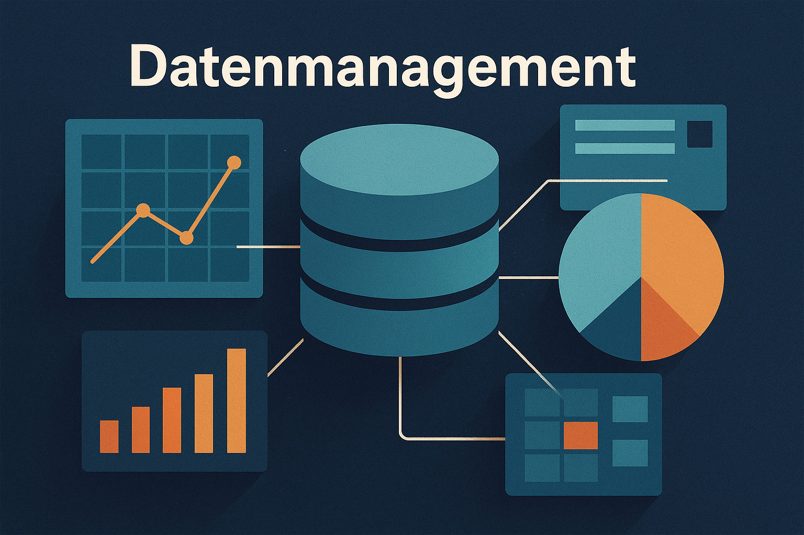

import DefinitionList from "@tdev-components/DefinitionList";
import CmsText from '@tdev-components/documents/CmsText';
import WithCmsText from '@tdev-components/documents/CmsText/WithCmsText';

# Data Management
:::Hero

:::

## Unterrichtsfolien
Die Unterrichtsfolien zu diesem Thema finden Sie [hier](https://erzbe-my.sharepoint.com/:f:/g/personal/silas_berger_gbsl_ch/EknN9a1Ub-BBheKhCqZ0YO4BuLy1Qrh1Woki5k3MJNiW9w?e=Co2QM8).

## Probe
<DefinitionList>
  <dt>Dauer</dt>
  <dd>ca. 40 Minuten</dd>

  <dt>Gewichtung</dt>
  <dd>100%</dd>

  <dt>Modus</dt>
  <dd>Details folgen</dd>

  <dt>Hilfsmittel</dt>
  <dd>Details folgen</dd>

  <WithCmsText entries={{note: "70a11ee7-8b9c-43f5-9a84-bf3c2efc218f", punkte: "b41c4e62-590c-44e4-b137-d19d52f28fc8"}}>
    <dt>Note</dt>
    <dd>__<CmsText name="note" />__ (<CmsText name="punkte" />/?? Punkten)</dd>
  </WithCmsText>
</DefinitionList>

:::info[Prüfungsstoff]
- Sie können die Grundbegriffe von Excel korrekt verwenden und die wichtigsten Bedienelemente benennen.
- Sie können eine neue Excel-Arbeitsmappe erstellen, speichern und schliessen.
- Sie können Excel-Tabellen optisch ansprechend formatieren.
- Sie können in Excel Daten eingeben und Zellen formatieren (Zahlenformate).
- Sie können in Excel Formeln (mit und ohne Funktionen) erstellen und bearbeiten und darin sowohl relative als auch absolute Bezüge korrekt verwenden.
- Sie können in Excel-Formeln die Funktionen `SUMME()`, `MIN()`, `MAX()`, `MITTELWERT()` und `WENN()` sinnvoll und korrekt verwenden.
- Sie können verschiedene Ansätze zur Strukturierung von Daten (z.B. CSV, Excel) miteinander vergleichen und deren Vor- und Nachteile benennen.
- Sie können die Begriffe «Datensatz», «Datenfeld» und «Datenbank» definieren und miteinander in Beziehung setzen.
- Sie können erklären, wie _SQLite_ und _SQLiteStudio_ zusammenhängen und was deren jeweilige Aufgaben sind.
- Sie können Daten aus einer oder mehreren Datenbank-Tabellen abfragen und dabei jeweils alle oder nur bestimmte Zeilen und Spalten auswählen.
- Sie können bei der Abfrage aus zwei oder mehr Datenbank-Tabellen die entsprechenden Tabellen korrekt miteinander verbinden (JOIN).
- Sie können bestimmen, in welchem Verhältnis (`1:1`, `1:n`, `n:m`) zwei Datenbank-Tabellen zueinander stehen (Kardinalität).
- Sie können in einer Datenbank-Tabelle neue Daten einfügen, bestehende Daten aktualisieren und nicht mehr benötigte Daten löschen.
- Sie können abstrakte Fragestellungen (z.B. «Welche Legodudes haben dieselbe Art von Haustier?») und Sachverhalte (z.B. «Finn gehört neuerdings Litty Feuerwehr.», «A$AP Geerky und Litty Feuerwehr haben sich angefreundet.») in konkrete SQL-Abfragen (CRUD) übersetzen, diese ausführen und deren Ergebnisse korrekt interpretieren.
:::

---