# Überblick
Hier erhalten Sie einen Überblick über die wichtigsten Grundbegriffe und Funktionen von Excel.

:::aufgabe[Überblick]
<TaskState id="e3a35b54-f8b5-4524-9581-6e554b41dc20" />
Öffnen Sie jetzt gleich ein neues Excel-Dokument. Lesen Sie anschliessend diese Seite durch und probieren Sie die gezeigten Beispiele gleich selbst aus.

Notieren Sie am Schluss hier mindesens zwei Dinge, die Sie neu gelernt haben:

<QuillV2 id="f9a76a8c-0f9f-4b1a-8ccc-ca76fe99ab55" />

Sie können die Seite jederzeit wieder aufrufen, um etwas nachzuschlagen.
:::

## Aufbau und Grundbegriffe
Ein Excel-Dokument wird als **Arbeitsmappe** (engl.: _workbook_) bezeichnet. Eine solche Mappe enthält ein oder mehrere **Blätter** (engl.: sheets).

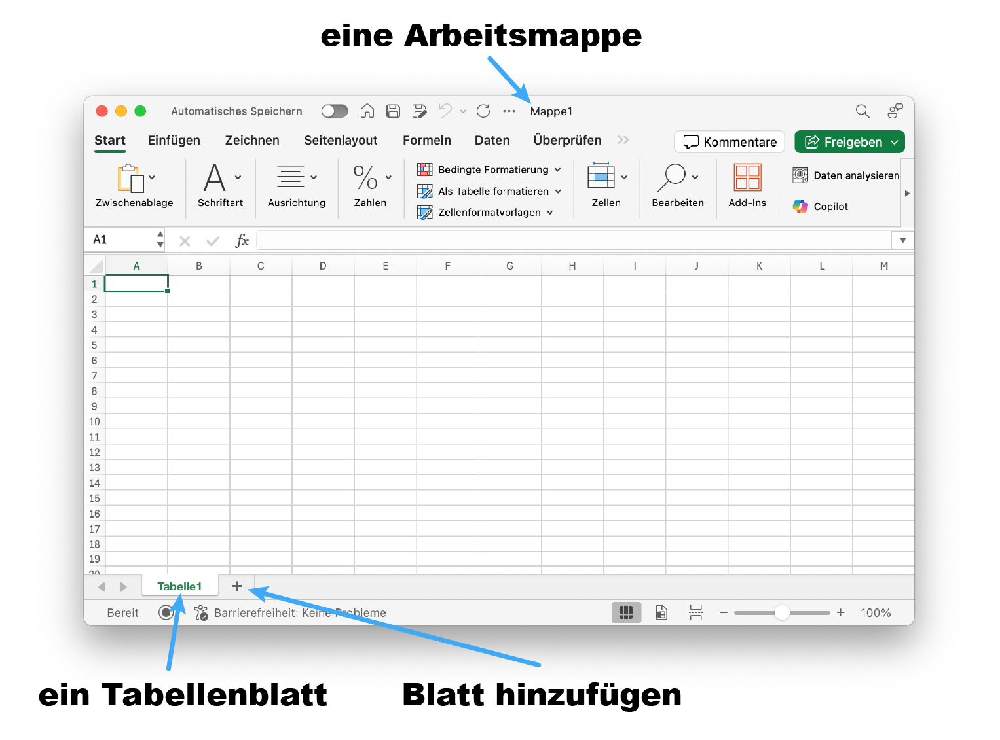

Eine Tabelle besteht aus **Zellen**. Diese sind in **Spalten** und **Zeilen** angeordnet. Die Spalten werden mit Buchstaben und die Zeilen mit Zahlen bezeichnet. Jede Zelle kann über die Spalte und die Zeile eindeutig identifiziert werden. Dabei wird immer **zuerst die Spalte, dann die Zeile** genannt (das ist später noch sehr wichtig!).

Hier ist also die **Zelle __B3__** markiert:

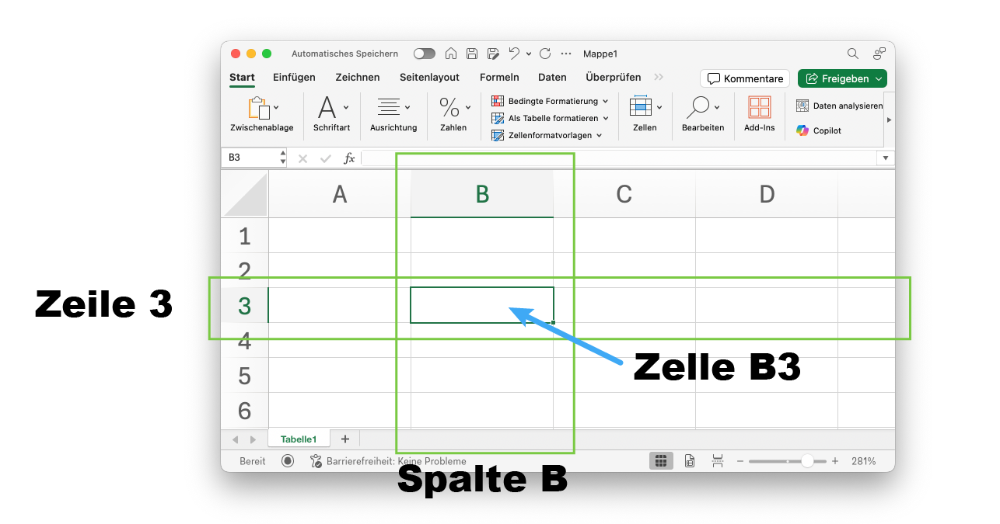

Eine Zelle kann beliebigen **Text**, **Zahlen** und **Formeln** enthalten. Wie genau der Inhalt einer Zelle dargestellt wird, hängt von ihrem **Format** ab. Hier enthält die Zelle __A3__ einen _Text_, die Zelle __B3__ ein _Datum_ und die Zelle __C3__ einen _Geldbetrag_.

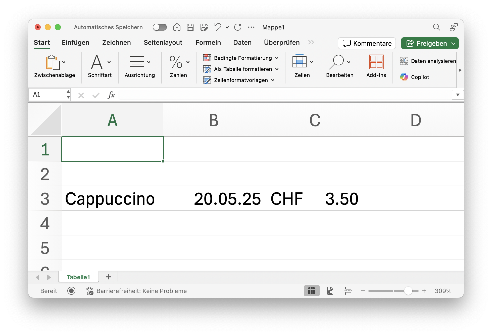

Excel versucht, das Format einer Zelle automatisch anhand des Inhalts zu bestimmen. Oft muss man das Format aber trotzdem noch von Hand setzen (hier z.B. für den Geldbetrag). Das macht man wie folgt:
1. [[:mdi[cursor-default-click] Rechtsklick]] → __Zellen formatieren…__
2. Gewünschtes Format auswählen (z.B. für Geldbeträge: __Buchhaltung__)

Das Format kann aber auch über die Menuleiste angepasst werden:

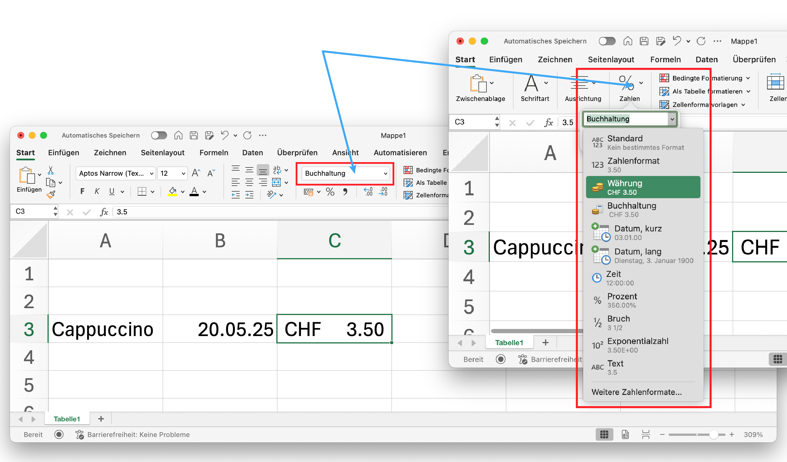

## Formeln
Eine Zelle kann an Stelle von fix definierten Werten auch **Formeln** enthalten. Der in der Zelle angezeigte Wert wird dann auf Grund der Formel berechnet. Eine Formel beginnt immer mit dem Zeichen `=`. 

In der Formel können Zahlen und **Bezüge** miteinander verknüpft werden. Ein Bezug ist nichts anderes, als ein Verweis auf eine andere Zelle. Beim Berechnen der Formel wird dann zuerst in dieser Zelle nachgeschaut, welcher Wert dort steht. Mehr dazu im nächsten Abschnitt.

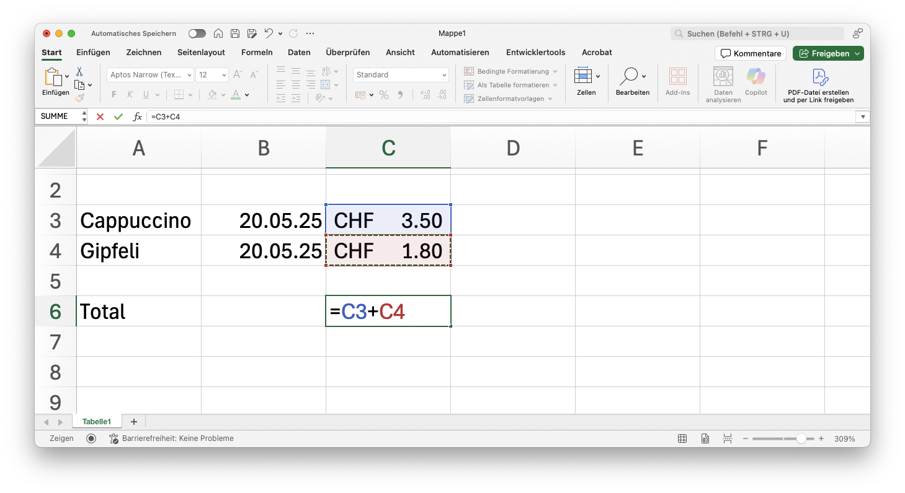

In obigem Beispiel enthält __C6__ eine Formel. Sie addiert die Werte der Zellen C3 und C4.

:::insight[Klicken statt tippen]
Statt `=C3+C4` zu tippen, können Sie nach dem `=` auch die Zelle __C3__ anklicken und dann das Plus-Zeichen `+` eingeben. Danach klicken Sie auf die Zelle __C4__ und drücken __Enter__. Excel fügt dann automatisch den Bezug ein.
:::

Das Resultat wird als Wert der Zelle __C6__ angezeigt:

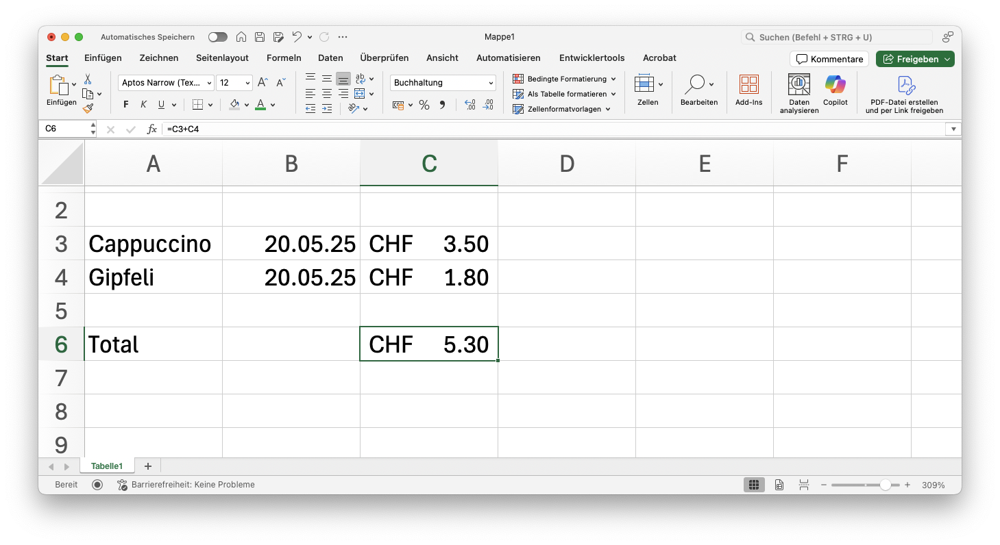

Wenn nun einer der Werte in __C3__ oder __C4__ verändert wird, aktualisiert Excel automatisch den Wert von __C6__:

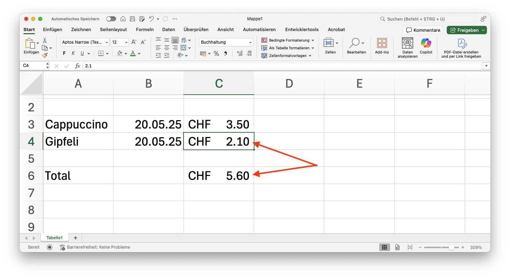

Formeln können beliebig kompliziert sein. Sie können darin die arithmetischen Operationen `+`, `-`, `*`, `/` verwenden und mit Klammern die Auswertungsreihenfolge beeinflussen, so wie Sie das von Ihrem Taschenrechner oder von Python auch kennen:

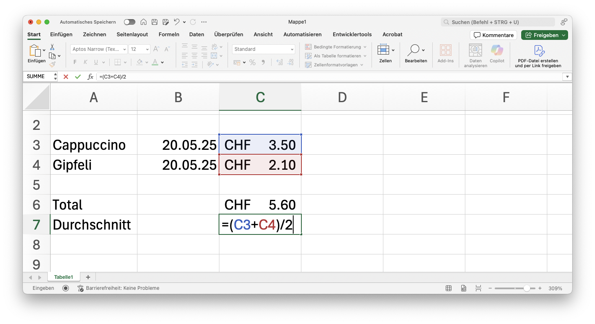

## Bezüge
In den obigen Beispielen haben Sie gesehen, dass in Formeln auf andere Zellen verwiesen wird. Ein solcher Verweis nennt man **Bezug**. Ein _Bezug_ ist nichts anderes als der Name einer Zelle, bestehend aus Spalte und Zeile.

### Relative Bezüge
Was passiert nun aber, wenn man die Tabelle nachträglich verändert und z.B. eine neue Zeile zwischen den Zeilen __3__ und __4__ einfügt?

:::cards
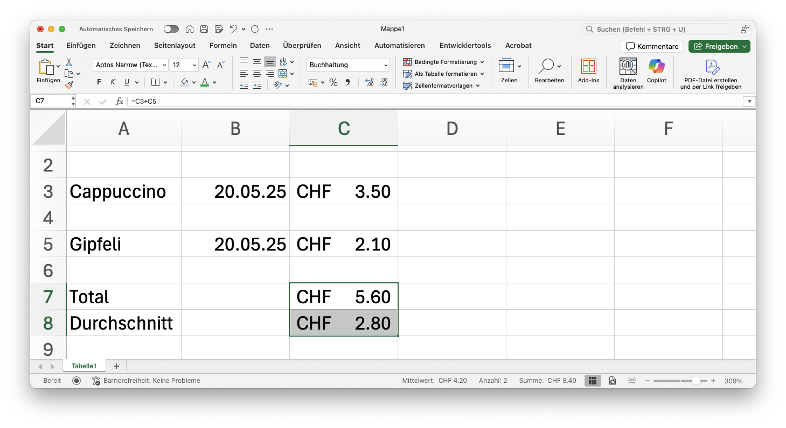
::br
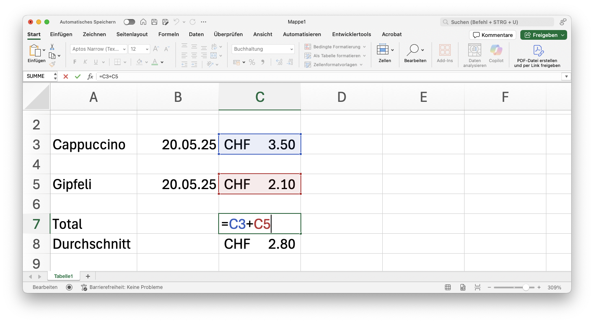
:::

Wie Sie links sehen, zeigen die Zellen __C7__ und __C8__ immer noch die gleichen Werte an, wie vorher. Excel hat die Bezüge in den Formeln automatisch angepasst. Aus dem Bezug __C4__ in der Formel `=C3+C4` ist __C5__ geworden. Solche Bezüge nennt man **relative Bezüge**. 

### Absolute Bezüge
Es gibt auch Fälle, wo man nicht möchte, dass Excel die Bezüge anpasst, wenn die Tabelle verändert wird. Solche Bezüge nennt man **absolute Bezüge**. 

Im folgenden Beispiel sollen in der Zelle __C5__ die Fahrkosten für den Zug auf Grund des Preises für ein Einzelbillett (steht in Zelle __F3__) berechnet werden. 

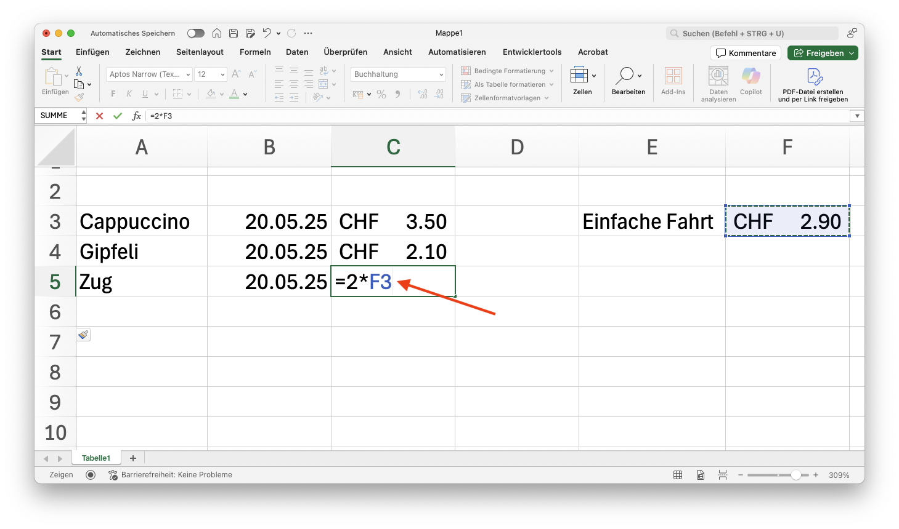

Wenn man nun die Zeile __5__ kopiert (Zeile __5__ markieren → __:mdi[cursor-default-click] Rechtsklick__ → __Kopieren__) und auf Zeile __6__ einfügt (Zeile __6__ markieren → __:mdi[cursor-default-click] Rechtsklick__ → __Kopierte Zellen einfügen…__), so stellt man fest, dass in der Formel von __C6__ aus dem Bezug __F3__ der Bezug __F4__ geworden ist:

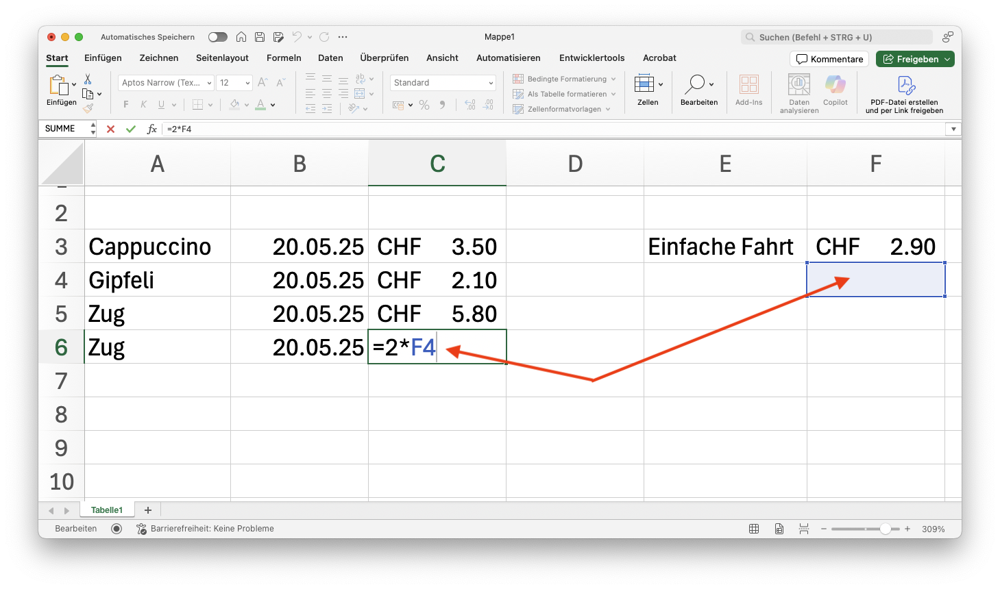

Um dies zu verhindern muss in der Formel von __C5__ mit einem __absoluten Bezug__ gearbeitet werden. Dazu wird löschen wir den Inhalt der Zeile __6__ nochmal und bearbeiten die Zeile __5__: Im Bezug zu __F3__ fügen wir vor der Spalte und der Zeile das jeweils das Zeichen `$` ein:

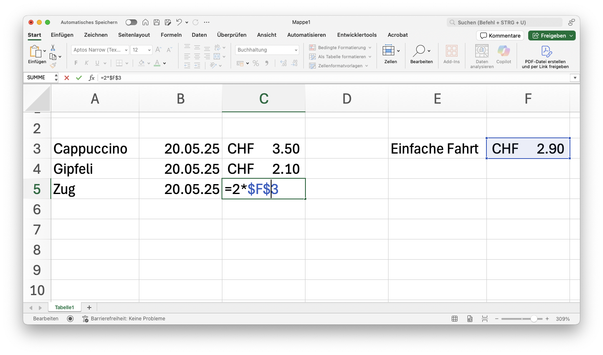

Wenn jetzt die Zeile __5__ kopiert und in Zeile __6__ eingefügt wird, bleibt der Bezug __F3__ auf der Zeile __6__ bestehen:

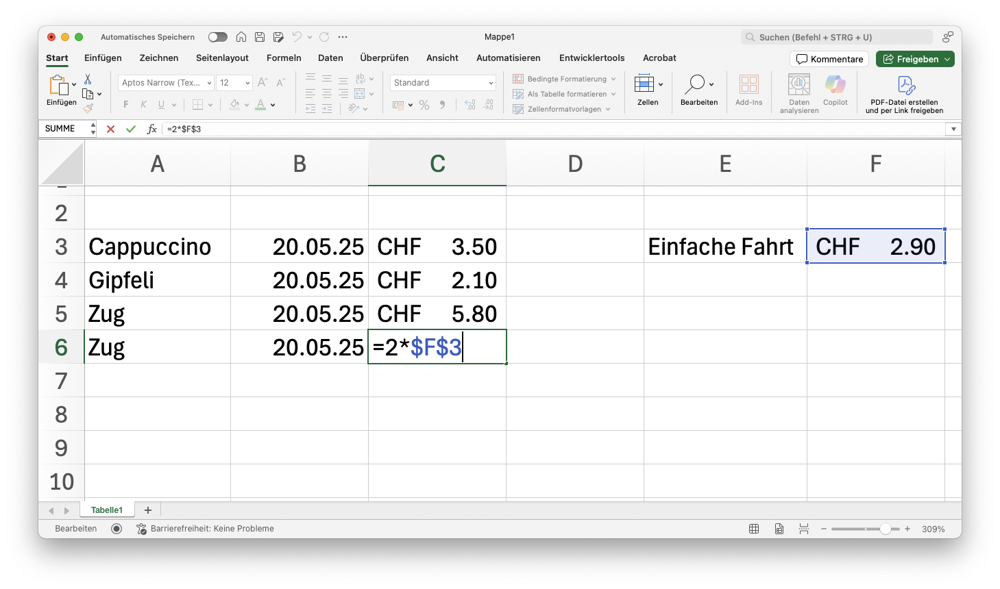

:::insight[Warum gleich zwei Dollarzeichen?]
Wenn Sie nur ein Dollarzeichen vor der Spalte oder der Zeile setzen, wird nur diese eine Koordinate fixiert. Das heisst, dass die andere Koordinate angepasst wird, wenn die Tabelle verändert wird.

Das kann in manchen Fällen nützlich sein, aber in den meisten Fällen möchte man beide Koordinaten fixieren.
:::

## Funktionen
Bis jetzt haben wir in unseren Formeln nur arithmetische Operation verwendet. Excel bietet aber auch eine riesige Palette von vordefinierten **Funktionen** an, welche in Formeln verwendet werden können. So können wir z.B. für das Berechnen des Totals in den obigen Beispielen die Funktion `SUMME()` verwenden:

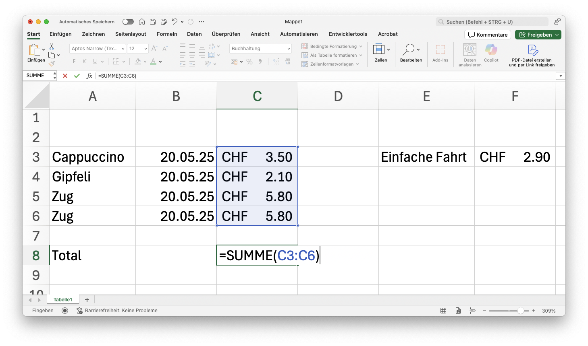

Das Ergebnis ist wie erwartet:

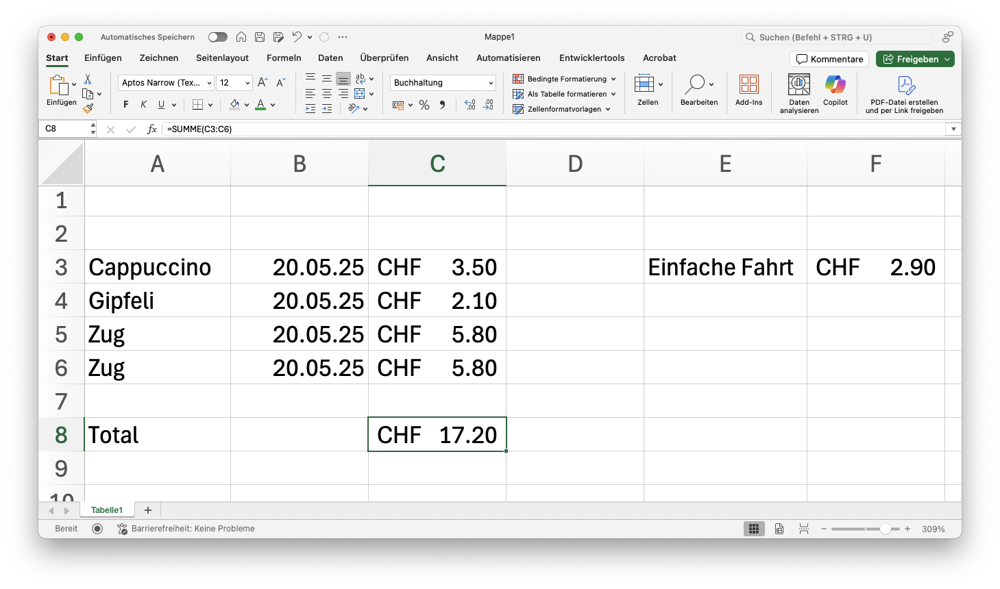

:::warning[Spracheinstellungen]
Die Funktion `SUMME()` heisst in der englischen Version von Excel `SUM()`. Wenn Sie Excel also auf Englisch eingestellt haben, müssen Sie die englische Schreibweise verwenden.

In dieser Anleitung verwenden wir die deutsche Schreibweise. Wenn Sie eine andere Sprache verwenden, müssen Sie jeweils googlen, wie die Funktion in dieser Sprache heisst. In der Regel ist es aber so, dass die Funktionen in allen Sprachen gleich heissen, nur die Schreibweise ändert sich. So heisst `SUMME()` in Englisch `SUM()`, in Französisch `SOMME()`, etc.
:::

Beachten Sie dabei, wie der zu summierende Bereich angegeben wird: `C3:C6`, also durch zwei Bezüge, welche den zu summierenden Bereich begrenzen. Es ist auch möglich die zu summierenden Zellen aufzuzählen: `=SUMME(C3;C4;C7)`. Man kann die beiden Formen auch beliebig mischen.

Weitere hilfreiche Funktionen sind `MITTELWERT()`, `MAX()`, `MIN()`, `WENN()`. Sie werden einige davon noch genauer kennenlernen.

---