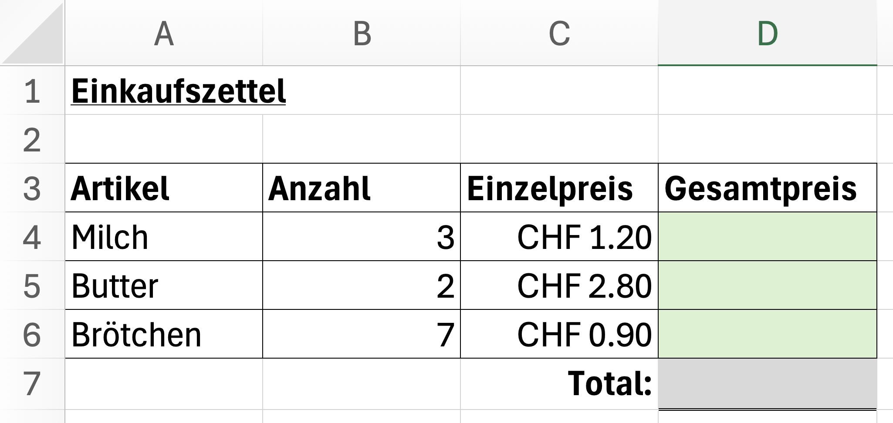

import Restricted from '@tdev-components/documents/Restricted';
import { checkExcelFormulaAnswer } from './util/checkSolution';

# Formeln und Bezüge
Gehen Sie in Ihrer Kopie der Mappe _«Statistik der Jugendstrafrechtspflege des Kantons Zürich.xlsx»_ (siehe vorheriger Abschnitt) auf das Blatt **Delikte**. Lösen Sie darin die nachfolgenden Aufgaben.

:::warning[Eingeloggt?]
Falls Sie hier keinen OneDrive-Link sehen, sind Sie nicht eingeloggt.
:::

<Restricted id="f5f94521-cc5c-4c05-8203-e1e09c3175c0">
Die für diese Seite benötigten Materialien finden Sie in [diesem OneDrive-Ordner](https://erzbe-my.sharepoint.com/:f:/g/personal/silas_berger_gbsl_ch/EqGDw-PH46NOm2qR6yo0Hq8BsC5J9gAGKnEaCDiixf4J2g?e=CiTyz6)
</Restricted>

 

:::aufgabe[Vorbereitung]
<TaskState id="dfd4c428-5c09-4995-b08a-d4ad296eda30" />
Schauen Sie sich die beiden Videos (_«Formeln und Bezüge»_ und _«Prozente mit Excel»_; siehe OneDrive-Ordner) vollständig an.
:::

:::warning[Formeln verwenden]
Sie sollten in den folgenden Aufgaben **keine** Zahlen manuell ausrechnen, sondern immer Formeln verwenden. Das heisst, Sie müssen die Formeln so eingeben, dass sie die Werte der Zellen verwenden, auf die sie sich beziehen. So können Sie später die Tabelle einfach aktualisieren, wenn sich die Daten ändern.

**Funktionen** wie `SUMME()` oder `MITTELWERT()` benötigen Sie für diese Aufgaben **noch nicht**.
:::

:::aufgabe[Summen der Delikte]
<TaskState id="b1c2d3e4-f5a6-7b8c-9d0e-f1a2b3c4d5e6" />
Gehen Sie auf die Zeile __15__. Auf dieser Zeile soll für jede Deliktart die **Summe der entsprechenden Delikte in den Jahren 2016 bis 2018** angegeben werden (z.B. sollte in der Spalte `Leib_und_Leben` das Ergebnis $666$ stehen).

Fügen Sie in den Zellen __B15__ bis __I15__ die nötigen Formeln ein.
:::

:::aufgabe[Durchschnittliche Delikte]
<TaskState id="2af8d5db-e5f9-4c42-b812-6567d7f9841f" />
Auf Zeile __16__ soll nun für jede Deliktart die durchschnittliche Anzahl Delikte aus den Jahren 2016 bis 2018 angezeigt werden. Fügen Sie die nötigen Formeln ein.

**Tipp:** Wenn Sie es geschickt machen, sollten Sie dazu in jeder Formel nur einen einzigen Bezug auf eine andere Zelle benötigen.
:::

:::aufgabe[Nachkommastellen]
<TaskState id="f7ac2bd9-c616-401b-a32b-235d7156a562" />
Excel stellt die Zahlen in der Zeile __16__ mit vielen Kommastellen dar. Das beeinträchtigt die Lesbarkeit. Im Formatierungsmenü finden Sie ein Möglichkeit, um die Anzahl der dargestellten Kommastellen zu verändern. Finden Sie sie? Sonst googlen 😉.
:::

:::aufgabe[Zunahme / Abnahme]
<TaskState id="160a7906-428c-41c0-a865-cec2ad925847" />
Fügen Sie auf Zeile __17__ eine neue, leere Zeile ein. In dieser Zeile sollen für alle Deliktarten die Zunahme (positiv) oder Abnahme (negativ) im Jahr 2018 gegenüber dem Jahr 2017 angezeigt werden. 

**Beispiel:**

| Jahr | Deliktart_X | Deliktart_Y |
| --- | --- | --- |
| 2017 | 200 | 300 |
| 2018 | 220 | 265 |
|  | **20** | **-35** |

Fügen Sie die nötigen Formeln ein.
:::

:::aufgabe[Prozentuale Veränderung]
<TaskState id="c19b3445-1db0-4745-9bf8-657023bb018e" />
Auf Zeile __18__ soll für jede Deliktart angezeigt werden, wieviel Prozent die Zunahme oder Abnahme aus der vorangehenden gegenüber dem Wert von 2017 ausmacht.

**Beispiel:**

| Jahr | Deliktart_X | Deliktart_Y |
| --- | --- | --- |
| 2017 | 200 | 300 |
| 2018 | 220 | 265 |
|  | 20 | -35 |
|  | **10%** | **-12%** |

Fügen Sie die nötigen Formeln ein. Sie müssen dabei die Umrechnung in Prozent nicht selber «programmieren». Das können Sie mithilfe des Formatierungsmenüs von Excel lösen. Dort gibt es eine Möglichkeit, um eine Zahl als Prozentzahl darzustellen.
:::

:::aufgabe[Formatieren]
<TaskState id="91b8d985-12c1-4ef9-b849-858efd81bc63" />
Fügen Sie schliesslich in den Zellen __A15__ bis __A18__ passende Zeilenbeschriftungen ein und formatieren Sie die Tabelle so, dass sie übersichtlich und gut lesbar ist.
:::

:::aufgabe[Selbsttest]
<TaskState id="d0c1f2b6-3a4e-4b5c-8d7f-9e0a1c5f3b2c" />
Betrachten Sie die folgende Excel-Tabelle:

Geben Sie hier die benötigten Formeln **(ohne Leerzeichen!)** für die grün / grau markierten Zellen ein. Nicht vergessen: Formeln beginnen immer mit einem `=`.

| Zelle | Formel |
| - | - |
| __D4__ | <String id="1b119a22-8fb9-4033-95c9-15e7ceaf0fc6" checker={(val) => checkExcelFormulaAnswer(val, ['=B4*C4', '=C4*B4'])} solution='' />|
| __D5__ | <String id="a3dbc6f9-67f6-4340-a537-dbb4febfd5a2" checker={(val) => checkExcelFormulaAnswer(val, ['=B5*C5', '=C5*B5'])} solution='' />|
| __D6__ | <String id="e3d79410-757b-4bcd-ac10-415a5cf6663c" checker={(val) => checkExcelFormulaAnswer(val, ['=B6*C6', '=C6*B6'])} solution='' />|
| __D7__ | <String id="a4a56f43-6c40-40fe-bef3-ca801e0826a7" checker={(val) => checkExcelFormulaAnswer(val, ['=D4+D5+D6', '=D4+D6+D5', '=D5+D4+D6', '=D5+D6+D4', '=D6+D4+D5', '=D6+D5+D4'])} solution='' />|
:::

---