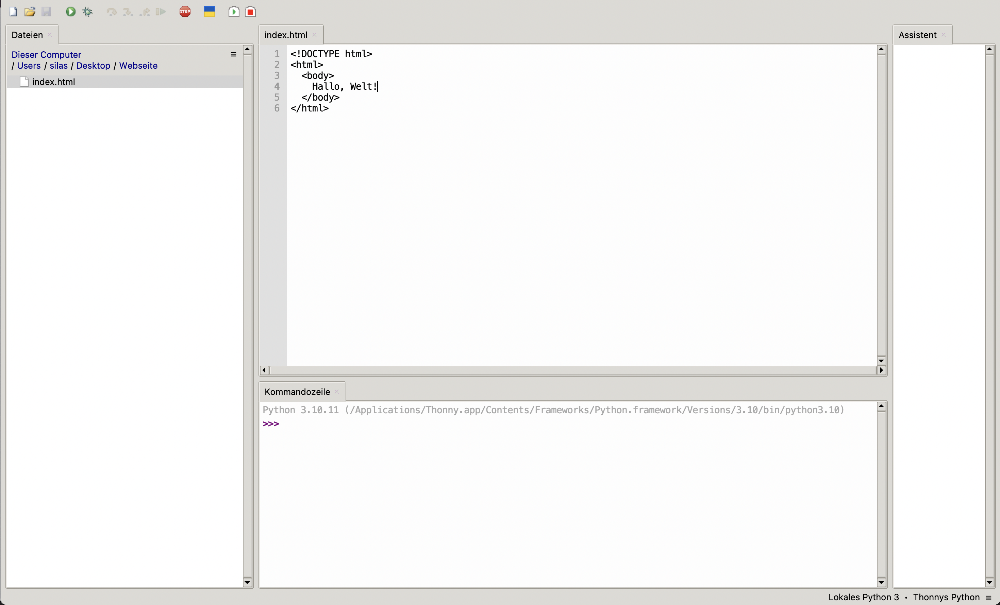

import BrowserWindow from "@tdev-components/BrowserWindow";

# Ein HTML-Dokument erstellen
Wir Sie in der [Einleitung zu diesem Kapitel](.) bereits gelernt haben, können wir mit Thonny nicht nur Python programmieren, sondern auch HTML-Dokumente erstellen. Genau das wollen wir in diesem Abschnitt ausprobieren.

Dazu öffnen wir Thonny und erstellen eine neue Datei:

Diese Datei speichern wir gleich auf unserem Computer ab (z.B. irgendwo in OneDrive), und zwar als `index.html`[^1]:

In diese neue Datei `index.html` können wir nun den _HTML-Code_ aus dem [vorherigen Abschnitt](HTML-Dokument) reinschreiben:

Thonny zeigt nun mit dem kleinen Sternchen (`*`) rechts neben `index.html` an, dass sich der Inhalt dieser Datei geändert hat. Also müssen wir diese Änderungen speichern:

Um unser fertiges Dokument nun anzuzeigen, machen wir einen rechtsklick auf die Datei im Reiter _Dateien_ und klicken dann auf "Öffne in externer Standard-App":

Die Standard-App für HTML-Datein ist immer ein Webbrowser (Edge, Safari, Chrome, etc.), und _extern_ ist sie aus Thonnys sicht deshalb, weil sie nicht Teil von Thonny selbst ist.

Es sollte sich bei Ihnen jetzt also ein Browserfenster öffnen, das wie folgt aussieht:
<BrowserWindow url="C:\Benutzer\silas\Webseite\index.html">
  
</BrowserWindow>

[^1]: Mit HTML-Dokumente sind Webseiten, und die Startseite einer Webseite nennen wir immer `index.html`. Das `.html` gibt an, dass es sich hier um ein HTML-Dokument handelt - genauso wie wir mit `.docx` angeben, dass es sich um ein Word-Dokument handelt.
