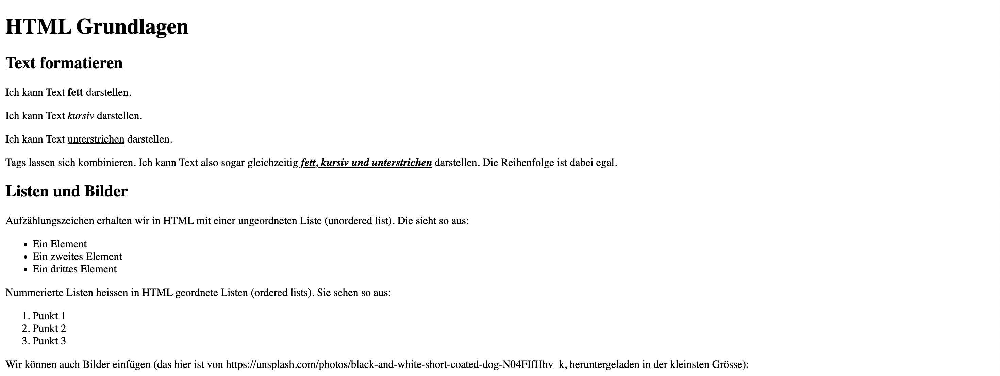
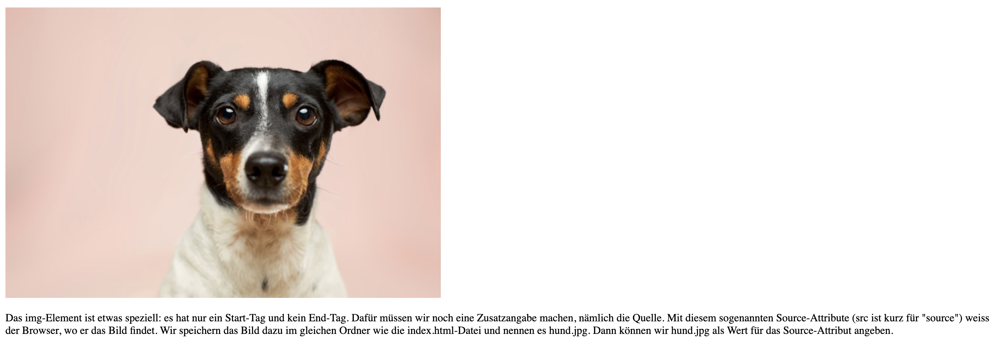

import BrowserWindow from '@tdev-components/BrowserWindow';

# Grösseres HTML-Dokument

Ein etwas grösseres HTML-Dokument mit mehr Elementen könnte folgendermassen aussehen:

<BrowserWindow url="C:\Benutzer\silas\Webseite\groesseres-dokument.html">
     
</BrowserWindow>

Der HTML-Code dahinter sieht so aus:

```html
<!DOCTYPE html>
<html>
    <body>
        <h1>HTML Grundlagen</h1>
        <h2>Text formatieren</h2>
        <p>Ich kann Text <b>fett</b> darstellen.</p>

        <p>Ich kann Text <i>kursiv</i> darstellen.</p>

        <p>Ich kann Text <u>unterstrichen</u> darstellen.</p>

        <p>
            Tags lassen sich kombinieren. Ich kann Text also sogar gleichzeitig
            <b
                ><i><u>fett, kursiv und unterstrichen</u></i></b
            >
            darstellen. Die Reihenfolge ist dabei egal.
        </p>

        <h2>Listen und Bilder</h2>
        <p>
            Aufzählungszeichen erhalten wir in HTML mit einer ungeordneten Liste (unordered list). Die sieht
            so aus:
        </p>
        <ul>
            <li>Ein Element</li>
            <li>Ein zweites Element</li>
            <li>Ein drittes Element</li>
        </ul>

        <p>Nummerierte Listen heissen in HTML geordnete Listen (ordered lists). Sie sehen so aus:</p>
        <ol>
            <li>Punkt 1</li>
            <li>Punkt 2</li>
            <li>Punkt 3</li>
        </ol>

        <p>
            Wir können auch Bilder einfügen (das hier ist von
            https://unsplash.com/photos/black-and-white-short-coated-dog-N04FIfHhv_k, heruntergeladen in der
            kleinsten Grösse):
        </p>
        

        <p>
            Das img-Element ist etwas speziell: es hat nur ein Start-Tag und kein End-Tag. Dafür müssen wir
            noch eine Zusatzangabe machen, nämlich die Quelle. Mit diesem sogenannten Source-Attribute (src
            ist kurz für "source") weiss der Browser, wo er das Bild findet. Wir speichern das Bild dazu im
            gleichen Ordner wie die index.html-Datei und nennen es hund.jpg. Dann können wir hund.jpg als Wert
            für das Source-Attribut angeben.
        </p>
    </body>
</html>
```

:::warning[Bilder] Beachten Sie, dass das Bild genau `hund.jpg` heissen und im gleichen Ordner wie `index.html` abgespeichert sein muss, damit das Source-Attribut `src="hund.jpg"` funktioniert. Wenn Sie das Bild umbenennen wollen, dann müssen Sie diesen Wert anpassen.

Ein Bild braucht zudem kein End-Tag. :::
