# Screencasts erstellen

Ein **Screencast** (also, eine _Bildschirmaufzeichnung_ oder eine _Bildschirmaufnahme_) ist eine Video-Aufzeichnung, die die Abläufe bei der Verwendung von Software am Computer-Bildschirm wiedergibt und gegebenenfalls beschreibt. Abläufe können von Audio-Kommentaren begleitet sein. So, wie ein Screenshot eine einzelne Aufnahme des Bildschirms darstellt, ist der Screencast eine Folge von solchen Bildern.

In dieser Anleitung lernen Sie, wie Sie mit der **_Open Broadcaster Software_ (OBS)** einen Screencast erstellen.

## Installation

Gehen Sie auf die Webseite [https://obsproject.com/de](https://obsproject.com/de) und laden Sie OBS für Ihr Betriebssystem (Windows oder macOS) herunter. Befolgen Sie anschliessend die unten stehende Anleitung für Ihr Betriebssystem.

::::Tabs :::Tab[Windows]{value="win"} 🚧 Work in progress 🚧 :::

:::Tab[macOS]{value="macos"}

1. Suchen Sie im _Downloads_-Ordner die heruntergeladene Datei (`obs-studio-[...].dmg`) und führen Sie sie aus (Doppelklick auf die Datei).
2. Ziehen Sie die _OBS.app_-Kachel auf die _Applications_-Kachel: 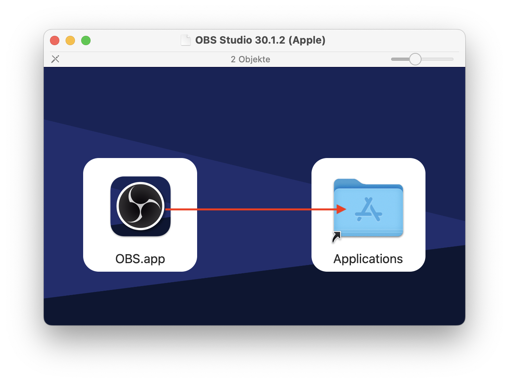
3. Fertig. Sie können dieses Fenster nun Schliessen und das Installationsprogramm im _Finder_ auswerfen: 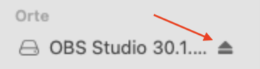

::: ::::

## Erste Einrichtung

Bei der ersten Verwendung von OBS gibt es einige Dinge zu beachten. Gehen Sie deshalb genau nach dieser Anleitung vor.

::::Tabs :::Tab[Windows]{value="win"} 🚧 Work in progress 🚧 :::

:::Tab[macOS]{value="macos"}

1. Öffnen Sie OBS. Vermutlich erhalten Sie dabei folgende Meldung, bei der Sie einfach auf _Öffnen_ klicken: 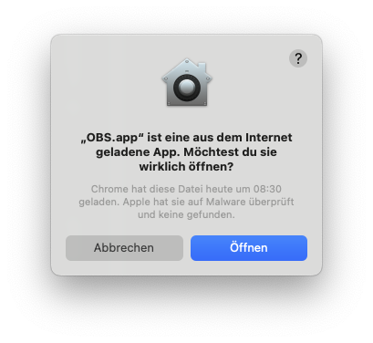
2. Prüfen Sie bei diesem Fenster anschliessend, ob OBS alle nötigen Berechtigungen hat. Wenn rechts _Zugriff erlaubt_ steht, dann ist die entsprechende Berechtigung erteilt. 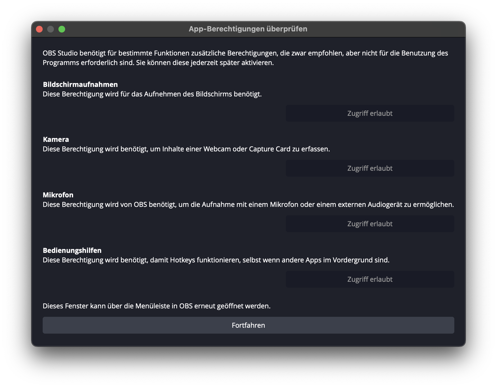
3. Wenn Sie folgende Warnung erhalten, klicken Sie auf _Systemeinstellungen öffnen_ und dort anschliessend bei _Laden der Systemsodftware des Programs "OBS.app" wurde blockiert_ auf _Erlauben_. 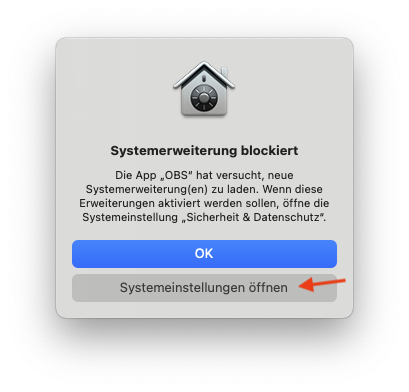 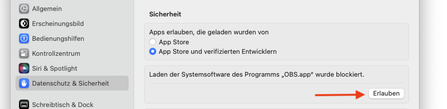
4. Wählen Sie hier die Option _Für das Aufnehmen optimieren_ aus und klicken Sie auf _Weiter_: 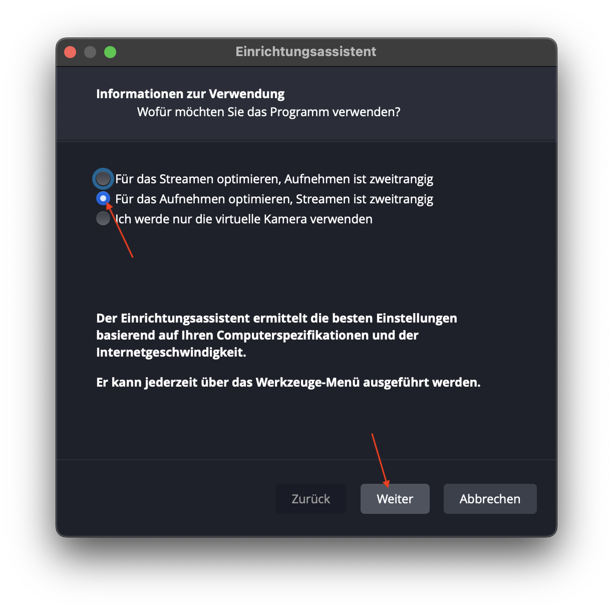
5. Wählen Sie die folgenden Videoeinstellungen aus, klicken Sie auf _Weiter_, und klicken Sie beim letzten Fenster auf _Einstellungen übernehmen_: 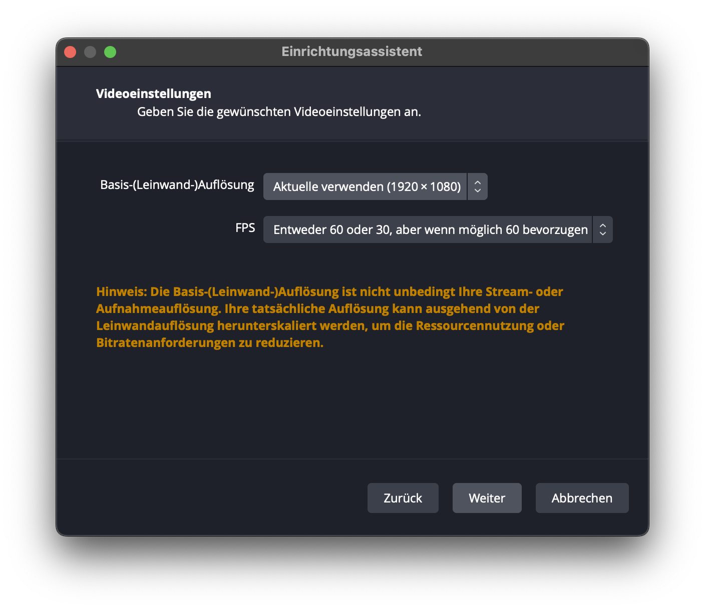 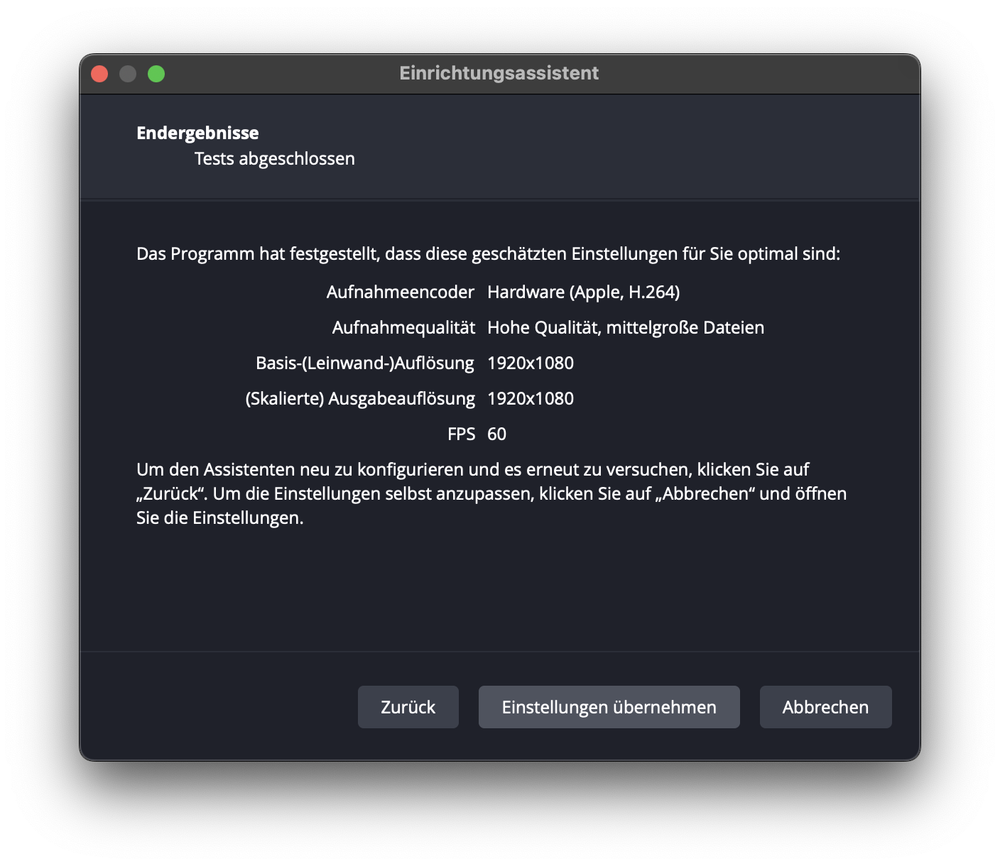 ::: ::::

## Verwendung von OBS

Hier sehen Sie eine Übersicht über die wichtigsten Bedienelemente von OBS: 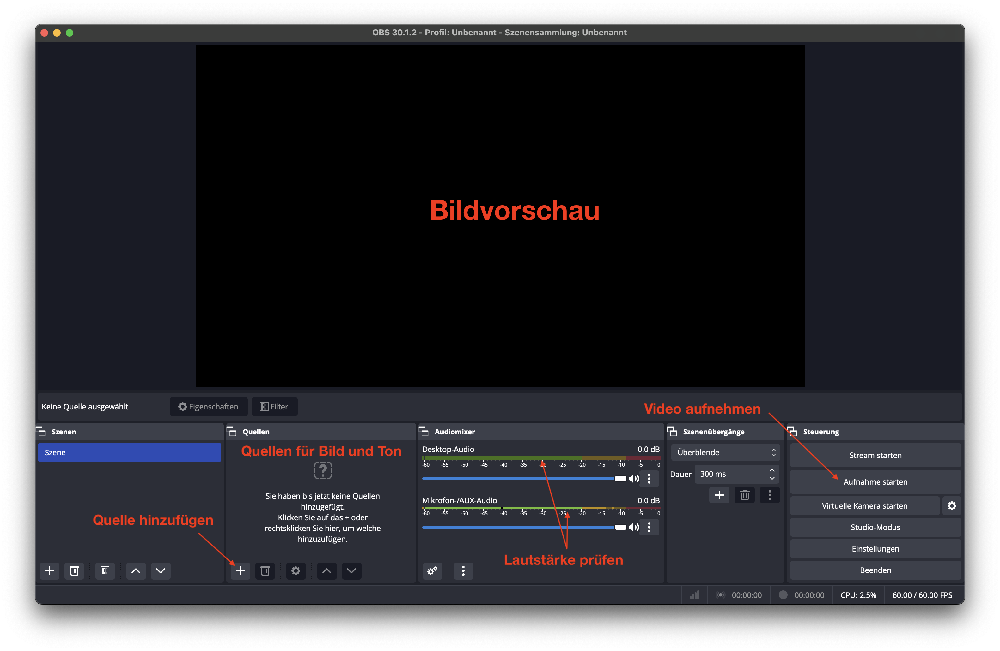

### Quellen für einen Screencast hinzufügen

Die wichtigste Quelle für einen Screencast ist die Bildschirmaufnahme. Eine solche Quelle fügen Sie wie folgt hinzu:

1. Klicken Sie bei Quellen auf das "+" um eine neue Quelle hinzuzufügen.
2. Wählen Sie den Eintrag _Bildschirmaufnahme_ (ggf. heisst er _macOS-Bildschirmaufnahme_ oder _Windows-Bildschirmaufnahme_).
3. Lassen Sie im Dialog alle Einstellungen unverändert und klicken Sie auf _Okay_.
4. Lassen Sie im darauffolgenden Dialog wieder alle Einstellungen unverändert und klicken Sie auf _Okay_.
5. Mit dem roten Rahmen rund um das Bild können Sie nun die Grösse dieser Bildschirmaufnahmequelle anpassen. Sie können die Quelle auch im Bildvorschau-Feld herumschieben. 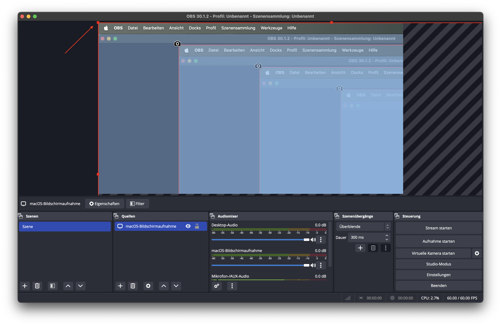
6. Die Quelle ist korrekt eingerichtet, wenn Sie nirgends mehr schraffierte (grau/schwarze) Flächen sehen. Schwarze Balken sind okay und lassen sich nicht immer vermeiden. 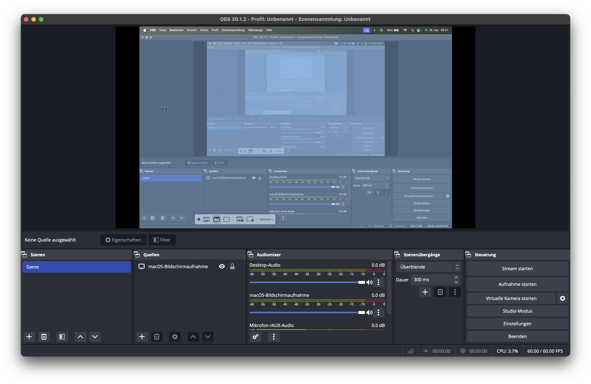

7. Klicken Sie bei Quellen auf das "+" um eine neue Quelle hinzuzufügen.
8. Wählen Sie den Eintrag _Videoaufnahmegerät_
9. Lassen Sie im Dialog alle Einstellungen unverändert und klicken Sie auf _Okay_.
10. Wählen Sie im darauffolgenden Dialog beim Dropbdown-Menu _Gerät_ Ihre Webcam aus. Unter macOS heisst die Webcam z.B. meistens FaceTime HD-Kamera. Belassen Sie die restlichen Einstellungen unverändert und klicken Sie auf _Okay_. 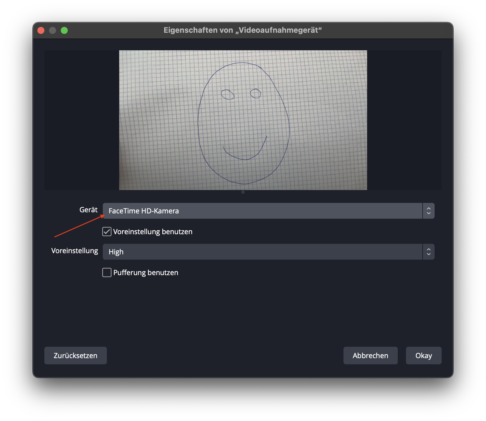
11. Die Grösse des Videos können Sie nun auch wieder mit dem roten Rahmen anpassen. Stellen Sie dazu sicher, dass Sie die korrekte Quelle ausgewählt haben (siehe _Quellen_ unten). Stellen Sie zudem sicher, dass in der _Quellen_-Liste die _Videoaufnahme_ **oberhalb** der _Bildschirmaufnahme_ steht. 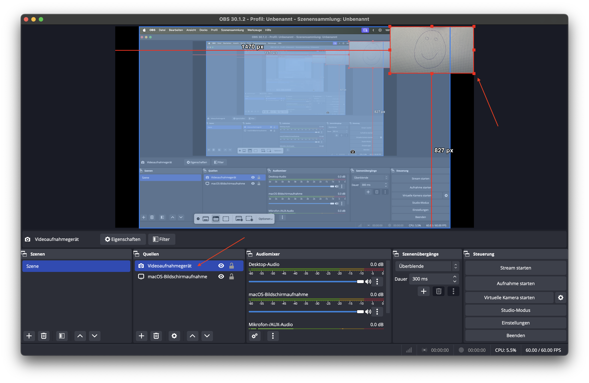

:::tip[Quellen werden gespeichert] Ihre Einstellungen werden automatisch gespeichert. Wenn Sie OBS schliessen und wieder öffnen, müssen Sie diese Einrichtung nicht nochmal vornehmen. :::

### Screencast aufnahmen

Bevor Sie die Aufnahme starten, gehen Sie durch folgende Checkliste:

1. Sind alle nötigen Quellen vorhanden und haben sie die richtige Grösse?
2. Wird das Mikrofon aufgezeichnet? Dazu prüfen Sie unter _Audiomixer_, ob sich bei _Mikrofon-/AUX-Audio_ etwas bewegt, wenn Sie sprechen.
3. Wird das Audio der Bildschirmaufnahme aufgezeichnet? Dazu prüfen Sie unter _Audiomixer_, ob sich bei _Bildschirmaufnahme_ etwas bewegt, wenn Sie beispielsweise ein YouTube-Video abspielen.

Wenn Sie alle Punkte geprüft haben, dann sind Sie bereit für die Aufnahme.

:::danger[Testaufnahme] Machen Sie am besten jetzt zuerst eine kurze Testaufnahme und schauen Sie sich das Ergebnis an. Prüfen Sie, ob Bild und Ton genau so sind, wie Sie sie erwarten. :::

Für die Aufnahme gehen Sie wie folgt vor:

1. Klicken Sie am rechten Rand auf _Aufnahme starten_.
2. Führen Sie Ihre Bildschirmdemonstration durch und sprechen Sie dabei laut und deutlich. Es macht übrigens nichts, wenn Sie das OBS-Fenster während der Demo nicht mehr sehen. Die Aufnahme läuft trotzdem weiter.
3. Wenn Sie fertig sind, öffnen Sie wieder das OBS-Fenster und klicken Sie rechts auf _Aufnahme beenden_.
4. Am unteren Bildschirmrand wird kurz eingeblendet, wo die Aufnahme gespeichert wurde. Sollten Sie die Meldung verpasst haben, dann gehen Sie auf _Datei_ → _Einstellungen_ (oder _Preferences_) → _Ausgabe_ und schauen dort unter _Aufnahme_ → _Aufnahmepfad_ nach.

---
