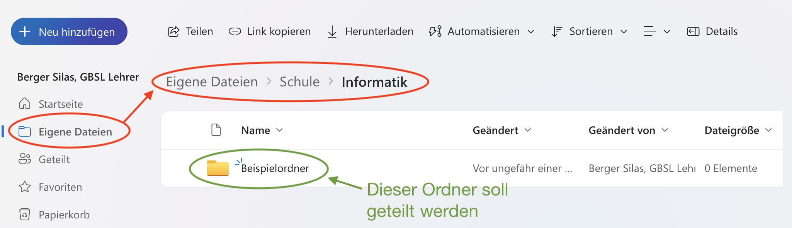
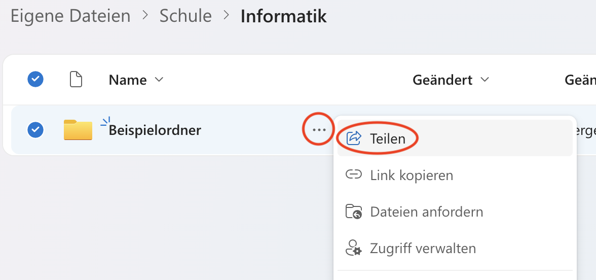
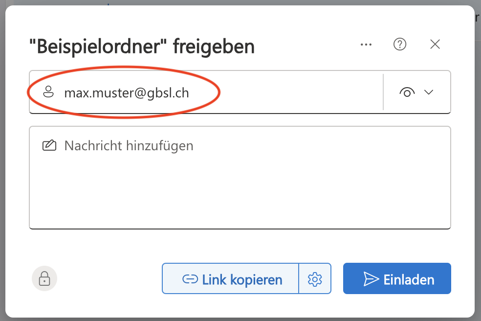
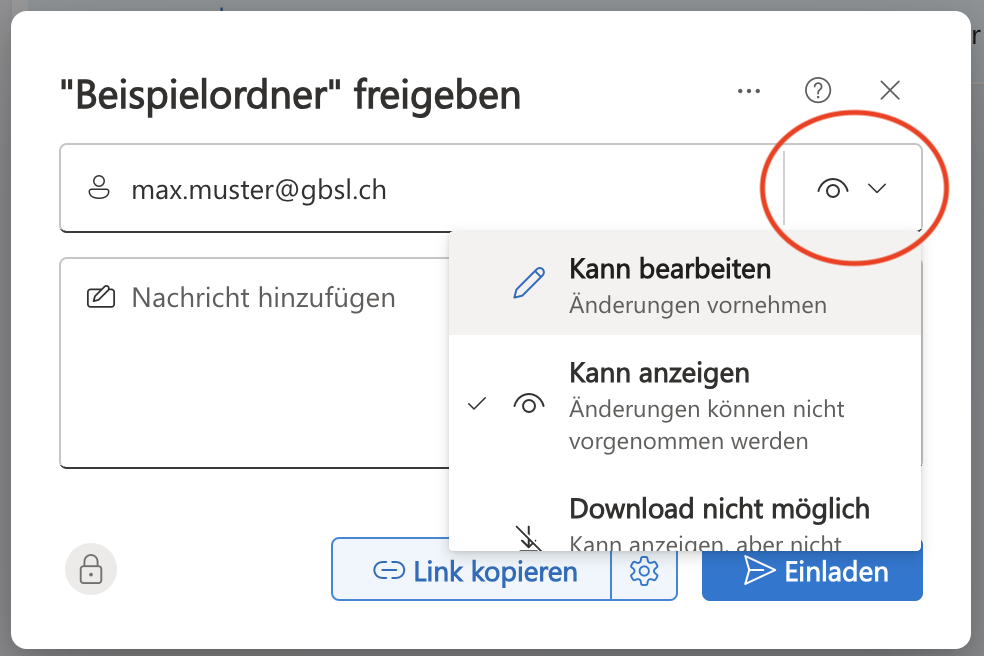
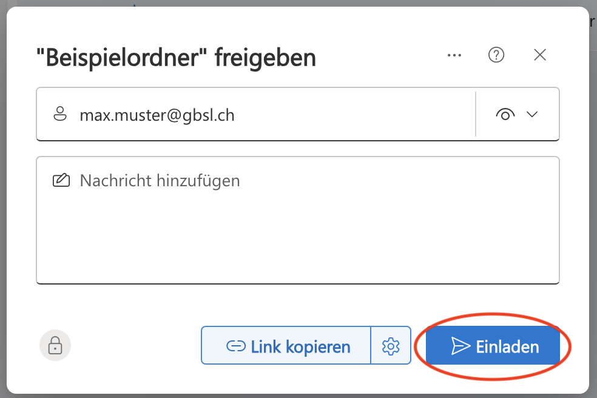
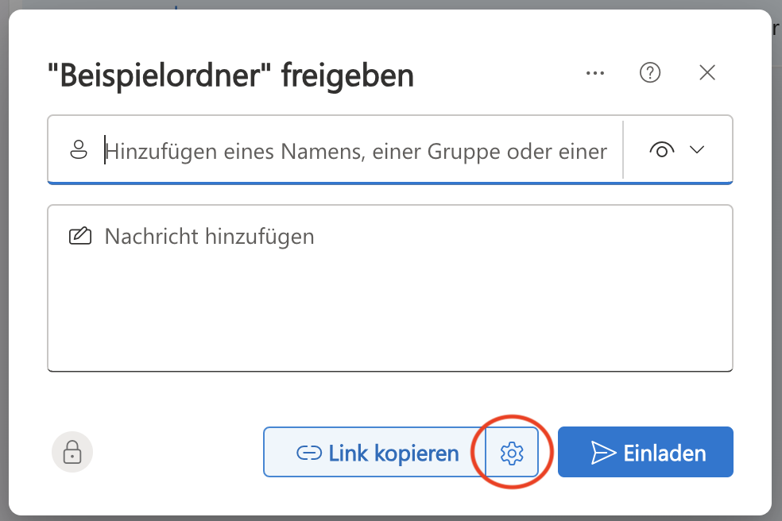
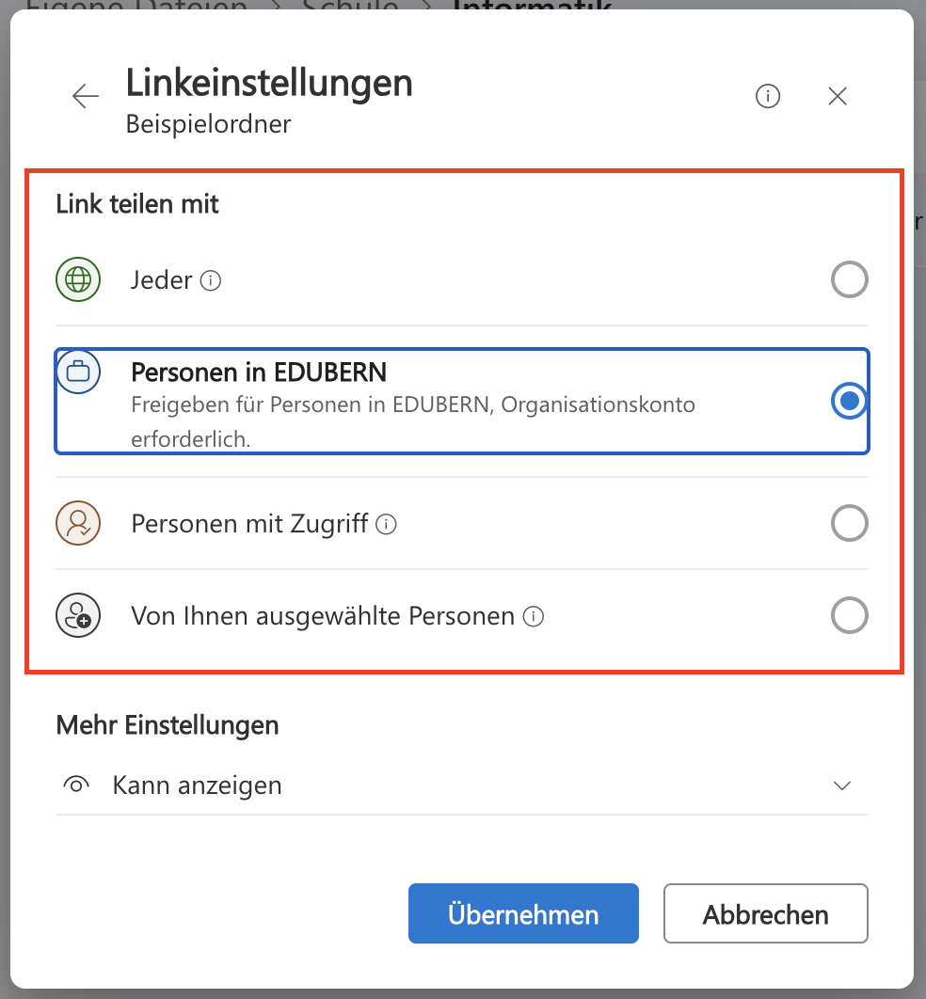
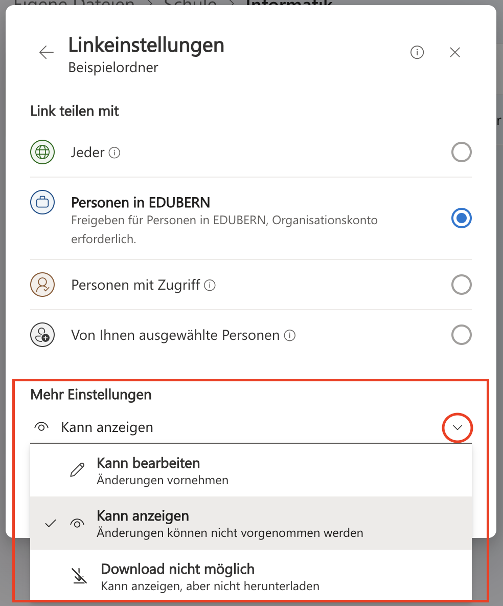
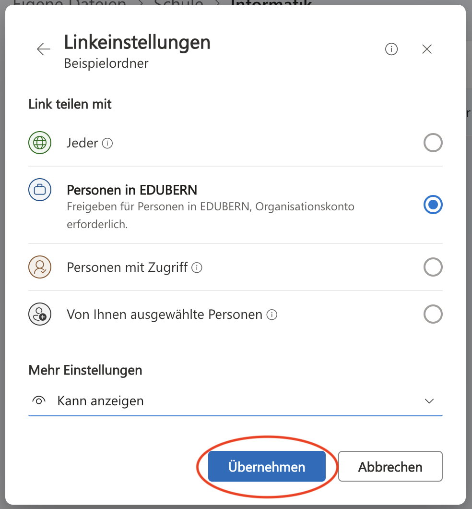
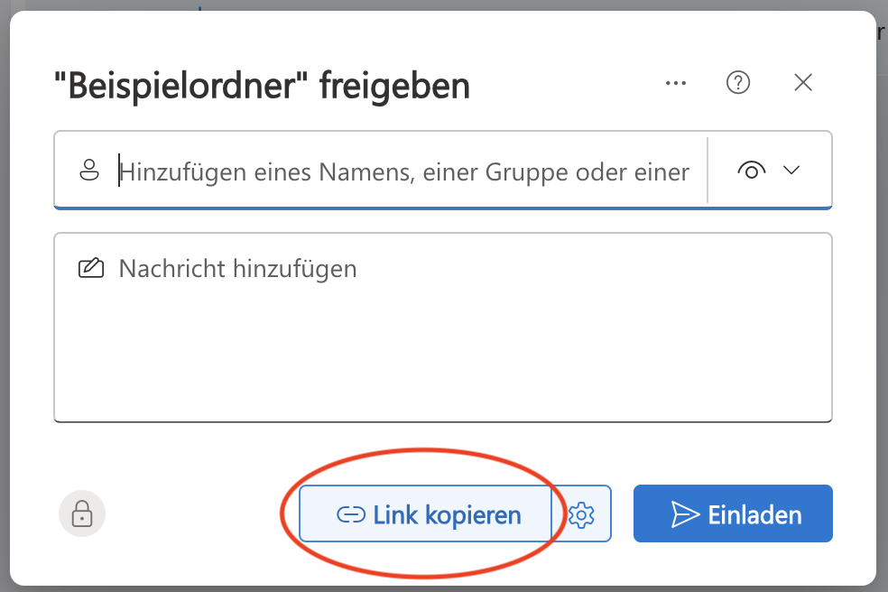

# Einen OneDrive-Ordner teilen
Sie können einen OneDrive-Ordner teilen, um ihn anderen Personen zur Verfügung zu stellen. Das ist beispielsweise praktisch für kollaborative Projekte oder für gewisse Abgaben.

Um einen Ordner in OneDrive zu teilen, gehen Sie wie folgt vor:
1. Gehen Sie auf die [OneDrive-Webseite der Schule](https://erzbe-my.sharepoint.com)
2. Navigieren Sie zum Ordner, der geteilt werden soll:
   
3. Klicken Sie auf die drei Punkte neben dem Namen des Ordners, und dann auf _Teilen_:
   
4. Entscheiden Sie, ob Sie den Ordner für bestimmte Personen freigeben wollen, oder an alle Personen, die über einen Link verfügen. Wählen Sie unten den entsprechenden Tab aus und folgen Sie dieser Anleitung.

::::Tabs
:::Tab[Für bestimmte Personen freigeben]{groupId="individual"}
1. Tragen Sie zuerst die Email-Adressen aller Personen ein, denen Sie diesen Ordner freigeben möchten:
   
2. Anschliessend können Sie auswählen, welche Berechtigungen diese Personen haben sollen (anzeigen und bearbeiten, oder nur anzeigen):
   
3. Klicken Sie zum Schluss auf _Einladen_, damit die entsprechenden Personen eine Email mit der Einladung zum geteilten Ordner erhalten:
   
:::

:::Tab[Link freigeben]{groupId="link"}

1. Klicken Sie zuerst auf das Zahnrad-Symbol, um die Optionen für den Freigabelink anzupassen:
   
2. Oben können Sie einstellen, wer diesen Link verwenden können soll. Wenn Sie den Link nur für Personen innerhalb Ihrer Schule freigeben wollen, dann setzen Sie diese Option auf _Personen in EDUBERN_. Wenn auch Personen ohne Schulkonto den Link verwenden können sollen, dann wählen Sie _Jeder_.
   
3. Anschliessend können Sie auswählen, welche Berechtigungen Personen haben sollen, die über den Link verfügen (anzeigen und bearbeiten, oder nur anzeigen):
   
4. Klicken Sie auf _Übernehmen_, um die Einstellungen zu speichern:
   
5. Klicken Sie zum Schluss auf _Link kopieren_. Den kopierten Link können Sie nun zum Beispiel ins OneNote kopieren, damit Sie ihn nicht verlieren. Jetzt können Sie ihn an alle Personen versenden, die Zugriff auf diesen Order erhalten sollen.
   
:::
::::

---
