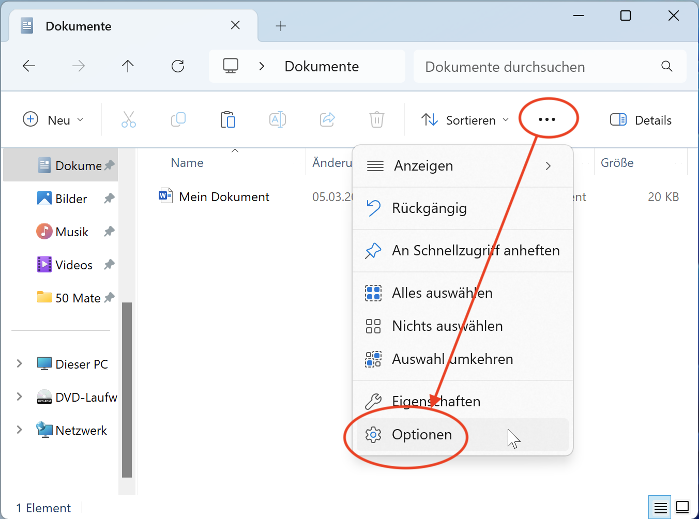
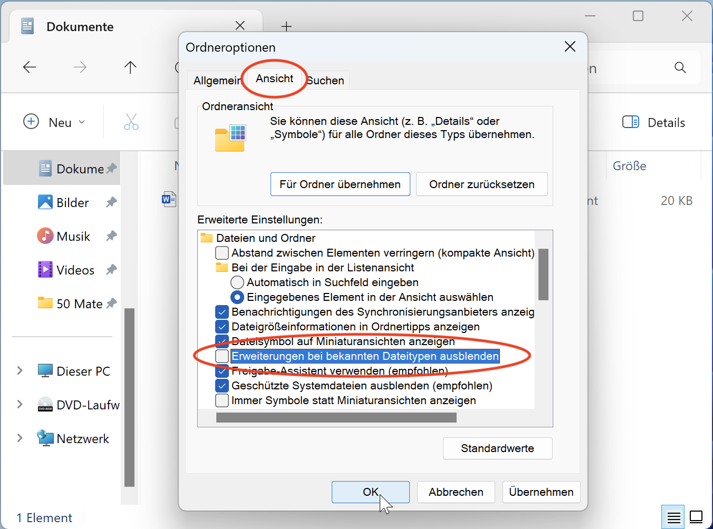

# Dateiendungen anzeigen

Jede Datei hat eine sogenannte **Dateiendung**, damit das Betriebssystem (Windows, macOS) weiss, mit welchem Programm es sie öffnen muss. Bekannte Dateiendungen sind etwa `.docx` für Word-Dokumente, `.jpg` und `.png` für Bilder, oder `.py` für Python-Programme.

Damit Sie auf Ihrem Gerät die Dateiendungen sehen können, müssen Sie zuerst die entsprechende Option aktivieren. Dazu gehen Sie folgendermassen vor:

::::Tabs{groupId="os"} :::Tab[Windows]{value="win"}

1. Öffnen Sie den **Windows Explorer**
2. Öffnen Sie die Optionen in Windows Explorer: 
3. Deaktivieren Sie im Reiter _Ansicht_ folgende Option und bestätigen Sie mit _OK_. 

Anschliessend werden im Windows Explorer alle Dateiendungen angezeigt. :::

:::Tab[macOS]{value="macos"}

1. Öffnen Sie den **Finder**
2. Öffnen Sie die Einstellungen im Finder: 
3. Aktivieren Sie die folgende Option: 

Anschliessend werden im Finder alle Dateiendungen angezeigt. ::: ::::

---
