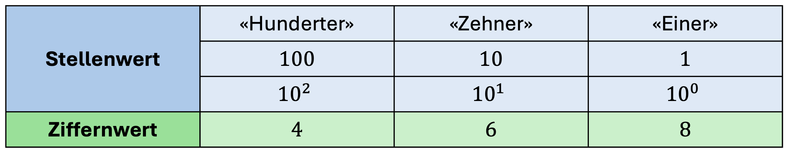

import TaskState from "@tdev-components/documents/TaskState";
import QuillV2 from "@tdev-components/documents/QuillV2";
import Solution from "@tdev-components/documents/Solution";

# Stellenwertsysteme
Wie interpretieren wir die Zahl $468$? In der Primarschule haben wir das folgendermassen gelernt:

> $4$ Hunderter plus $6$ Zehner plus $8$ Einer gibt _vierhundertachtundsechzig_.

Wir können das auch als Tabelle darstellen:

Das ist unser **Dezimalsystem**. Jede Ziffer in einer Zahl des Dezimalsystems entspricht einem **Stellenwert**. Deshalb nennen wir so etwas auch ein **Stellenwertsystem**.

Der Stellenwert im _Dezimalsystem_ ist dabei immer eine Potenz von $10$. Die Ziffer $8$ in der Zahl $468$ hat also den Stellenwert $8 \cdot 10^0 = 8 \cdot 1 = 8$, die Ziffer $6$ den Stellenwert $6 \cdot 10^1 = 6 \cdot 10 = 60$ und die Ziffer $4$ den Stellenwert $4 \cdot 10^2 = 4 \cdot 100 = 400$.

Der **Ziffernvorrat** des _Dezimalsystem_ besteht dabei aus den Ziffern $0$ bis $9$. Das sind die Ziffern, die an einer Stelle in einer Zahl vorkommen können. _Zehn_ Stück.

_Deka_ kommt aus dem Griechischen und bedeutet _zehn_. Das _Dezimalsystem_ ist also ein _dekadisches_ Stellenwertsystem: es arbeitet mit _zehn_ Ziffern, und seine Stellenwerte sind Potenzen von $10$ (wir sagen: es hat die **Basis** $10$).

:::aufgabe[Wieso keine elfte Ziffer?]
<TaskState id="5a30ac4f-84f6-491f-ad07-ed13b48e1a4a" />
Könnten wir dem Dezimalsystem nicht auch noch eine elfte Ziffer hinzufügen? Die Ziffern $0$ bis $9$ sind schliesslich einfach nur Zeichen, also könnten wir doch ein weiteres Zeichen als zusätzliche Ziffer verwenden: Zum Beispiel könnten wir sagen, dass $\Omega$ dem Wert "zehn" entsprechen soll, richtig?

Überlegen Sie, weshalb das nicht sinnvoll wäre. Halten Sie Ihre Gedanken hier fest.

<QuillV2 id="e378bc05-202f-4d44-ac4a-83c0a5dffbea" />

<Solution id="6b99a483-360c-4b3c-9f33-e3125aaede72">
Eine solche zusätzliche Ziffer wäre im Dezimalsystem problematisch. Wie würden wir jetzt zum Beispiel die Zahl "zwanzig" darstellen? Es gäbe nun zwei Möglichkeiten:
1. $20$ (das heisst: $2 \cdot 10^1 + 0 \cdot 10^0 = 2 \cdot 10 + 0 \cdot 1$)
2. $1\Omega$ (das heisst: $1 \cdot 10^1 + \Omega \cdot 10^0 = 1 \cdot 10 + 1 \cdot 10$)

Plötzlich gäbe es also nicht mehr für jede Zahl eine eindeutige Darstellungsweise. Deshalb verwenden wir im Dezimalsystem nur 10 Ziffern.
 
Wenn wir also die Zahl $19$ um $1$ erhöhen wollen, dann können wir den Einer-Stellenwert nicht mehr erhöhen. Stattdessen "schwappt" es rüber auf den Zehner, der um $1$ erhöht wird, während wir den Einer auf 0 zurücksetzen.
</Solution>
:::

:::key[Basis und Ziffernvorrat]
Bei einem Stellenwertsystem entspricht die Menge der Ziffern im Ziffernvorrat immer der Basis des Systems. So ist zum Beispiel im Dezimalsystem die Basis $10$ (d.h. wir arbeiten mit Potenzen von $10$) und es werden 10 Ziffern verwendet.
:::

---