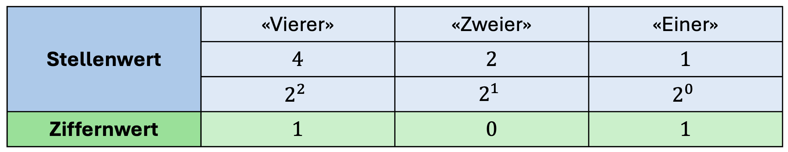
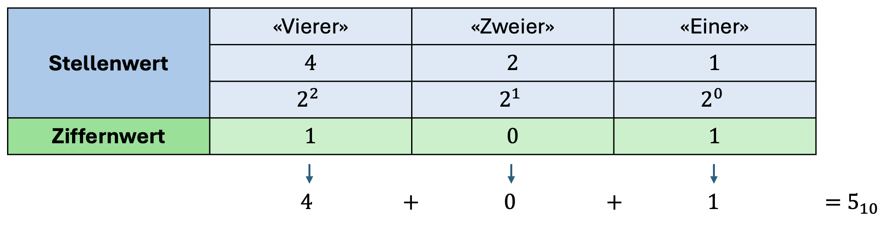

import QuillV2 from "@tdev-components/documents/QuillV2";
import Solution from "@tdev-components/documents/Solution";
import String from "@tdev-components/documents/String";

# Binär
Was mit der Basis $10$ funktioniert, funktioniert auch mit der Basis $2$. Diesmal schauen wir uns die Zahl $101$ an, interpretieren sie aber **binär**, also **zur Basis $2$**.

Diese Zahl repräsentiert dann also nicht den Wert "einhunderteins" (in unserem Dezimalsystem), sondern 

> $$1 \cdot 2^2 + 0 \cdot 2^1 + 1 \cdot 2^0 = 1 \cdot 4 + 0 \cdot 2 + 1 \cdot 1$$

was dem Wert "fünf" entspricht.

Damit wir wissen, zu welcher Basis wir eine Zahl interpretieren sollen, schreiben wir diese Basis als Index hinter die Zahl: $101_2$. Und somit können wir sagen: 

> $$101_2 = 5_{10}$$

## Von binär zu dezimal
Die Umrechnung von binär zu dezimal haben wir damit bereits beschrieben: Wir lesen von rechts nach links, wobei die Zahl ganz rechts dem Stellenwert $2^0 = 1$ entspricht, die nächste dem Stellenwert $2^1 = 2$, die übernächste dem Stellenwert $2^2 = 4$, und so weiter. Wenn bei der Stelle eine $1$ steht, addieren wir den Stellenwert zum Zwischenergebnis, wenn eine $0$ steht, lassen wir ihn weg.

::::aufgabe[2 zu 10]
<TaskState id="98ef27ef-bb50-4b32-85cd-0cb05bc66e81" />
Erledigen Sie die folgenden Umrechnungen ohne Hilfsmittel. Prüfen Sie jeweils Ihre Eingaben.

|Binär|Dezimal|
|-|-|
|$1001$|<String id="f87db474-b597-4710-ab6f-55f6f49e2217" solution="9" />|
|$10010$|<String id="174a5908-7460-43a3-86d5-19771a2d0422" solution="18" />|
|$1011$|<String id="b43f007c-1771-4d26-a745-e6ce9242e2ba" solution="11" />|
|$10000001$|<String id="8dfda742-7bc3-4c51-81b2-f7971fe633c2" solution="129" />|
|$10100000$|<String id="2aee8dd1-f8be-43b2-bc0d-891190905fd0" solution="160" />|
|$1000110$|<String id="e720e85d-08e0-4daf-9e65-314140c97ccd" solution="70" />|
::::

## Von dezimal zu binär
Für die Umrechnung von dezimal zu binär gibt es zwei Möglichkeiten.

### Möglichkeit 1: Division mit Rest
Wir teilen die Dezimalzahl durch die Basis $2$ und merken uns den Rest. Diesen Rest schreiben wir auf, und teilen das Ergebnis erneut durch $2$. Diesen Rest schreiben wir wieder auf, und so weiter, bis das Ergebnis $0$ ist. Die Reste lesen wir dann von unten nach oben, und erhalten so die Binärdarstellung der Zahl.

### Möglichkeit 2: Subtraktion
1. Suche die grösste Zweierpotenz, die in der Dezimalzahl Platz hat. Schreibe eine $1$1 und ziehe den Wert der Zweierpotenz von der Dezimalzahl ab.
2. Gehe zur nächstkleineren Zweierpotenz.
3. Prüfe: Hat diese Zweierpotenz in der Dezimalzahl Platz?
   - Ja: Schreibe eine $1$ und und ziehe ihren Wert von der Dezimalzahl ab.
   - Nein: Schreibe eine $0$.
4. Wiederhole ab Schritt 2, bis die kleinste Zweierpotenz erreicht ist.

Am Beispiel $53_{10}$:

| Dezimalzahl | Überlegung | Binärzahl |
|--------------|------------|-----------|
| $53$           | nächstkleinere Zweierpotenz ist $32$ | $1$ |
| $53 - 32 = 21$ | $16$ passt in $21$ | $1$ |
| $21 - 16 = 5$  | $8$ passt nicht in $5$ | $0$ |
| $5$            | $4$ passt in $5$ | $1$ |
| $5 - 4 = 1$    | $2$ passt nicht in $1$ | $0$ |
| $1$            | $1$ passt in $1$ | $1$ |

> Binärzal von oben nach unten gelesen: $110101_2$ = $53_{10}$.

### Übungen
::::aufgabe[10 zu 2: Üben]
<TaskState id="0db0c9d8-74d0-4781-b838-569276a8d900" />

Auf [dieser Seite](https://oinf.ch/interactive/basiswechsel-10-zu-2/) können Sie das Umrechnen vom Dezimal- zum Binärsystem üben. Üben Sie so lange, bis Sie sich darin sicher fühlen.
::::

::::aufgabe[10 zu 2: Check]
<TaskState id="e6052af8-a347-467c-be79-36d555a74056" />
Erledigen Sie die folgenden Umrechnungen ohne Hilfsmittel. Prüfen Sie jeweils Ihre Eingaben.

:::warning[Eingabeformat]
Die Webseite akzeptiert nur Eingaben im Format $1101010$, also ohne Leerzeichen, Hochstriche, etc., und immer mit einer $1$ an erster Stelle.
:::

|Dezimal|Binär|
|-|-|
|$15$|<String id="daf89fc0-bb6f-451a-a829-57449fece4c7" solution="1111" />|
|$19$|<String id="bb0b9918-9683-46bd-9853-32de01e898ee" solution="10011" />|
|$96$|<String id="955089fa-26a4-4839-b58c-30e97e719b6c" solution="1100000" />|
|$131$|<String id="627fef4a-5d4b-4b4d-a599-5fced9e0efb9" solution="10000011" />|
|$72$|<String id="886f2afb-3031-4be2-8933-6e43ebb88e4e" solution="1001000" />|
|$128$|<String id="a96dc292-9289-4fa2-8d2c-7b80afc20cfc" solution="10000000" />|
::::

---