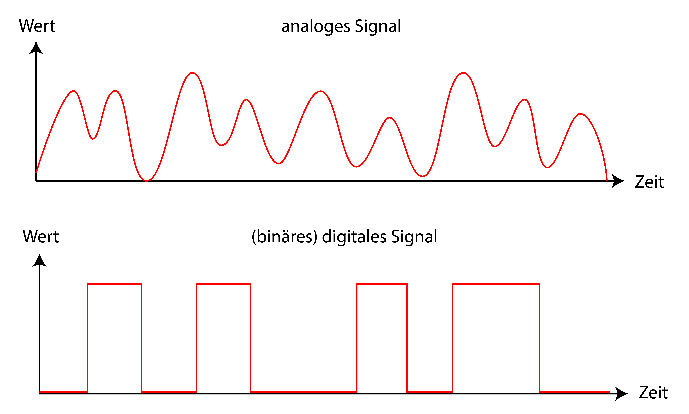

# Das Binärsystem
_In der Informatik ist alles 0 und 1._ Diese Aussage haben Sie vermutlich schon mal irgendwo gehört. Doch woher kommt das, und was bedeutet das genau?

Gemeint ist damit das sogenannte **Binärsystem**, das wir in der Informatik immer wieder antreffen. Im Allgemeinen ist ein _Binärsystem_ ein System aus jeweils **genau zwei** Zuständen, Möglichkeiten, Optionen, Werten, etc. Hier dazu einige Beispiele:

| Entweder...                                    | Oder...                                              |
|------------------------------------------------|------------------------------------------------------|
| wahr                                           | falsch                                               |
| `True`                                           | `False`                                               |
| ein                                            | aus                                                  |
| das Licht brennt  :mdi[alarm-light]                             | das Licht brennt nicht :mdi[alarm-light-off-outline]                              |
| es fliesst Strom :mdi[power-plug]                              | es fliesst kein Strom :mdi[power-plug-off-outline]                               |
| [blinzeln](../Schmetterling-und-Taucherglocke) | [nicht blinzeln](../Schmetterling-und-Taucherglocke) |
| $0$                                            | $1$                                                  |

:::definition[Binärsystem in der Informatik]
In der Informatik meinen wir mit dem _Binärsystem_ das System aus den Werten $0$ und $1$, mit dem wir jede Zahl, jeden Buchstaben, jedes Bild, jedes Programm und überhaupt jede Art von Information darstellen können.
:::

## Was heisst eigentlich "digital"?
Der Begriff _digital_ (engl.: _digit_, Ziffer) ist eng mit dem Binärsystem verwandt ist. Um ihn besser zu verstehen, widmen wir uns zuerst seinem Gegenteil: _analog_.

:::Hero

:::
:::Caption
Bild von [Mike Gattorna auf Pixabay](https://pixabay.com/de//?utm_source=link-attribution&utm_medium=referral&utm_campaign=image&utm_content=4994402)
:::

Stellen Sie sich einen herkömmlichen Kochherd vor: Wenn Sie eine Herdplatte einschalten wollen, dann drehen den Knopf für diese Platte so lange im Uhrzeigersinn, bis die gewünschte Stufe erreicht ist. Je weiter Sie die Platte "hochdrehen", desto mehr Strom fliesst durch die Heizschlange, und desto heisser wird die Platte. Wenn wir die Stromstärke als _Signal_ bezeichnen, dann verändern Sie mit dem Drehen des Knopfs also den Wert dieses Signals. Bei den meisten älteren Kochherden müssen Sie sich dabei aber nicht beispielsweise für genau die Stufe 6 oder die Stufe 7 entscheiden. Es sind nämlich auch alle Werte zwischen 6 und 7 möglich. Dieses Verhalten bezeichnen wir als **kontinuierlich** (_"durchgehend"_, _"stufenlos"_), und ein _kontinuierliches_ Signal nennen wir ein **analoges Signal**.

Bei einem moderneren Kochherd sieht das bereits etwas anders aus. Da haben Sie häufig nur noch eine Plus- und eine Minus-Taste, mit denen Sie die Hitze jeweils genau auf eine bestimmte Stufe einstellen können. Vielleicht haben Sie dort ebenfalls wieder die Stufen 6 und 7 - Werte zwischen 6 und 7 sind hier aber nicht möglich. Bei einem solchen Kochherd verändern Sie den Wert des Signals (Hitze) also nicht _stufenlos_ (_kontinuierlich_), sondern _abgestuft_. Eine solche abgestufte Veränderung nennen wir **diskret**, und ein _diskretes_ Signal nennen wir ein **digitales Signal**.

| Werte                                   | Art des Signals |
|-----------------------------------------|-----------------|
| kontinuierlich (durchgehend, stufenlos) | analog          |
| diskret (abgestuft)                     | digital         |

Bei diesem modernen Kochherd können wir davon ausgehen, dass er vermutlich über etwa 10 Stufen (0-9) verfügt. Nun wäre aber auch ein vereinfachter Kochherd denkbar, bei dem es genau zwei Optionen gibt: ein oder aus. Ein solches _digitales Signals_ können wir noch etwas spezifischer als **binäres Signal** bezeichnen.

## Wieso digitale Signale?
Denken Sie zurück an die Geschichte von [Jean-Dominique Bauby](../Schmetterling-und-Taucherglocke) und sein Blinzel-Diktierverfahren. Er verwendet nämlich ebenfalls ein binäres Signal! Die möglichen Werte sind _blinzeln_ oder _nicht blinzeln_. Solange er das Signal _nicht blinzeln_ "sendet", geht sein Gegenüber weiter durch das Alphabet. Sobald er das Signal _blinzeln_ sendet, bedeutet dies, dass er den zuletzt genannten Buchstaben diktieren wollte.

Stellen Sie sich nun vor, Bauby würde stattdessen ein _analoges_ Signal verwenden. Beispielsweise könnte er zwischen 26 Öffnungsgraden seines linken Augenlids unterscheiden, wobei jeder Öffnungsgrad für einen Buchstaben stehen würde. Mit der Geschwindigkeit des Öffnens und Schliessens könnte er vielleicht seinen Sprechrhythmus oder seine Sprachmelodie kommunizieren. Das mag in der Theorie zwar durchaus gut klingen - jedoch wäre es für sein Gegenüber kaum mehr möglich, diese Signale einigermassen fehlerfrei zu lesen.

Genau so verhält es sich auch mit     Die Werte $0$ und $1$ lassen sich in der physikalischen Welt sehr gut darstellen, wenn wir davon ausgehen, dass keine Werte dazwischen möglich sind.

---
