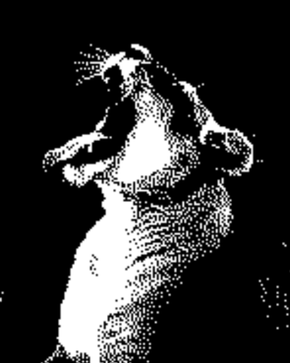

import Solution from "@tdev-components/documents/Solution";
import TaskState from "@tdev-components/documents/TaskState";
import QuillV2 from "@tdev-components/documents/QuillV2";

# Graustufen

Sie haben gelernt, wie man Rastergrafiken aus schwarzen und weissen Bildpunkten zusammensetzt und mit Zahlen beschreiben kann. Solche Bilder wirken sehr grob, wie das obige Bild zeigt. Wie wäre es, wenn wir in unseren Bildern auch Grautöne (also Werte zwischen schwarz und weiss) verwenden könten?

Das ist möglich, indem wir pro Bildpunkt nicht nur die Zahlen $0$ und $1$ verwenden, sondern Zahlen von $0$ bis $255$. So entspricht $0$ einem schwarzen Bildpunkt und $255$ einem weissen Bildpunkt. Die Werte dazwischen sind dann die unterschiedlichen Graustufen.

Graustufenbilder könne beispielsweise im Portable-Graymap-Format (PGM) gespeichert werden.

:::aufgabe[Graustufen]
<TaskState id="bebd3059-1d8b-419f-95ba-bd3cf422436c" />
Laden Sie die Datei [Loewe.pgm](https://erzbe-my.sharepoint.com/:u:/g/personal/silas_berger_gbsl_ch/Ef1tg80CCl1HlBBfBGZkHN8BkKE8LadYZoEcyN1H-SaohA?e=S21GaN) herunter. Sie enthält das obige Bild als Graustufenbild. 

Öffnen Sie die Datei wieder im Text Editor und kopieren Sie die Daten in den [PBM Viewer](https://www.kylepaulsen.com/stuff/NetpbmViewer/).

Das Graustufenbild besteht aus genau gleich vielen Bildpunkten, wie das obige Bild, aber der Qualitätsunterschied ist beträchtlich.

Schauen Sie sich die Datei nun auch Text Editor genau an und vergleichen Sie den Inhalt demjenigen der Datei `Loewe.pbm` aus der vorherigen Aufgabe.

Schauen Sie sich die Zahl auf der dritten Zeile an (die gemäss den Regeln des PBM-Formats übrigens optional ist). Spielen Sie mit dieser Zahl herum, bis sie herausfinden, was sie macht. Ändern Sie sie beispielsweise mal zu 20, mal zu 1000, etc.

Was verändert sich? Welche Information könnte hinter dieser Zahl stecken?

<QuillV2 id="77e1f920-1687-46fb-b572-5c20d2ef0b78" />

<Solution id="271f1257-598d-45f5-a427-722bfd14da83">
Diese Zahl definiert den Maximalwert für die einzelnen Bildpunkte. 
 
Wenn sie auf `255` gesetzt ist, dann wird ein Pixelwert von `255` als komplett weiss interpretiert. Wird sie z.B. auf `20` gesetzt, dann ist `255` immer noch komplett weiss – aber auch `20` ist bereits komplett weiss. Wird die Zahl auf `1000` gesetzt, dann ist `255` nur noch rund $25%$ weiss (also ein dunkles grau).
</Solution>
:::

---