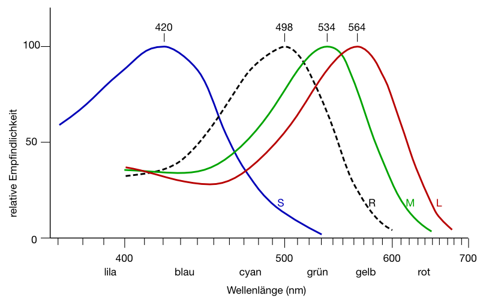
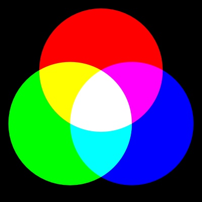
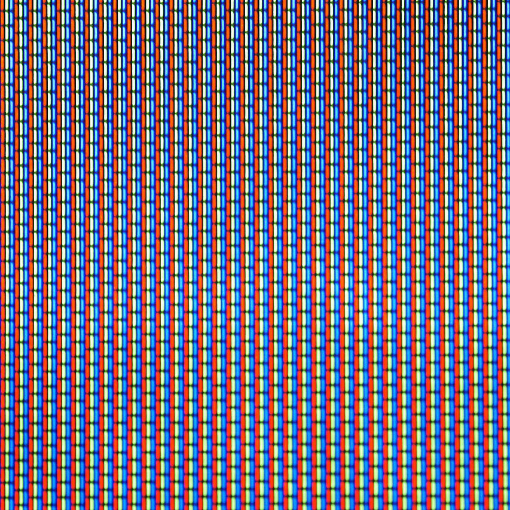

import Solution from "@tdev-components/documents/Solution";
import TaskState from "@tdev-components/documents/TaskState";
import String from "@tdev-components/documents/String";
import QuillV2 from "@tdev-components/documents/QuillV2";
import ColorPicker from '@radial-color-picker/react-color-picker';

export const ColorBoxes = () => {

    const colorBoxStyle = {
        display: "flex",
        justifyContent: 'center',
        alignItems: 'center',
        fontSize: '1.5em',
        
        height: "100%"
    };

    return (
        

            
Farbe 1

            
Farbe 2

            
Farbe 3

        

    );
};

# Farben
Für die digitale Verarbeitung müssen Farben in Zahlen umgewandelt werden. Das geschieht, indem die Farben in verschiedene Komponenten, sogenannte **Farbkanäle** aufgeteilt werden. Pro Pixel kann so die Intensität je Farbkanal als Zahl bestimmt werden.

Die zwei wichtigsten Ansätze, wie diese Aufteilung in verschiedene Kanäle erfolgt, werden unten vorgestellt.

## RGB-Farbmodell
Das **RGB-Farbmodell** basiert auf der Funktionsweise des menschlichen Auges. Dieses nimmt Farben mit Hilfe von drei Arten von sogenannten **Zäpfchen** wahr, die für Licht unterschiedlicher Wellenlängen empfindlich sind. So werden vom Menschen die Grundfarben Rot, Grün und Blau wahrgenommen.

Diese Eigenschaft des Auges wird bei der **additiven Farbdarstellung** ausgenutzt, indem sich überlagernde Lichtquellen in den drei Grundfarben Rot, Grün und Blau verwendet werden. Durch die Regulierung der Helligkeit der einzelnen Lichtquellen können sämtliche Farben erzeugt werden.

Dieses Farbmodell kommt überall dort zum Einsatz, wo Licht verwendet wird, um ein Bild zu erzeugen, insbesondere bei Bildschirmen und Videoprojektoren («Beamer»). Die Farben auf einem Bildschirm werden erzeugt, indem drei nahe beieinanderliegende Leuchtdioden in den Farben Rot, Grün und Blau in unterschiedlicher Helligkeit leuchten. Ein solches Trio von Leuchtdioden wird Pixel genannt.

:::cards

::br

:::

Umgekehrt kann man bei einem Bild die Rot-, Grün- und Blauanteile jedes Bildpunkts bestimmen. Man sagt, dass man das Bild in Rot-, Grün- und Blaukanal aufteilt:

Im entsprechenden RGB-Farbsystem wird eine Farbe definiert, indem die Helligkeit der Rot-, Grün- und Blauanteils durch eine Zahl zwischen $0$ und $255$ ausgedrückt wird.

Um eine Farbe binär darzustellen, werden die binären Darstellungen der Zahlen für Rot, Grün und Blau nacheinander aufgeschrieben. So hat beispielsweise die Farbe mit den RGB-Werten $255$, $220$, $150$ und die binäre Darstellung `11111111 11011100 10010110`.

## RGBA-Farbmodell
Für das **RGBA-Farbmodell** wird das RBG-Farbmodell um einen Kanal erweitert. Dieser heisst **Alphakanal** und drückt aus, wie stark die Deckkraft der Farbe ist. Ein Wert von $0$ bedeutet gar keine Deckkraft und somit volle Transparenz ein maximaler Wert bedeutet maximale Deckkraft und somit keine Transparenz.

## CMYK-Farbmodell
Das CMYK-Farbmodell basiert auf der Weise, wie Gegenstände farbig erscheinen. Ein Gegenstand wird üblicherweise mit weissem Licht, also Licht verschiedener Wellenlängen (Rot, Grün und Blau) angestrahlt. Beispielsweise erscheint ein gelber Gegenstand deshalb in dieser Farbe, weil er blaues Licht **absorbiert** und rotes und grünes Licht **reflektiert**.

Bei der **subtraktiven Farbdarstellung** werden auf weissem Material die drei Grundfarben Cyan, Magenta (Fuchsia) und Yellow (Gelb) verwendet, welche rotes, grünes bzw. blaues Licht absorbieren. Zusätzlich wird schwarze Farbe (Key-Kanal) verwendet, welche alles Licht absorbiert.

Dieses Farbmodell kommt beim Drucken zum Einsatz.

## Farbtiefe
Die Anzahl Bits oder Bytes, welche **insgesamt** für die Speicherung einer Farbe verwendet werden, wird **Farbtiefe** genannt. Damit wird festgelegt, wie viele unterschiedliche Abstufungen pro Farbkanal dargestellt werden können. Beim **RGB-Farbmodell** wird üblicherweise eine Farbtiefe von **3 Byte** oder **24 Bit** verwendet. Dies ergibt pro Farbkanal acht Bit, also ein Byte. Somit können $256 \cdot 256 \cdot 256 \approx 16.7 \cdot 10^6$ unterschiedliche Farben dargestellt werden.

| Farbmodell | Farbtiefe | Bytes für $n$ Pixel |
| - | - | - |
| RGB (True Colour) | 3 Byte | $n \cdot 3$ |
| CMYK | 4 Byte | $n \cdot 4$ |
| Graustufen | 1 Byte | $n$ |
| Schwarz-weiss | 1 Bit | $\dfrac{n}{8}$ |

## Aufgaben
:::aufgabe[Farben mischen]
<TaskState id="d6beafee-fd6e-487a-9c7a-9a98d888907a" />
Versuchen Sie, auf [dieser Seite](https://www.w3schools.com/colors/colors_rgb.asp) die folgenden Farben durch verschieben der Rot-, Grün- und Blauanteile (mit der Maus in die Balken klicken und schieben) nachzubauen:

<ColorBoxes />

Tragen Sie Ihre Ergebnisse (mit Dezimalzahlen, z.B. `R = 15, G = 190, B = 41`), hier ein.

<String id="9c921ae4-f356-4184-a23c-70c1478c37b0" label="Farbe 1" placeholder="Werte für R, G und B" />
<String id="55c4e346-0366-45ae-bb50-12c2f92c3fa8" label="Farbe 2" placeholder="Werte für R, G und B" />
<String id="8e62d812-515d-4810-b5b9-f5228d6b607e" label="Farbe 3" placeholder="Werte für R, G und B" />

<Solution id="26f44941-0dc0-411e-89d0-918dc7556f97">
1. R = 210, G = 130, B = 1
2. R = 32, G = 209, B = 34
3. R = 62, G = 16, B = 212
</Solution>
:::

:::aufgabe[Wissensfragen]
<TaskState id="aa60cfc3-72cc-49cb-8f10-18fcdbd90624" />
Beantworten Sie folgende Fragen unten im Textfeld:
1. Welche Grundfarben verwendet das additive Farbmodell?
2. Wo kommt das additive Farbdarmodell zur Anwendung?
3. Welche Grundfarben verwendet das subtraktive Farbmodell?
4. Wo kommt das subtraktive Farbmodell zur Anwendung?

<QuillV2 id="eb0cb4b6-7fa4-4032-a874-7144c0eac8d2" />

<Solution id="3f02b131-ec67-4368-810c-8b484877f155">
1. Rot, Grün, Blau (RGB).
2. Überall, wo ein farbiges Bild durch Lichtquellen erzeugt wird. (Bildschirm, Beamer, etc.).
3. Cyan, Magenta, Gelb (yellow), Schwarz (key) (CMYK).
4. Überall dort, wo ein farbiges Bild durch Mischen und Auftragen von Farbpigmenten auf einen weissen Hintergrund (z.B. Papier) hergestellt werden (namentlich, beim Drucken).
</Solution>
:::

:::aufgabe[Farbige Rastergrafik]
<TaskState id="0c484352-f7c6-4a62-8dec-cb21c36ee51f" />
Wir brauchen pro Pixel also nicht mehr nur einen Wert zwischen $0$ und $255$, sondern drei davon. Diese drei Werte enthalten die Helligkeit für die einzelnen Farbkanäle Rot, Grün und Blau.

Farbige Rastergrafiken können zum Beiepiel mit dem Portable Pixel Format (PPM) gespeichert werden.

Laden Sie die Datei [Loewe.ppm](https://erzbe-my.sharepoint.com/:u:/g/personal/silas_berger_gbsl_ch/EXTTg0L_9-xDoZwYKUDSzHcBIzoABVMls3ZimxGloo8UxQ?e=ZlE8W0) herunter, öffnen Sie sie im Text Editor und kopieren Sie die Daten in den [https://www.kylepaulsen.com/stuff/NetpbmViewer/](PBM Viewer).

Vergleichen Sie den Inhalt mit der Datei aus der Aufgabe mit dem Graustufenbild (`Loewe.pgm`). Woran erkennt man, dass es sich jetzt um eine farbige Rastergrafik handelt? 
<QuillV2 id="79817758-0e08-4a01-9f4b-c37d08165b1c" />

<Solution id="6c503fb2-b421-41e9-87dc-2dda7c5aa109">
In der ersten Zeile steht P3. Das bedeutet, dass es sich um eine farbige Rastergrafik handelt.
</Solution>
:::

:::aufgabe[Kanäle isolieren]
<TaskState id="15e0cfae-6614-4d9c-8db4-e87e75395fe7" />
Wenn man in der Datei `Loewe.ppm` für jeden Bildpunkt den zweiten und dritten Wert auf 0 setzt, sollte man ein Bild erhalten, bei dem nur der Rotkanal dargestellt wird. Laden Sie die Datei [Loewe rot.ppm](https://erzbe-my.sharepoint.com/:u:/g/personal/silas_berger_gbsl_ch/EdPIcPkCQcRGmatVQC9RaHgBEwilmEXqDlptmvvonvwK5w?e=0HhpGg) herunter und überprüfen Sie, ob diese These stimmt, indem Sie die Datei einerseits mit dem Editor öffnen und andererseits mit dem PBM Viewer anzeigen lassen.

Falls Sie auch noch die anderen Farbkanäle überprüfen möchten, hier sind die entsprechenden Dateien: [Loewe grün.ppm](https://erzbe-my.sharepoint.com/:u:/g/personal/silas_berger_gbsl_ch/Ecolx0SlgHVArQq68zUnSS4BwhD5LTur0vdQMgodVGwrPA?e=cq55us), [Loewe blau.ppm](https://erzbe-my.sharepoint.com/:u:/g/personal/silas_berger_gbsl_ch/EX1zrY7tWuRLnDwmJ_U4aT8BqwZ7dkdtdREf5Z-nS5YqkQ?e=v98cdA).
:::

---