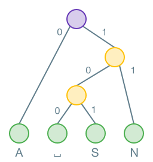
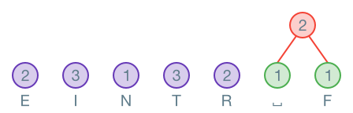
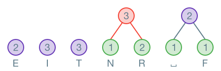
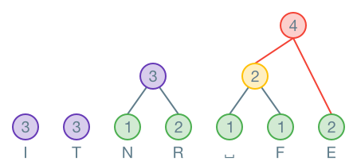
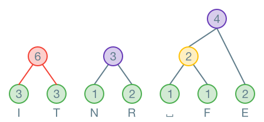
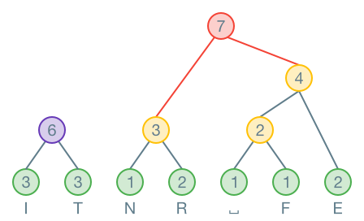
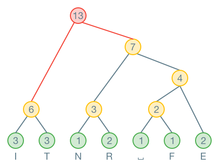
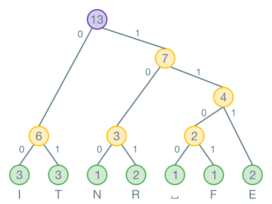
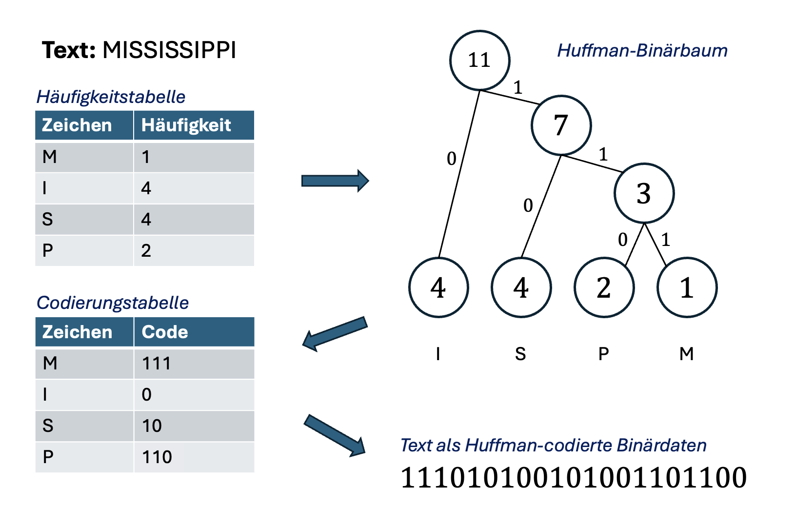
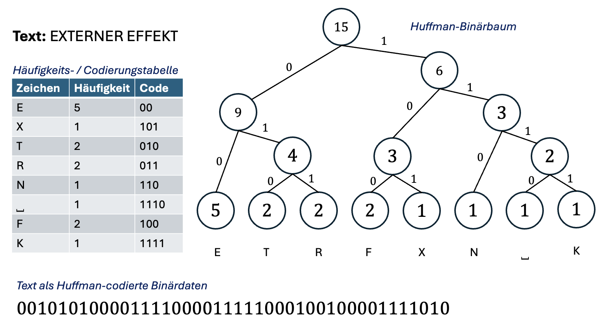

export const styles = {
    startNode: {
        display: 'inline-block',
        backgroundColor: '#d9cfed',
        borderColor: '#d9cfed',
        borderRadius: '1em',
        padding: '0 0.5em'
    },
    intermediateNode: {
        display: 'inline-block',
        backgroundColor: '#ffefcc',
        borderColor: '#ffefcc',
        borderRadius: '1em',
        padding: '0 0.5em'
    },
    leafNode: {
        display: 'inline-block',
        backgroundColor: '#d5ebd4',
        borderColor: '#d5ebd4',
        borderRadius: '1em',
        padding: '0 0.5em'
    },
    newNode: {
        display: 'inline-block',
        backgroundColor: '#fed2cf',
        borderColor: '#f64c3e',
        borderRadius: '1em',
        padding: '0 0.5em'
    }
};

# Huffman-Codierung

David Huffman hat 1952 ein Verfahren entwickelt, mit welchem Zeichen platzsparender codiert werden können. Seine Idee ist, dass Zeichen, welche häufig im Text vorkommen, einen kürzeren Code erhalten, als Zeichen, welche selten im Text vorkommen. Damit unterscheidet sich das Verfahren z.B. von der ASCII-Codierung, bei der alle Zeichen gleich viel Speicherplatz brauchen.

:::insight[Alltagsbezug] Die Huffman-Codierung und ähnliche Verfahren werden für das Komprimieren von Dateiformaten wie DOCX, JPG oder MP3 eingesetzt.[^1] :::

## Binärbaum

Ein Binärbaum ist eine Struktur mit **genau einem** <span style={styles.startNode}>Startknoten</span>, **mindestens einem** <span style={styles.leafNode}>Blattknoten</span> und **beliebig vielen** <span style={styles.intermediateNode}>Zwischenknoten</span>.



Hier handelt es sich um einen ganz bestimmten Binärbaum: nämlich um einen **Huffman-Binärbaum**.

Um eine binäre Ziffernfolge mit diesem Baum zu decodieren, startet man beim <span style={styles.startNode}>Startknoten</span>. Von diesem aus geht es entweder nach links oder rechts unten weiter: Steht in der binären Ziffernfolge eine $0$, geht man nach links, bei einer $1$ geht man nach rechts. Wenn man einen <span style={styles.leafNode}>Blattknoten</span> (also einen Knoten mit einem Buchstaben) erreicht hat, hat man ein Zeichen decodiert und startet für das nächste Zeichen wieder beim <span style={styles.startNode}>Startknoten</span>.

Nehmen wir als Beispiel die folgenden Daten:

```
0111101011000110110101
```

Die erste $0$ führt uns vom Startknoten direkt zum Buchstaben `A`.

```
0|111101011000110110101 → A
```

Anschliessend folgt eine $1$. Wir starten wieder beim Startknoten und kommen zum oberen Zwischeknoten. Es folgt nochmal eine $1$, womit wir beim Buchstaben `N` landen.

```
011|1101011000110110101 → AN
```

:::aufgabe[Beispiel fertigstellen]

<TaskState id="8c074f14-73d1-47fc-b553-13f5fea602dd" />
Fahren Sie nach demselben Prinzip weiter, bis Sie die gesamte binäre Zeichenfolge abgearbeitet und so den Text
decodiert haben.

Geben Sie den decodierten Text hier ein (alles in Grossbuchstaben) und überprüfen Sie Ihre Antwort.

<String id="4be3bb55-b5a4-4ca9-92c1-c29ca14d1199" solution="ANNAS ANANAS" />
:::

## Erstellen eines Huffman-Baums

Der obige Huffman-Binärbaum ist natürlich nicht allgemeingültig. Für jeden Text, den wir komprimieren wollen, erstellen wir einen **individuellen Huffman-Baum**. Die damit codierten Daten lassen sich demnach auch **nur mit genau diesem Baum wieder decodieren**.

Wie der Huffman-Algorithmus funktioniert, soll am Beispiel der Codierung des Texts `EINTRITT FREI` gezeigt werden.

Zuerst zählt man, wie oft jedes Zeichen im Text vorkommt und erstellt eine Häufigkeitstabelle.

| Zeichen | Häufigkeit |
| ------- | ---------- |
| E       | 2          |
| I       | 3          |
| N       | 1          |
| T       | 3          |
| R       | 2          |
| ␣       | 1          |
| F       | 1          |

Nun geht es darum, einen Binärbaum zu erstellen. Dazu wird zunächst für jeden Buchstaben ein Knoten gebildet. Die Häufigkeit steht im Knoten, der Buchstaben darunter:


Nun werden die **zwei Knoten mit den kleinsten Häufigkeiten** an einen <span style={styles.newNode}>neuen Knoten</span> angehängt. Der neue Knoten enthält die **Summe der Häufigkeiten** der ursprünglichen Knoten:



Dies wird wiederholt, bis alle Knoten miteinander verbunden sind. **Wenn zwei Knoten die gleiche Häufigkeit haben, spielt es keine Rolle, welcher gewählt wird.** Im nächsten Schritt wird der kleinste Knoten `N` mit `R` zusammengefasst. Es könnten aber auch `N` und `E` oder `N` und der neu erstellte Knoten zusammengefasst werden. Die Lösung ist somit **nicht eindeutig**: Es gibt mehrere korrekte Lösungen!



Wichtig ist, dass **immer die kleinsten Knoten zusammengefasst** werden. Hier werden die zwei Knoten mit Häufigkeit $2$ zusammengefasst:









Wenn der Baum fertig ist, werden alle Äste, welche nach links zeigen, mit einer $0$ markiert. Alle die nach rechts zeigen, werden mit einer $1$ markiert.



Nun kann eine **Codierungstabelle** erstellt werden, indem der Code für jedes Zeichen vom Baum abgelesen wird:

| Zeichen | Code |
| ------- | ---- |
| I       | 00   |
| T       | 01   |
| N       | 100  |
| R       | 101  |
| E       | 111  |
| ⎵       | 1100 |
| F       | 1101 |

Mit dieser Codierungstabelle können wir nun – genau wie z.B. mit der ASCII-Tabelle – den Text binär codieren.

Das Resultat: `EINTRITT FREI` → `11100100011010001011100110110111100`.

:::key[Elemente einer Huffman-Codierung] Eine abgeschlossene Huffman-Codierung besteht also aus folgenden Elementen:

- Häufigkeitstabelle
- Huffman-Baum
- Codierungstabelle
- Huffman-codierter Text (Binärdaten) :::

:::aufgabe[Kompressionsverhältnis]

<TaskState id="9c73836c-4f0c-4251-9ca4-d13368da86a7" />

Wie effizient wurde hier komprimiert?

Zählen Sie zuerst die Anzahl Bits in den Huffman-codierten Binärdaten. Überlegen Sie anschliessend, wie viele Bits wir für den Text `EINTRITT FREI` benötigen, wenn wir ihn ganz normal mit 8-Bit ASCII codieren.

Rechnen Sie anschliessend

$$ C = 100 \cdot (1 - \frac{\text{Anz. Bits mit Huffman}}{\text{Anz. Bits mit ASCII}})$$

um das Kompressionsverhältnis $C$ dieser Huffman-Codierung in $\%$ des ASCII-codierten Vergleichswerts zu erhalten.

Geben Sie das Resultat hier ein (inkl. $\%$-Zeichen, gerundet auf eine Ganzzahl):

<String label="Kompressionsverhältnis" id="b60fc310-2524-4420-85f1-e8105820d6f8" solution="66%" />

So viel $\%$ an Speicherplatz sparen wir also ein, wenn wir den Text mit Huffman statt mit 8-Bit ASCII codieren. :::

## Übungen

:::aufgabe[Texte codieren]

<TaskState id="7af279ca-7df1-4b26-8e2e-6ed59642d4db" />
Gegeben sind folgende Texte: 1. `MISSISSIPPI` 2. `EXTERNER EFFEKT`

Gehen Sie für beide Texte **einzeln** je so vor:

1. Erstellen Sie eine Häufigkeitstabelle.
2. Erstellen Sie den Huffman-Baum.
3. Erstellen Sie daraus die Codierungstabelle.
4. Codieren Sie den Text mit der Codierungstabelle.

Bearbeiten Sie die beiden Texte als zwei separate Teilaufgaben. Arbeiten Sie auf Papier. Vergleichen Sie Ihre Resultate am Schluss mit der Musterlösung.

<Solution id="c2d542fe-1257-4aad-9d23-2b81c0300472">
    **Achtung:** Der Huffman-Algorithmus produziert kein eindeutiges Ergebnis! Es kann also mehrere korrekte
    Huffman-Bäume, und somit auch mehrere korrekte Codierungstabellen und Binärdaten geben. Falls Sie unsicher
    sind, lassen Sie Ihre Lösung gerne von der Lehrperson prüfen.
    <br />
     
</Solution>
:::

:::aufgabe[Verlustfrei oder verlustbehaftet?]

<TaskState id="48123a14-877f-42f8-b18d-294e6febf549" />
Handelt es sich bei Huffman um eine verlust**freie** oder eine verlust**behaftete** Kompression? Begründen
Sie.

<QuillV2 id="5e2b4edd-31b9-488e-9502-b0b124b41654" />

<Solution id="904ef7ec-ef8f-457d-b1be-d345a481a853">
    Es handelt sich um eine verlust**freie** Kompression. Mithilfe der Codierungstabelle können wir aus den
    Huffman-codierten Binärdaten den ursprünglichen Text vollständig wiederherstellen.
    <br />
    Text eignet sich allgemein eher nicht für verlust**behaftete** Kompression. Wenn bei einem Bild die
    Qualität etwas reduziert wird, ist das nicht so schlimm. Wenn bei einem Text aber einzelne Zeichen
    weggelassen werden, ist das meistens problematisch. Der Text bleibt zwar noch relativ lange lesbar (vor
    allem dann, wenn wir eher die häufigeren Buchstaben entfernen), aber als Leser:innen tolerieren wir dies
    kaum. Eine Ausnahme sind vielleicht Abkürzungen und Kurzwörter («z.B.», «ehem.», «GBSL», «Azubi»).
</Solution>
:::

:::aufgabe[⭐️ Exkurs: Bezug zu UTF-8]

<TaskState id="7cf810a9-a240-49d6-836b-42ec2f97857b" />
«Im Gegensatz zu ASCII ist UTF-8 ebenfalls eine Form der Kompression, weil dabei nicht jedes Zeichen gleich
viele Bytes braucht.»

Diskutieren Sie diese These. Stimmen Sie Ihr zu? Wieso (nicht)?

<QuillV2 id="f33b9e3a-2270-45c2-97e1-643177fb5d19" />

<Solution id="0383acf0-54fd-40f7-b754-51908a0b1cad">
    UTF-8 ist ein platzsparendes Codierungsverfahren für die Zeichen der Unicode-Tabelle. Die weit
    verbreiteten ASCII-kompatiblen Zeichen brauchen dabei nur je 1 Byte, während andere Zeichen wie etwa
    Emojis mit mehreren Bytes pro Zeichen codiert werden.
    <br />
    Hier von einer Kompression zu sprechen, scheint aber dennoch problematisch. UTF-8 orientiert sich
    schliesslich nicht primär an der Häufigkeit eines Zeichens. Je weiter hinten ein Zeichen auf der
    Unicode-Tabelle steht (sprich, je höher seine Codepoint-Zahl), desto mehr Bytes benötigt dessen
    Unicode-Codierung.
    <br />
    Die Unicode-Tabelle wird laufend ergänzt, darf daneben aber niemals verändert (z.B. neu sortiert) werden,
    weil bestehende Texte sonst plötzlich falsch decodiert würden. Es könnte nun sein, dass ein neu
    eingeführtes Zeichen plötzlich an Beliebtheit gewinnt und deshalb sehr oft verwendet wird. Das ändert aber
    nichts daran, dass es weit hinten in der Tabelle steht (Codepoint $> 150'000$) und seine UTF-8 Codierung
    somit mehrere Bytes ($\ge 4$) benötigt.
    <br />
    Was wäre zudem mit einem Text wie `👋⏰🦄🍫`? UTF-8 kann nichts dagegen tun, dass sämtliche dieser Zeichen
    mit je 4 Bytes codiert werden und der gesamte Text somit 16 Bytes benötigt. Huffman könnte hier hingegen
    auf 2 Bits (!) pro Zeichen und somit 1 Byte für den gesamten Text komprimieren.
</Solution>
:::

[^1]: Wikipedia: [Huffman coding](https://en.wikipedia.org/wiki/Huffman_coding#Applications).
