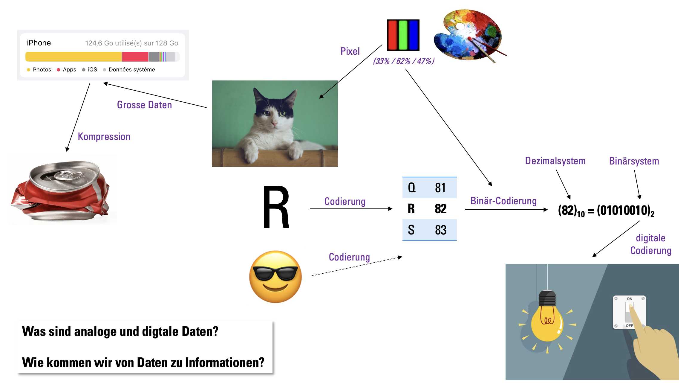

import DefinitionList from '@tdev-components/DefinitionList';
import CmsText from '@tdev-components/documents/CmsText';
import WithCmsText from '@tdev-components/documents/CmsText/WithCmsText';

# Information & Daten

Was sind eigentlich Daten? Und wie unterscheiden sie sich von Information? Wie sieht ein Buchstabe, ein Bild oder ein Emoji aus Sicht eines Computers aus? Mit diesen und vielen weiteren Fragen befassen wir uns in diesem Kapitel.

## Unterrichtsfolien

Die Unterrichtsfolien finden Sie [hier](https://erzbe-my.sharepoint.com/:f:/g/personal/silas_berger_gbsl_ch/EgygoURAg8lKg8ju7_HEb8UBWr_cusFu2FrH0iYn9F2p5Q?e=rgHSVM).

---
