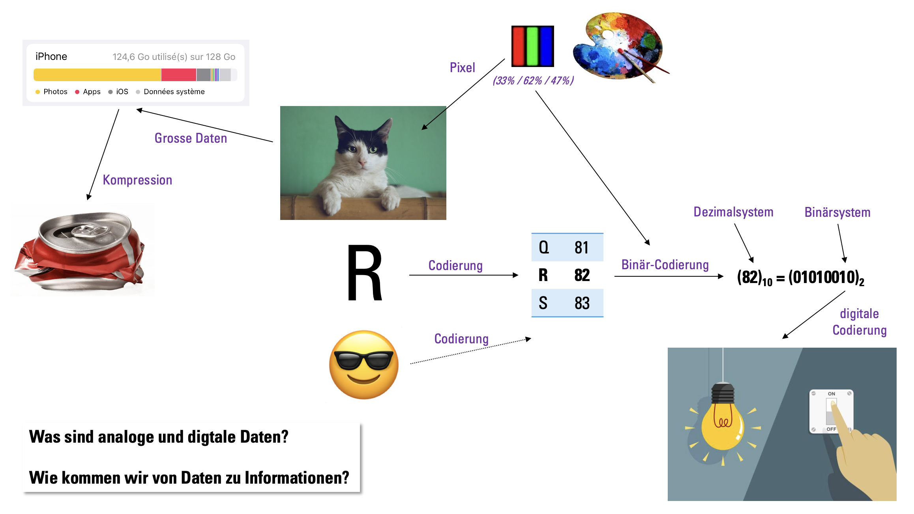

# Information & Daten
Was sind eigentlich Daten? Und wie unterscheiden sie sich von Information? Wie sieht ein Buchstabe, ein Bild oder
ein Emoji aus Sicht eines Computers aus? Mit diesen und vielen weiteren Fragen befassen wir uns in diesem Kapitel.

## Lernziele
Dauer
: 45 Minuten
Benotung
: Die Note zählt voll
Hilfsmittel
: Taschenrechner erlaubt

:::info[Prüfungsstoff]
- Sie können den Begriff _Stellenwertsystem_ erklären und zeigen, wie dieses am Beispiel des Binärsystems funktioniert.
- Sie können positive Ganzzahlen zwischen dem Dezimal-, Binär- und Hexadezimalsystem umrechnen.
- Sie können Zahlen im Binärsystem addieren.
- Sie können mit Einheiten und Einheitenvorsätze (Präfixe) von Datenmengen einschätzen und damit rechnen.
- Sie können den Unterschied zwischen _Informationen_ und _Daten_ erklären und erkennen.
- Sie können erklären, was man unter dem Begriff _Codierung_ versteht.
- Sie können verschiedene Codierungen für Text als digitale Daten wie (z.B. ASCII, Unicode) erklären.
- Sie können einen Text binär codieren und decodieren.
- Sie können erklären, was eine _Rastergrafik_ ist.
- Sie können erklären, wie man Farben codieren kann.
- Sie können eine schwarz-weisse Rastergrafik erstellen und binär codieren.
- Sie können die drei Formen des Formats _Portable Bitmap (PBM)_ P1-P3 beschreiben und anwenden.
- Sie können erklären, was eine _Vektorgrafik_ ist.
- Sie können einfache Vektorgrafiken (bestehend aus Rechtecken, Kreisen und Linien) codieren.
- Sie können den Unterschied zwischen verlustbehafteter und verlustfreier Kompression erklären, sowie Vor- und Nachteile nennen.
- Sie können das Prinzip der verlustbehafteten Kompression erklären und mindestens zwei Beispiele nennen und grob beschreiben.
- Sie können das Prinzip der verlustfreien Kompression erklären.
- Sie können mit einem gegebenen Huffman-Codebaum eine gegebene Bitfolge decodieren.
- Sie können einen gegebenen Text Huffman-codieren und dabei den dazugehörigen Huffman-Baum und die dazugehörige Codierungstabelle erstellen.
:::

---
