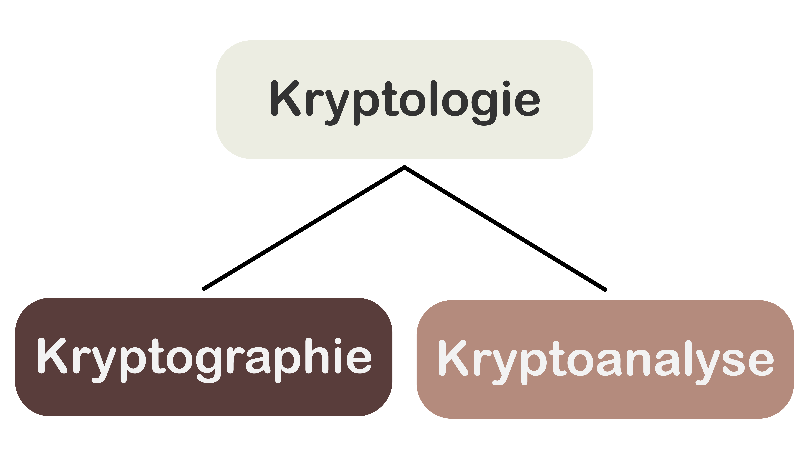
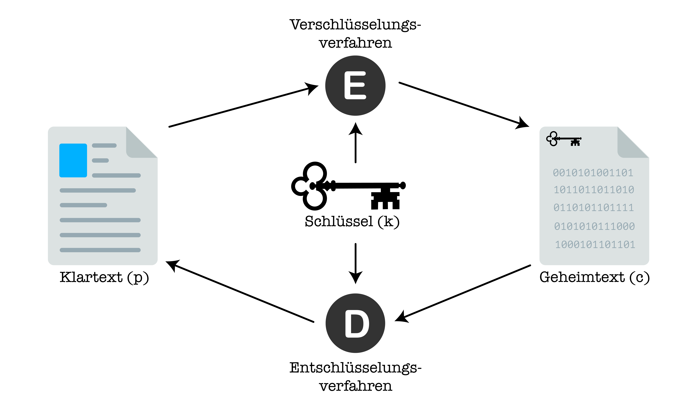

import TaskState from '@tdev-components/documents/TaskState';

# Grundbegriffe
## Kryptologie
Der Begriff **Kryptologie** setzt sich zusammen aus dem altgriechischen κρυπτός (also kryptós, _verborgen_) und λόγος (also lógos, _Lehre, Kunde_). Die Kryptologie ist also die _Lehre des Verborgenen_. Sie ist die Wissenschaft, die sich mit der Ver- und Entschlüsselung von Informationen (also mit Informationssicherheit) beschäftigt.

## Kryptographie und Kryptoanalyse
Die Kryptologie kann grob in zwei Bereiche unterteilt werden:
* die **Kryptographie** (γράφειν, also gráphein, was _schreiben_ bedeutet) und
* die **Kryptoanalyse**.

Während sich die _Kryptographie_ mit dem Finden von sicheren Verschlüsselungsverfahren beschäftigt, liegt der Fokus der _Kryptoanalyse_ auf dem "Brechen" oder "Knacken" solcher Verfahren.

## Die Begriffe der Kryptographie
In der Kryptologie bezeichnen wir eine _unverschlüsselte_ Nachricht als **Klartext** und notieren diesen Begriff oft abgekürzt mit $p$ (engl.: _plaintext_). Eine _verschlüsselte_ Nachricht bezeichnen wir als **Geheimtext** und notieren dies mit $c$ (engl.: _ciphertext_).

Um einen Klartext in einen Geheimtext umzuwandeln, benötigen wir einerseits einen **Schlüssel** ($k$, engl.: _key_) und andererseits einen Algorithmus, der den Klartext unter Verwendung des Schlüssels in Geheimtext umwandelt. Diesen Algorithmus bezeichnen wir als **Verschlüsselungsverfahren** oder **Verschlüsselungsalgorithmus**, abgekürzt $E$ (engl.: _encryption algorithm_). Damit wir eine verschlüsselte Nachricht aber auch wieder entschlüsseln können, brauchen wir zudem noch ein dazugehöriges **Entschlüsselungsverfahren**, resp. einen **Entschlüsselungsalgorithmus** ($D$, engl.: _decryption algorithm_). Ein Paar aus zwei solchen Algorithmen bezeichnen wir dann als eine **Chiffre**, wenn $D$ die unter Verwendung desselben Schlüssels $k$[^1] die Umkehroperation von $E$ ist.

| Symbol | Deutscher Begriff                                           | Englischer Begriff     | Bedeutung                                                                                                                           |
|--------|-------------------------------------------------------------|------------------------|-------------------------------------------------------------------------------------------------------------------------------------|
| $p$    | **Klartext**                                                | _plaintext_            | unverschlüsselte Nachricht                                                                                                          |
| $c$    | **Geheimtext**                                              | _ciphertext_           | verschlüsselte Nachricht                                                                                                            |
| $k$    | **Schlüssel**                                               | _key_                  | Information, welche benötigt wird, um den Klartext zu ver-, bzw. den Geheimtext zu entschlüsseln                                    |
| $E$    | **Verschlüsselungsverfahren (Verschlüsselungsalgorithmus)** | _encryption algorithm_ | Ein Algorithmus, der einen Klartext unter Verwendung eines Schlüssels in Geheimtext umwandelt.                                      |
| $D$    | **Entschlüsselungsverfahren (Entschlüsselungsalgorithmus)** | _decryption algorithm_ | Ein Algorithmus, der einen Geheimtext unter Verwendung eines Schlüssels in Klartext umwandelt.                                      |
|        | **Chiffre**                                                 | _cipher_               | Ein Paar aus einem $E$ und einem $D$, bei dem $D$ die unter Verwendung desselben Schlüssels $k$[^1] die Umkehroperation von $E$ ist |

:::definition[Die Bestandteile einer Chiffre]
Formal können wir die Bestandteile einer Chiffre also wie folgt definieren:
* $E$ ist eine Funktion, sodass gilt: $E(p, k) = c$. Das Verschlüsselungsverfahren $E$ ist also eine Funktion, die aus einem Klartext $p$ und dem Schlüssel $k$ den dazugehörigen Geheimtext $c$ berechnet.
* $D$ ist eine Funktion, sodass gilt: $D(c, k) = p$. Das Entschlüsselungsverfahren $D$ ist also eine Funktion, die aus einem Geheimtext $c$ und dem Schlüssel $k$ den dazugehörigen Klartext $p$ berechnet.
:::

:::insight[Das Zusammenspiel der Bestandteile einer Chiffre]
Weil $E(p, k) = c$ gilt, können wir in $D(c, k) = p$ das $c$ mit $E(p, k)$ ersetzen und erhalten somit $D(E(p, k), k) = p$. Mit anderen Worten: Wenn wir einen Klartext $p$ unter Verwendung eines Schlüssels $k$ mit $E$ **ver**schlüsseln und das Ergebnis wieder unter Verwendung desselben Schlüssels $k$[^1] mit $D$ **ent**schlüsseln, dann erhalten wir am Ende wieder den ursprünglichen Klartext $p$.
:::

## Quiz
:::aufgabe[Testen Sie Ihr Wissen!]
<TaskState id="54109a75-6f16-49dd-8c95-7b5d19c1e08c" />
::learningapps[https://learningapps.org/phw2uc49a24]
:::

[^1]: Wenn wir uns später mit der _asymmetrischen Verschlüsselung_ befassen, werden wir sehen, dass wir mit einem "Schlüssel" manchmal auch ein _Schlüsselpaar_ (also zwei separate aber zusammengehörige Schlüssel) meinen.
