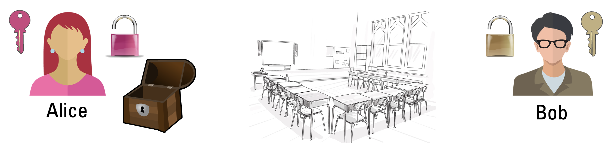

---
sidebar_custom_props:
  source:
    name: ofi.gbsl.website
    ref: 'https://ofi.gbsl.website/26e/Kryptologie/Asymmetrisch/key-exchange'
page_id: e3d2290e-6965-405a-b8f9-4fe8a3d9cc49
---

import Solution from "@tdev-components/documents/Solution";

# Schlüsselaustausch

## Ausgangslage
- Bob und Alice…
  - …haben je ein eigenes Schloss und einen dazu passenden Schlüssel (der Schlüssel für Bobs Schloss passt aber nicht zum Schloss von Alice, und umgekehrt).
  - …können sich nicht physisch treffen.
- Alice hat eine Box, die man mit 1-2 Schlössern verschliessen kann.
- Alice will Bob eine geheime Nachricht senden. Dabei gilt:
  - _geheim_ = in der Box eingeschlossen.
  - _versenden_ = durchs Klassenzimmer durchgeben.

## Übung
Überlgen Sie, wie Bob und Alice vorgehen müssen, um unter diesen Umständen eine geheime Nachricht austauschen können. Sie müssen dabei nicht unbedingt alles Material verwenden.

:::aufgabe[Lösung überlegen]
<TaskState id="97adcea6-0713-4b67-b9ee-a68f75bfd9c7" />
Überlegen Sie sich zu zweit eine Lösung für dieses Problem. Halten Sie Ihre Idee hier fest (jede:r für sich).

<QuillV2 id="4d057b7a-c000-4702-aa56-6bc8c6e6dc7d" />
:::

:::aufgabe[Nachbesprechung]
<TaskState id="d34c2010-8b21-4654-8ac3-5fd9ea494ec4" />
Machen Sie sich bei der Nachbesprechung dieser Übung hier Notizen. Hat Ihre Idee funktioniert? Was waren allenfalls ihre Nachteile? Welche anderen Ansätze haben Sie gehört, und was sind dort jeweils die Vor- und Nachteile?

<QuillV2 id="7d9c8e7e-c8aa-4023-a864-1b0a6f1a7216" />
:::

---
