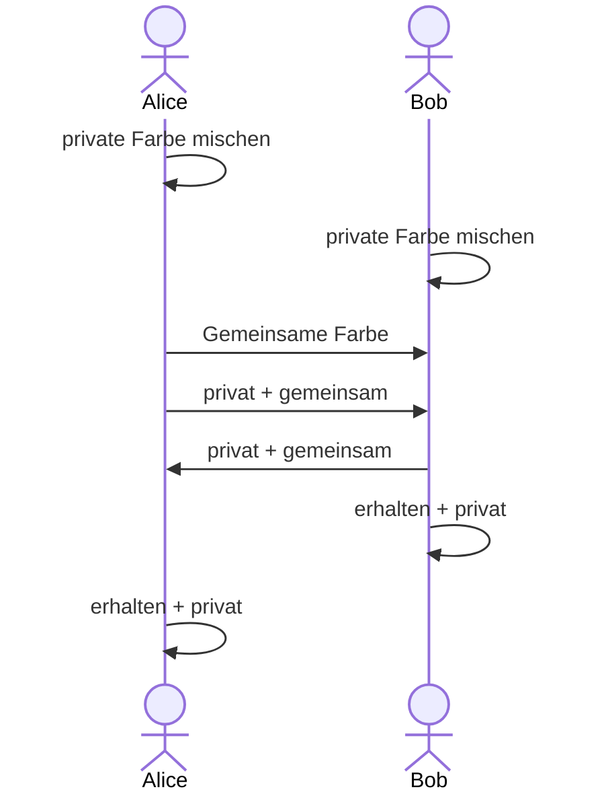

---
sidebar_custom_props:
    source:
        name: ofi.gbsl.website
        ref: 'https://ofi.gbsl.website/26e/Kryptologie/Asymmetrisch/secret-color'
page_id: 3079dc5e-ec4c-4a10-82a8-ad2c75281faa
---

import DefinitionList from '@tdev-components/DefinitionList';
import ColorExchange from '@tdev-components/visualization-tools/ColorExchange';

# Geheime Farbe

Alice und Bob arbeiten an einem neuen Kunstwerk, auf das die Öffentlichkeit gespannt wartet. Die beiden möchten dafür **eine** ganz besondere Farbe verwenden. Diese Farbe soll aber unbedingt bis zur Vernissage **geheim bleiben**. Alice und Bob wohnen weit auseinander und können sich nicht treffen, um die geheime Farbe gemeinsam herzustellen, sie können sich lediglich Farbkübel per Post zusenden.

## Alice und Bob

Sie haben eine Idee und gehen wie folgt vor:

  <DefinitionList>
    <dt>Private Farbe</dt>
    <dd>**Schritt 1**: Alice und Bob mischen sich je in einem Farbkübel eine persönliche, geheime Farbe, die sie niemandem mitteilen (private Farbe genannt).</dd>

    <dt>Öffentliche Farbe</dt>
    <dd>**Schritt 2** Alice wählt nun zusätzlich eine Farbe, die nicht geheim gehalten wird. Sie füllt zwei grosse Farbkübel mit dieser Farbe, einen behält sie für sich selbst, den anderen schickt sie per Post an Bob (öffentliche Farbe genannt).</dd>

    <dt>Zwischenfarbe</dt>
    <dd>**Schritt 3**: Im nächsten Schritt mischen sich Alice und Bob je in einem leeren Farbkübel eine neue Farbe: Sie nehmen dazu genau dieselbe Menge der eigenen privaten Farbe und der gemeinsamen Farbe. Diese neue Farbe schicken sie sich wieder gegenseitig zu.</dd>

    <dt>Zielfarbe</dt>
    <dd>**Schritt 4**: Im letzten Schritt erzeugen Sie die Zielfarbe fürs Kunstwerk. Dazu nehmen sie zwei Einheiten der soeben erhaltenen Farbe und eine Einheit der privaten Farbe und erhalten die gemeinsame private Farbe, mit der sie die Teile des neuen Kunstwerks bemalen.</dd>

  </DefinitionList>

## Eve

Die neugierige Journalistin Eve möchte unbedingt wissen, was Alice und Bob aushecken, um noch vor der Vernissage einen exklusiven Zeitungsbericht zu veröffentlichen. Daher versucht sie, an die gemeinsame private Farbe zu gelangen. Sie überwacht die Post und füllt sich von jeder transportierten Farbe ein wenig in eigene Behälter ab.

## Ausprobieren

::::aufgabe[Geheime Farbe herausfinden]

<TaskState id="aa92e889-4064-4cb9-a7ff-244f40c0971d" />
Bestimmen Sie je eine Farbe für Alice und Bob und schauen Sie sich die Ergebnisse an.

<ColorExchange />

 
Wieso erhalten Alice und Bob schlussendlich dieselbe Farbe?

<QuillV2 id="e247b1be-ff28-4ed1-a997-8d5d0534dcc1" />

<Solution id="59e1d25e-34de-4d03-8a59-dbea32d03786">
    Bob und Alice beginnen je mit ihrer Geheimfarbe. Zudem gibt es eine öffentliche Farbe, die beide kennen.
     
    Alice kreiert anschliessend die Farbmischung "Alice + Öffentlich", und Bob kreiert "Bob + Öffentlich".
     
    Diese beiden Mischungen tauschen Sie dann über den öffentlichen Kanal aus (wieso das okay ist, ist die
    Frage der nächsten Aufgabe). Jetzt kann Alice aus ihrer Geheimfarbe und er Mischung "Bob + Öffentlich"
    ihre finale Mischung "Alice + Bob + Öffentlich" produzieren. Analog dazu produziert Bob seien finale
    Mischung "Bob + Alice + Öffentlich". Diese beiden Mischungen sind natürlich identisch.
</Solution>
::::

:::aufgabe[Wieso kennt Eve die geheime Farbe nicht?]

<TaskState id="def3cec1-d468-4ad1-85b2-efdbe939dd2b" />

Wieso kann Eve aus den verschickten Farben die geheime Farbe nicht herstellen?

<QuillV2 id="d07e338d-ece1-4234-bec8-d7a38701cc78" />

<Solution id="348ad1ee-f158-43c3-a83f-1b05bd7d2594">
    Eine Mischung aus zwei Farben lässt sich natürlich nicht einfach "entmischen". Im Prinzip ist es aber
    nicht völlig ausgeschlossen, dass Eve die Geheimfarben von Bob und Alice dennoch rekonstruieren könnte.
    Schliesslich kennt sie die öffentliche Farbe. Sie könnte die öffentliche Farbe also mit allen möglichen
    anderen Farben mischen, bis sie irgendwann eine der beiden Farbmischungen erhält. Allerdings gibt es sehr
    viele (theoretisch sogar unendlich viele) mögliche Farben. Dieser Prozess würde also enorm lange, oder
    sogar unendlich lange dauern.
</Solution>
:::

---
