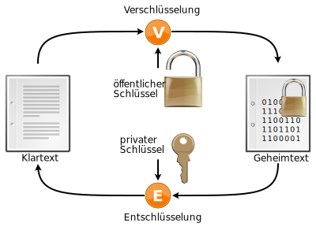
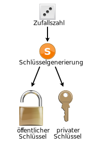
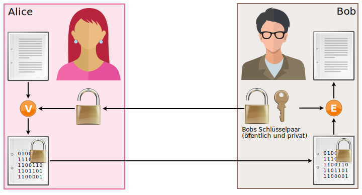
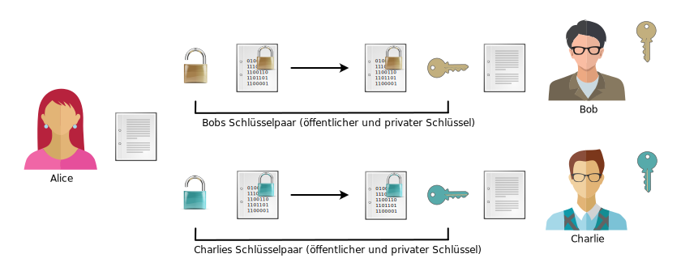

# Asymmetrische Verschlüsselung

Das Prinzip der asymmetrischen Verschlüsselung beruht also auf zwei verschiedenen Schlüsseln, dem sogenannten **Schlüsselpaar** (engl. key pair). Die beiden Schlüssel eines Schlüsselpaars nennt man **öffentlichen** und **privaten** Schlüssel (engl. public und private key).

Da für den Verschlüsselungsvorgang nicht derselbe Schlüssel verwendet wird wie für den Entschlüsselungsvorgang, spricht man von einem **asymmetrischen Verfahren**.

  

  

## Schlüsselpaar
Jede Person besitzt ein eigenes Schlüsselpaar, so auch Bob. Die beiden Schlüssel, die dieses Schlüsselpaar bilden, sind mathematisch verwandt. Der private Schlüssel lässt sich jedoch nicht in sinnvoller Zeit aus dem öffentlichen Schlüssel  berechnen.

Bobs öffentlicher Schlüssel entspricht also dem Bügelschloss aus unserem ersten Beispiel. Bobs privater Schlüssel ist der Schlüssel, der zum Bügelschloss passt. Das Schloss kann (in geöffneter Form natürlich) bei einer vertrauenswürdigen Stelle (Trent) deponiert werden, wo es von Alice abgeholt werden kann. Den Schlüssel behält Bob stets für sich.

## Verschlüsselung
In der folgenden Abbildung sieht man auf der linken Seite, dass Alice bei der Verschlüsselung den öffentlichen Schlüssel von Bob (und nicht den eigenen) verwendet. Dieser öffentliche Schlüssel enthält keine geheime Information und ist für alle Leute zugänglich (z.B. via eine vertrauenswürdige Stelle), somit können alle eine Nachricht für Bob verschlüsseln.

## Entschlüsselung
In derselben Abbildung ist zu sehen, dass Bob bei der Entschlüsselung seinen privaten Schlüssel verwenden muss. Somit ist sichergestellt, dass nur Bob die Nachricht entschlüsseln kann.

:::warning[Achtung]
Um Verwechslungen zu vermeiden, spricht man bei der **symmetrischen** Verschlüsselung vom **geheimen** Schlüssel (engl. secret key), während man bei **asymmetrischen** Verfahren vom **privaten** Schlüssel spricht und nicht vom _geheimen_ Schlüssel, weil jede involvierte Person ein eigenes Schlüsselpaar und somit einen eigenen privaten Schlüssel besitzt.
:::

:::aufgabe[Asymmetrische Verschlüsselung]
<TaskState id="24544131-88fa-48a0-ab37-a5ba41e3511c" />
1. Überlegen Sie sich, wie die Verschlüsselung funktioniert, wenn ein Dokument an verschiedene Leute versendet wird. Machen Sie sich dazu eine Skizze.
2. Welche Nachteile erkennen Sie?

<QuillV2 id="9f8ccbbb-b8ed-487d-b285-37fee03469c6" />

<Solution id="060a920e-fe2f-4e14-993e-0d7cdb86cb15">

Wir müssen das Dokument für jede Person einzeln verschlüsseln, da jede:r Empfänger:in ein eigenes Schlüsselpaar verwendet. Das erhöht den Rechenaufwand, zumal die asymmetrische Verschlüsselung ohnehin bereits deutlich rechenintensiver ist, als die symmetrische.
</Solution>
:::

---
