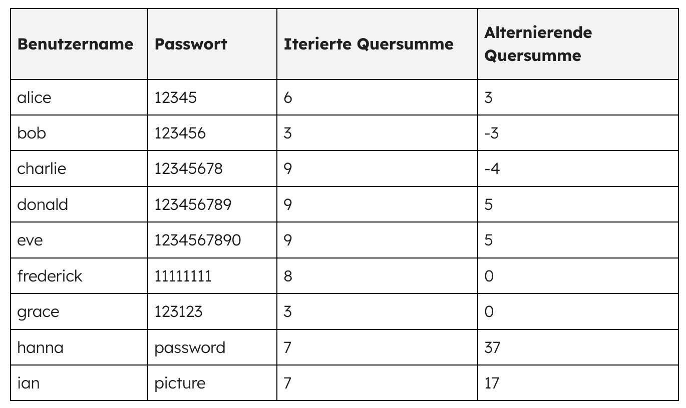
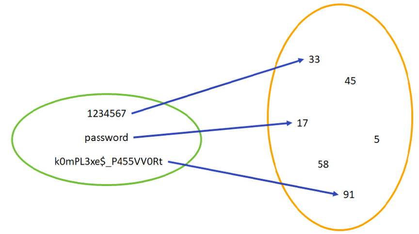

---
sidebar_custom_props:
  source:
    name: ofi.gbsl.website
    ref: 'https://ofi.gbsl.website/26e/Kryptologie/Hashfunktionen/save-passwords'
page_id: c5385473-277c-4bee-82b1-ed904a8e9873

---

import QuillV2 from '@tdev-components/documents/QuillV2';
import TaskState from '@tdev-components/documents/TaskState';

# Passwörter speichern
Passwörter sind wichtig, wir sollten sie beschützen. Doch dies gilt nicht nur für unsere eigenen Passwörter, auch Firmen sollten die Passwörter ihrer Kunden schützen.

## Passwörter speichern
Wie würden Sie die Passwörter Ihrer Kunden speichern, falls Sie einen Webshop erstellen würden? Natürlich nicht im Klartext, oder?

Dass die Passwörter «verschlüsselt» werden müssen, scheint logisch. Also sollten die Passwörter wohl auf dem Firmenserver verschlüsselt werden, damit sie nicht ausgelesen werden können – weder von Hackern noch von neugierigen Mitarbeitenden.

Doch gerade dies ist ein grosses Problem: Der Firmenserver soll die Kunden anhand ihres Passwortes authentifizieren können, die Mitarbeitenden dürfen allerdings keinen Zugriff auf die Kundenpasswörter haben. Alle bisherigen Verschlüsselungsverfahren arbeiten mit einem Schlüssel (oder mit mehreren). Wer den richtigen Schlüssel kennt, kann die Passwörter entschlüsseln. Wird der Schlüssel auf den Firmenservern gespeichert, so haben zumindest gewisse Mitarbeitende Zugriff.

Hier kommen wir momentan nicht weiter. Wir tasten uns von einer anderen Seite an die Lösung heran.

## Prüfsumme
Wir können jedoch – anstelle eines Passwortes – eine Prüfsumme speichern:

  | Benutzername | Passwort   | Iterierte Quersumme | Alternierende Quersumme |
  |:-------------|:-----------|:--------------------|:------------------------|
  | alice        | 12345      | 6                   | 3                       |
  | bob          | 123456     |                     |                         |
  | charlie      | 12345678   |                     |                         |
  | donald       | 123456789  |                     |                         |
  | eve          | 1234567890 |                     |                         |
  | frederick    | 11111111   |                     |                         |
  | grace        | 123123     |                     |                         |
  | hanna        | password   |                     |                         |
  | ian          | picture1   |                     |                         |

Die **iterierte Quersumme** ist die Quersumme, die entsteht, wenn man solange immer wieder die Quersumme ausrechnet, bis nur noch eine einzige Ziffer übrig bleibt. Für die Zahl 97 lautet die normale Quersumme 16, berechnet man davon wiederum die Quersumme, so entsteht die iterierte Quersumme: `7`.

Die **alternierende Quersumme** entsteht durch abwechslungweises Addieren und Subtrahieren der einzelnen Ziffern (für 1234 lautet diese 1 - 2 + 3 - 4 = -2).

:::aufgabe[Tabelle vervollständigen]
<TaskState id="9c2b620d-d38d-4783-9662-042420cdcd40" />

Vervollständigen Sie die oben stehende Tabelle auf Papier. Anstelle der in den Passwörtern enthaltenen Buchstaben können Sie die unten stehenden Zahlen einsetzen. Machen Sie am Schluss ein Foto Ihrer Tabelle und fügen Sie dieses hier ein:

<QuillV2 id="1f008e64-69d8-4fd2-9107-01aaf56dc776" />

|            |                                                                        |
| :--------- | :--------------------------------------------------------------------- |
| Buchstaben | `A B C D E F G H I _J _K _L _M _N _O _P _Q _R _S _T _U _V _W _X _Y _Z` |
| Zahlen     | `1 2 3 4 5 6 7 8 9 10 11 12 13 14 15 16 17 18 19 20 21 22 23 24 25 26` |

1. Welche der beiden Funktionen würden Sie wählen, um die Passwörter zu speichern?
2. Welche Probleme sehen Sie bei beiden Funktionen?

<QuillV2 id="2d3b6bd7-eec9-4be4-b44e-cfb8f5d7187b" />

<Solution id="61ae41a7-126a-4889-a428-4f2e4ff8313d">

1. Bei der iterierten Quersumme muss das Ergebnis immer einstellig sein. Es gibt somit nur 10 mögliche Prüfsummen und somit viele **Kollisionen**: Mehrere Passwörter haben dieselbe Prüfsumme. Das ist nicht ideal. Deshalb ist die alternierende Quersumme besser geeignet, um Passwörter zu speichern.
2. Auch bei der alternierenden Quersumme gibt es noch viele _Kollisionen_. Wenn ein Benutzer (Bob) beispielsweise das Passwort `donald` wählt, speichern wir die Prüfsumme `5` in unserer Datenbank. Wenn eine Angreiferin (Eve) nun versucht, Bobs Passwort zu knacken, könnte sie beispielsweise das Passwort `eve` ausprobieren, welches ebenfalls zur Prüfsumme `5` führt. Da wir nur die Prüfsumme und nicht das eigentliche Passwort gespeichert haben, können wir natürlich auch nur die Prüfsummen vergleichen. Weil bei `eve` nun ebenfalls `5` herauskommt, müssen wir davon ausgehen, dass Eve das korrekte Passwort eingegeben hat. Je mehr Kollisionen eine Prüfsumme aufweist, desto mehr «falsche» Passwörter können also fälschlicherweise als korrekt interpretiert werden. Das erhöht die Chance eines erfolgreichen Angriffs. 
</Solution>
:::

:::insight[Wunsch: Injektiviät]
Idealerweise gehört zu jeder Prüfsumme höchstens ein Passwort. Oder anders formuliert: Kollisionen sollen vermieden werden. Das bedeutet, dass jedes Passwort eine andere Prüfsumme erhalten soll.

:::

## Bessere Prüfsummen?!
Nachfolgend eine weitere Liste mit Vorschlägen für Prüfsummen.

| Benutzername | Passwort  | (a)       | (b)       | (c)        |
| :----------- | :-------- | :-------- | :-------- | :--------- |
| alice        | 1234567   | 7654321   | 3456789   | 5040       |
| bob          | qwerty    | ytrewq    | sygtva    | 17595000   |
| charlie      | abc123    | 321cba    | cde345    | 36         |
| donald       | million2  | 2noillim  | oknnkqp4  | 63685440   |
| eve          | 000000    | 000000    | 222222    | 0          |
| frederick    | 1234      | 4321      | 3456      | 24         |
| grace        | iloveyou  | uoyevoli  | knqygaqw  | 1403325000 |
| hanna        | password1 | 1drowssap | rcuuyqtf3 | 143475840  |
| ian          | qqww1122  | 2211wwqq  | ssyy3344  | 611524     |

:::aufgabe[Funktionen erkennen]
<TaskState id="5475e99e-53cd-4dba-97f8-928e6d20e443" />
Erkennen Sie, wie die Prüfsummen in den hintersten drei Spalten berechnet werden?

<QuillV2 id="4d4d0e4f-16e9-4065-843d-c80f43a0f5f4" />

<Solution id="51fa6805-f47a-4314-b2c4-1ebaa81b3622">
- **(a)** Umdrehen.
- **(b)** Zeichen +2 rechnen. Das ist eher eine Verschlüsselung (Caesar) als eine Prüfsumme, weil die Funktion umkehrbar ist.
- **(c)** Multiplizieren (Buchstaben mit Zahlen ersetzen; A=1, Z=26).

Sind diese Prüfsummen nun wirklich besser? Entscheiden Sie selbst 😉.
</Solution>
:::

:::insight[Wunsch: Unumkehrbarkeit]
Aus der Prüfsumme soll nicht auf das Passwort geschlossen werden können.
:::

---
