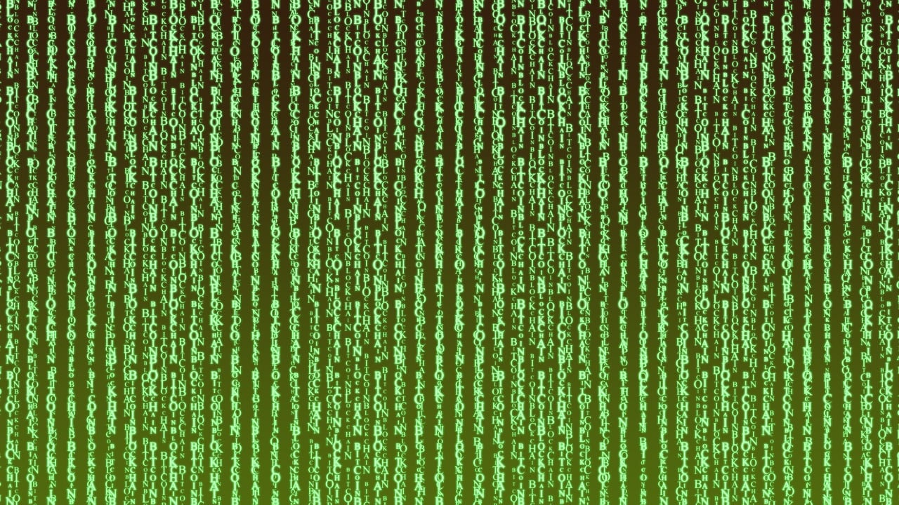

import DefinitionList from "@tdev-components/DefinitionList";
import CmsText from '@tdev-components/documents/CmsText';
import WithCmsText from '@tdev-components/documents/CmsText/WithCmsText';

# Kryptologie
:::Hero

:::

## Unterrichtsfolien
Die Unterrichtsfolien zu diesem Thema finden Sie [hier](https://erzbe-my.sharepoint.com/:f:/g/personal/silas_berger_gbsl_ch/EvZU9wlfJk1Fq3Giklfxh0gB6I9bDqFAXHS-8LLpBny89w?e=j1G72u).

## Probe
<DefinitionList>
  <dt>Dauer</dt>
  <dd>60 Minuten</dd>

  <dt>Wertung</dt>
  <dd>Die Note zählt voll</dd>

  <WithCmsText entries={{note: "b9dd8c01-8dce-4788-94dd-66046eb6d64a", punkte: "11e4ee3e-be56-445f-b9ad-df831be566de"}}>
    <dt>Note</dt>
    <dd>__<CmsText name="note" />__ (<CmsText name="punkte" />/?? Punkten)</dd>
  </WithCmsText>
</DefinitionList>

:::warning[Nicht abschliessend]
Diese Lernziele sind noch nicht abschliessend.
:::
:::info[Prüfungsstoff]

:::

---