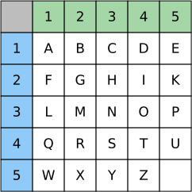

---
sidebar_custom_props:
  source:
    name: rothe.io
    ref: 'https://rothe.io/?b=crypto&p=423844'
page_id: 2a91b004-dd69-4c63-ac63-a65d128b134e
---

import Polybios from "@site/src/components/visualization-tools/cryptology/Polybios";

# Polybios-Chiffre

Die **Polybios-Chiffre** wurde vom griechischen Geschichtsschreiber Polybios (200 v. Chr. bis 120 v. Chr.) entwickelt.

Bei der Polybios-Verschlüsselung wird zunächst ein Quadrat mit den Buchstaben des Alphabets gefüllt. Das Resultat bezeichnen wir als **Polybios-Quadrat** (oder **Polybios-Matrix**). Polybios hat das griechische Alphabet mit 24 Buchstaben verwendet. Übertragen auf das lateinische Alphabet sieht dies folgendermassen aus:

Die beiden Buchstaben `J` und `V` finden keinen Platz in der Tabelle. `J` wird mit `I` zusammengefasst, `V` mit `U`.

Die Zeilen und Spalten im Quadrat werden durchnummeriert. Nun kann ein Buchstabe _verschlüsselt_ werden, indem seine Zeilen- und Spaltennummer aufgeschrieben wird.

:::insight[Beispiel]
So wird der Klartext `HALLO` zum Geheimtext `23 11 31 31 34`.
:::

Zur _Entschlüsselung_ werden diese Zahlen wiederum als Zeilen- und Spaltennummern im _Polybios-Quadrat_ interpretiert und so durch die Buchstaben in den entsprechenden Zellen ersetzt.

Die Anordnung der Buchstaben innerhalb eines _Polybios-Quadrats_ kann grundsätzlich beliebig gewählt werden. Die gewählte Anordnung ist dann der [geheime Schlüssel](../01-Grundbegriffe.mdx#die-begriffe-der-kryptographie).

## Polybios ausprobieren
:::info[Was ist der Schlüssel?]
Die Anordnung des Alphabets innerhalb eines _Polybios-Quadrats_ kann beliebig gewählt werden und bildet den geheimen Schlüssel. In dieser Simulation verwenden wir als Schlüssel einfachheitshalber die sequentielle Anordnung (`A` - `Z`, ohne `J` und `V`) wie sie in der obigen Abbildung gezeigt wird.
:::

<Polybios />

---
