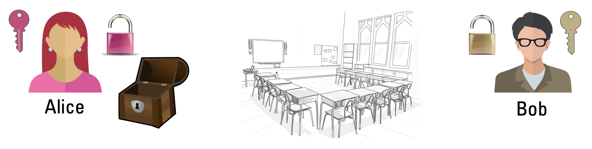

---
sidebar_custom_props:
  source:
    name: ofi.gbsl.website
    ref: 'https://ofi.gbsl.website/26e/Kryptologie/Asymmetrisch/key-exchange'
page_id: 97ef2989-9f05-426e-848b-6abb9a1855b3
---

# Schlüsselaustausch
Bob und Alice sitzen an gegenüberliegenden Enden im Klassenzimmer und möchten geheime Dokumente austauschen. Dazu haben sie eine kleine Truhe, welche man mit einem oder auch mit zwei Bügelschlössern verschliessen kann.

Die beiden dürfen sich im Klassenzimmer nicht bewegen. Wenn sie etwas austauschen möchten (zum Beispiel die Truhe), dann müssen sie den Gegenstand entlang der Pultreihe durch das Zimmer durchgeben. Dabei sollen die anderen Schüler:innen aber niemals eines ihrer geheimen Dokumente lesen können.

:::aufgabe[Aufgabe: Schlüsselaustausch]
1. Überlegen Sie sich eine Strategie, wie Bob und Alice unter den gegebenen Umständen ihre geheimen Dokumente so austauschen können, dass ihre Klassenkamerad:innen sie nicht lesen können. Es gibt mehrere sinnvolle Varianten!
2. Überlegen Sie sich, welche Probleme es bei Ihrer Strategie allenfalls geben könnte.

Unten finden Sie dazu einige Tipps, die Sie bei Bedarf verwenden können. Versuchen Sie die Aufgabe aber **zuerst ohne Hilfe** anzugehen.

  
Tipp 1

  

    Bob und Alice dürfen offene Bügelschlösser durch das Klassenzimmer durchgeben. Schlimmstenfalls schliesst jemand halt das Schloss — die Sicherheit der geheimen Dokument wird dadurch aber nicht gefährdet.
  

  
Tipp 2

  

    Man kann die Box auch mit zwei Schlössern gleichzeitig verschliessen. Was könnte das bringen?
  

  
Tipp 3

  

    Für die ideale Lösung braucht es eine vertrauenswürdige Drittperson.
  

:::

---
