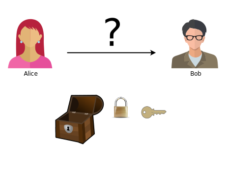

---
sidebar_custom_props:
  source:
    name: ofi.gbsl.website
    ref: 'https://ofi.gbsl.website/26e/Kryptologie/Asymmetrisch/key-exchange'
page_id: 19da1546-cfa1-4a49-8e09-f670f40d8b53
---

# Schlüsselaustausch

Alice und Bob möchten sich geheime Unterlagen senden. Doch wie können sie den Schlüssel austauschen?

Vielleicht hilft es, wenn wir uns in Erinnerung rufen, dass im Handel mehrere Schlösser mit unterschiedlichen Schlüsseln zu kaufen sind:

:::aufgabe[Aufgabe: Schlüsselaustausch]
Finden Sie eine Möglichkeit, den Inhalt der Truhe sicher zu übertragen?

Versetzen Sie sich dabei in die Rollen der anderen Krypto-Charaktere!

  
Hinweis: Variante 1

  

    #### Variante 1: Eigene Schlösser Verteilen

    Können Sie sich zusammenreimen, wie die geheimen Unterlagen versendet werden? Wo liegen allenfalls Probleme?
  

  
Hinweis: Variante 2

  

    #### Variante 2: Eigene Schlösser Verteilen

    

    Wie können die Unterlagen sicher zugestellt werden? Wo liegen allenfalls Probleme?
  

  
Hinweis: Variante 3

  

    #### Variante 3: Schlösser beim vertrauenswürdigen Trent beziehen

    

    Wie können die Unterlagen sicher zugestellt werden? Wo liegen allenfalls Probleme?
  

:::

---
