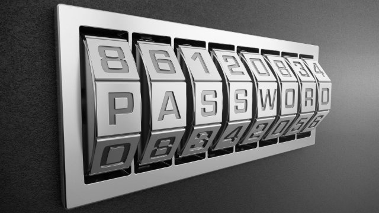
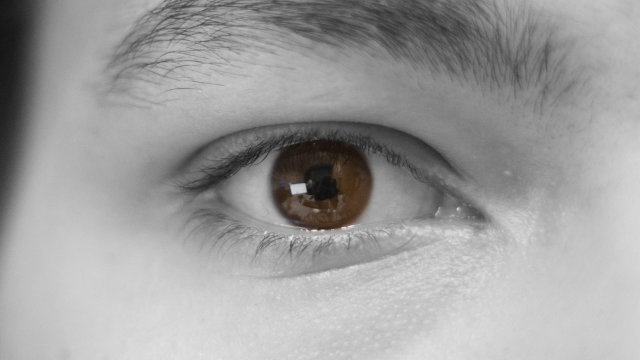

---
sidebar_custom_props:
  source:
    name: ofi.gbsl.website
    ref: https://ofi.gbsl.website/26e/Kryptologie/Hashfunktionen/Authentifizierung
---

import DefinitionList from "@tdev-components/DefinitionList";

# Authentifizierung
<DefinitionList>
  <dt>Authentifizierung</dt>
  <dd>(engl.: _authentication_) ist das Überprüfen einer Berechtigung. Die zu überprüfende Person **authentisiert** sich dabei.</dd>
</DefinitionList>

Es gibt drei verschiedene Wege, wie sich eine Person authentisieren kann:

::::Tiles
:::Tile[Wissen]

_Etwas, das man weiss._

Die Person weiss etwas, z.B. ein Passwort oder eine Pin
:::

:::Tile[Besitz]

_Etwas, das man hat._

Die Person besitzt etwas, z.B. eine Kreditkarte oder einen Schlüssel.
:::

:::Tile[Merkmal]

_Etwas, das man ist._

Die Person wird über körperliches Merkmal identifiziert, z.B. einen Fingerabdruck oder die Iris.
:::
::::

 

Jede dieser drei Methoden hat Vor- und Nachteile. Um die Nachteile auszugleichen kann eine sogenannte **Zwei-Faktor-Authentifizierung** verwendet werden, welche sich gleichzeitig auf zwei der drei Methoden abstützt.

## Wissen
Mit dieser Methode authentisiert sich die Person, indem sie eine bestimmte Information **weiss**, beispielsweise

- ein Passwort,
- eine Zahlenkombination für ein Fahrradschloss,
- eine persönliche Identifikationsnummer (PIN) oder
- die Antwort auf eine Sicherheitsfrage.

Die Information muss vor der Authentifizierung vereinbart worden sein. Wenn die Information erraten oder abgefangen worden ist, kann sie problemlos geändert werden.

Diese Authentifizierungsmethode hat folgende Schwachpunkte:

- Die Information kann vergessen werden.
- Sie kann erraten oder abgefangen werden.

## Besitz
Diese Methode überprüft, ob die Person einen bestimmten Gegenstand **besitzt**. Typische Gegenstände sind:

- Schlüssel
- Chipkarten (z.B. Bankkarten)
- SIM-Karte
- Smartphone

Solche Gegenstände müssen **eindeutig identifizierbar** sein, deshalb ist die Erstellung oder das Ersetzen mit Kosten verbunden.

Diese Methode hat folgende Schwachpunkte:
- Der Gegenstand kann verloren gehen oder gestohlen werden.
- Er kann gefälscht werden.

## Merkmal
Die Person kann auch über ein köperliches oder biometrisches Merkmal identifiziert werden. Es werden viele unterschiedliche Merkmale verwendet:

- Handschrift
- Fingerabdruck
- Gesichtsform
- Tippverhalten
- Stimme
- Iris
- Retina
- Venenmuster
- Erbinformation (DNS)

Die biometrische Authentifizierung ist sehr bequem, da keine Gegenstände mitgeführt und keine Informationen gemerkt werden müssen.

Viele biometrische Merkmale sind jedoch öffentlich zugänglich und einfach fälschbar. Dadurch sind Authentifizierungsmethoden wie Fingerabdruck- oder Gesichtserkennung sehr unsicher.

---
