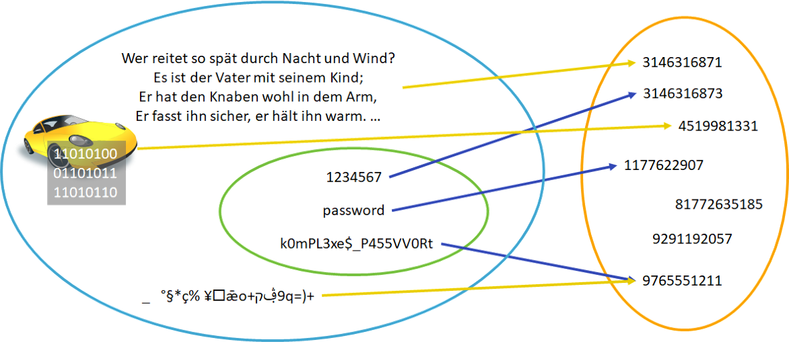

---
sidebar_custom_props:
    source:
        name: ofi.gbsl.website
        ref: 'https://ofi.gbsl.website/26e/Kryptologie/Hashfunktionen/hash-funktionen'
page_id: dcb272c8-48bb-4830-9793-325d9f4ee9d9
---

import HashSHA2 from '@tdev-components/visualization-tools/cryptology/HashSHA2';

# Hashfunktionen

:::definition[Hashfunktion] Eine Hashfunktion ist eine Abbildung, die eine grosse Eingabemenge auf eine kleinere Zielmenge abbildet. :::

Da eine **Eingabe beliebiger Länge** auf eine **Ausgabe mit fester Länge** abgebildet, ist Injektivität unmöglich. Die Eingabemenge ist folglich unendlich gross (Texte, Videos und Tonaufnahmen beliebiger Länge, Bilder beliebiger Grösse, ...). Die Ausgabemenge ist allerdings endlich, da die Hashwerte (also die Prüfsummen) eine fixe Länge haben.

## Hashfunktion

In der Abbildung oben sieht man, dass die Menge der Passwörter nur eine Teilmenge aller theoretisch möglichen Eingaben darstellt. Es ist nicht zu verhindern, dass Kollisionen auftreten.

:::definition[Kollisionsresistenz] Um genügend Sicherheit zu bieten, soll eine gute kryptographische Hashfunktion folglich kollisionsresistent sein. Das heisst, es soll praktisch unmöglich sein, Kollisionen zu finden. :::

## Hashwert

  

    Die Ausgabe der Hashfunktion – also die Prüfsumme – wird **Hashwert** genannt.

    Man kann einen Hashwert mit einem Fingerabdruck vergleichen, weil er gewissermassen eindeutig zu einem Passwort passt wie ein Fingerabdruck zu einem Menschen.

  

## Aktuelle Beispiele

Es gibt verschiedene aktuelle Hashfunktionen. Nachfolgend ein Tool, welches SHA-2 Hashes (Secure Hash Algorithm Version 2) berechnet.

<HashSHA2 />

:::aufgabe[Hashes berechnen]

1. Berechnen Sie den Hash Ihres Namens und den Ihrer E-Mail-Adresse. Halten Sie beide Hash-Werte fest.
2. Wie viele Buchstaben ändern sich, wenn Sie einen einzigen Tippfehler machen? :::

:::insight[Kleine Änderung, Grosse Auswirkung] Die letzten beiden Beispiele zeigen, dass bereits kleinste Änderungen zu komplett anderen Hashwerten führen. Kryptographische Hashfunktion sind so konstruiert, dass bei einer Änderung an einem Bit min. 50% der Hashwert-Bits ändern. :::

---
