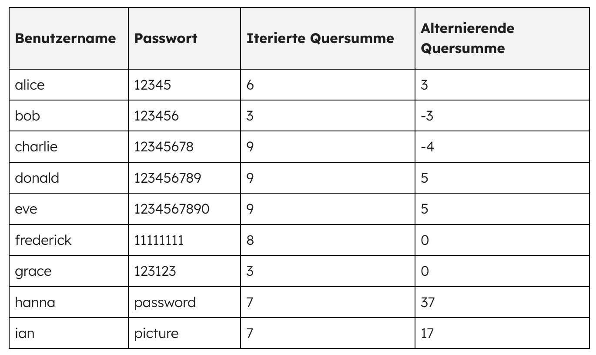

---
sidebar_custom_props:
  source:
    name: ofi.gbsl.website
    ref: 'https://ofi.gbsl.website/26e/Kryptologie/Hashfunktionen/hash-funktionen'
page_id: 90858166-9277-438b-b886-4d76c9a725cd
---

import HashSHA2 from '@tdev-components/visualization-tools/cryptology/HashSHA2'

# Hashing: Passwörter sicher speichern
Passwörter sind wichtig, wir sollten sie beschützen. Doch dies gilt nicht nur für unsere eigenen Passwörter, auch Firmen sollten die Passwörter ihrer Kunden schützen.

## Passwörter speichern
Wie würden Sie die Passwörter Ihrer Kunden speichern, falls Sie einen Webshop erstellen würden? Natürlich nicht im Klartext, oder?

Dass die Passwörter «verschlüsselt» werden müssen, scheint logisch. Also sollten die Passwörter wohl auf dem Firmenserver verschlüsselt werden, damit sie nicht ausgelesen werden können – weder von Hackern noch von neugierigen Mitarbeitenden.

Doch gerade dies ist ein grosses Problem: Der Firmenserver soll die Kunden anhand ihres Passwortes authentifizieren können, die Mitarbeitenden dürfen allerdings keinen Zugriff auf die Kundenpasswörter haben. Alle bisherigen Verschlüsselungsverfahren arbeiten mit einem Schlüssel (oder mit mehreren). Wer den richtigen Schlüssel kennt, kann die Passwörter entschlüsseln. Wird der Schlüssel auf den Firmenservern gespeichert, so haben zumindest gewisse Mitarbeitende Zugriff.

Hier kommen wir momentan nicht weiter. Wir tasten uns von einer anderen Seite an die Lösung heran.

## Prüfsumme
Wir dürfen Passwörter also nicht im Klartext speichern und es ist auch nicht sinnvoll, sie zu verschlüsseln. Die Lösung: Wir speichern stattdessen eine **Prüfsumme** des Passwortes. Eine _Prüfsumme_ ist eine Zahl, die aus einem Passwort (oder auch aus einer beliebigen anderen Eingabe) berechnet wird.

Hier zwei Beispiele für einfache Prüfsummen:

| Benutzername | Passwort     | Iterierte Quersumme | Alternierende Quersumme |
|:--------------|:-------------|:--------------------|:------------------------|
| alice         | 12345        | 6                   | 3                       |
| bob           | 123456       | 3                   | -3                      |
| charlie       | 12345678     | 9                   | -4                      |
| donald        | 123456789    | 9                   | 5                       |
| eve           | 1234567890   | 9                   | 5                       |
| frederick     | 11111111     | 8                   | 0                       |
| grace         | 123123       | 3                   | 0                       |
| hanna         | password     | 7                   | 1                       |
| ian           | picture1     | 3                   | 3                       |

Die **iterierte Quersumme** ist die Quersumme, die entsteht, wenn man solange immer wieder die Quersumme ausrechnet, bis nur noch eine einzige Ziffer übrig bleibt. Für die Zahl 97 lautet die normale Quersumme 16, berechnet man davon wiederum die Quersumme, so entsteht die iterierte Quersumme: `7`.

Die **alternierende Quersumme** entsteht durch abwechslungweises Addieren und Subtrahieren der einzelnen Ziffern (für 1234 lautet diese 1 - 2 + 3 - 4 = -2).

In den obigen Beispielen gehen wir davon aus, dass Buchstaben durch ihre Position im Alphabet ersetzt werden (A=1, B=2, ..., Z=26). 

:::aufgabe[Prüfsummen analysieren]
<TaskState id="9c2b620d-d38d-4783-9662-042420cdcd40" />

1. Welche der beiden Funktionen würden Sie wählen, um die Passwörter zu speichern?
2. Welche Probleme sehen Sie bei beiden Funktionen?

<QuillV2 id="2d3b6bd7-eec9-4be4-b44e-cfb8f5d7187b" />

<Solution id="61ae41a7-126a-4889-a428-4f2e4ff8313d">

1. Bei der iterierten Quersumme muss das Ergebnis immer einstellig sein. Es gibt somit nur 10 mögliche Prüfsummen und somit viele **Kollisionen**: Mehrere Passwörter haben dieselbe Prüfsumme. Das ist nicht ideal. Deshalb ist die alternierende Quersumme besser geeignet, um Passwörter zu speichern.
2. Auch bei der alternierenden Quersumme gibt es noch viele _Kollisionen_. Wenn ein Benutzer (Bob) beispielsweise das Passwort `donald` wählt, speichern wir die Prüfsumme `5` in unserer Datenbank. Wenn eine Angreiferin (Eve) nun versucht, Bobs Passwort zu knacken, könnte sie beispielsweise das Passwort `eve` ausprobieren, welches ebenfalls zur Prüfsumme `5` führt. Da wir nur die Prüfsumme und nicht das eigentliche Passwort gespeichert haben, können wir natürlich auch nur die Prüfsummen vergleichen. Weil bei `eve` nun ebenfalls `5` herauskommt, müssen wir davon ausgehen, dass Eve das korrekte Passwort eingegeben hat. Je mehr Kollisionen eine Prüfsumme aufweist, desto mehr «falsche» Passwörter können also fälschlicherweise als korrekt interpretiert werden. Das erhöht die Chance eines erfolgreichen Angriffs. 
</Solution>
:::

:::insight[Wunsch: Injektiviät]
Idealerweise gehört zu jeder Prüfsumme höchstens ein Passwort. Oder anders formuliert: Kollisionen sollen vermieden werden. Das bedeutet, dass jedes Passwort eine andere Prüfsumme erhalten soll.

:::

:::insight[Wunsch: Unumkehrbarkeit]
Aus der Prüfsumme soll nicht auf das Passwort geschlossen werden können.
:::

### Passwortprüfung mit Prüfsumme
Wenn wir Passwörter nicht mehr im Klartext sondern in Form von Prüfsummen speichern, erhöhen wir die Sicherheit unserer Nutzer:innen – denn aus der Prüfsumme (sofern sie sinnvoll gewählt ist) kann das ursprüngliche Passwort nicht mehr abgeleitet werden. Doch wie überprüfen wir nun, ob ein eingegebenes Passwort korrekt ist? Wir gehen wie folgt vor:
1. Eine:e Nutzer:in gibt ihr Passwort ein.
2. Wir berechnen die Prüfsumme des eingegebenen Passwortes (natürlich mit derselben Methode, die wir auch zum Abspeichern verwendet haben).
3. Wir vergleichen die berechnete Prüfsumme mit der in unserer Datenbank gespeicherten Prüfsumme.
4. Stimmen die Prüfsummen überein, so ist das Passwort (vermutlich) korrekt. Weshalb wir uns hier nicht ganz sicher sein können, sehen Sie weiter unten.

## Hashfunktion
:::definition[Hashfunktion]
Eine Hashfunktion ist eine Abbildung (eine mathematische Funktion), die eine grosse Eingabemenge auf eine kleinere Zielmenge abbildet, deren Werte eine fixe Länge haben.
:::

Es wird also eine **Eingabe beliebiger Länge** auf eine **Ausgabe mit fester Länge** abgebildet. Die Eingabemenge ist folglich unendlich gross (Texte, Videos und Tonaufnahmen beliebiger Länge, Bilder beliebiger Grösse, ...). Die Ausgabemenge ist allerdings endlich, da die Hashwerte (also die Prüfsummen) eine fixe Länge haben. **Injektivität** (siehe oben) ist damit **unmöglich**. 

In der Abbildung oben sieht man, dass die Menge der Passwörter nur eine Teilmenge aller theoretisch möglichen Eingaben darstellt. Es ist daher nicht zu verhindern, dass **Kollisionen** auftreten. Von einer _Kollision_ spricht man, wenn zwei verschiedene Eingaben denselben Hashwert ergeben. Das ist deshalb ein Problem, weil wir beim Überprüfen eines Passwortes nur die Hashwerte vergleichen können. Wenn zwei verschiedene Passwörter denselben Hashwert haben, dann könnte ein Angreifer theoretisch das falsche Passwort eingeben und es würde trotzdem als korrekt akzeptiert werden.

:::definition[Kollisionsresistenz]
Um genügend Sicherheit zu bieten, soll eine gute kryptographische Hashfunktion folglich kollisions**resistent** sein. Das heisst, es soll **praktisch unmöglich** sein, Kollisionen zu finden. Ganz unmöglich wird es jedoch – wie oben beschrieben – nie sein.
:::

### Hashwert

  

    Die Ausgabe der Hashfunktion – also die Prüfsumme – wird **Hashwert** genannt.

    Man kann einen Hashwert mit einem Fingerabdruck vergleichen, weil er gewissermassen eindeutig zu einem Passwort passt wie ein Fingerabdruck zu einem Menschen.
  

  

:::insight[Hashing ≠ Verschlüsselung]
Wie Sie oben gelernt haben, sind Hashfunktionen **nicht** dasselbe wie Verschlüsselungsverfahren. Bei einer Verschlüsselung kann der ursprüngliche Text (Klartext) wiederhergestellt werden, wenn man den richtigen Schlüssel kennt. Bei einer (guten kryptographischen) Hashfunktion darf dies nicht möglich sein.
:::

### Aktuelle Beispiele
Es gibt verschiedene aktuelle Hashfunktionen. Nachfolgend ein Tool, welches SHA-2 Hashes (Secure Hash Algorithm Version 2) berechnet.

<HashSHA2 />

:::aufgabe[Hashes berechnen]
<TaskState id="c4582e86-a05f-4c62-bcdc-4e262b37165a" />
1. Berechnen Sie den Hash Ihres Namens und den Ihrer E-Mail-Adresse. Halten Sie beide Hash-Werte fest.
2. Wie viele Buchstaben ändern sich, wenn Sie einen einzigen Tippfehler machen?

<QuillV2 id="0eef49c1-5d5e-49fb-910d-fe456ff75da4" />

<Solution id="81633946-8e93-447b-9e08-962d68b4a7fc">
1. Individuelle Lösung.
2. Vermutlich ändert sich ein Grossteil der Buchstaben, wenn nicht sogar fast alle. Das ist das Ziel einer sicheren (kryptographischen) Hashfunktion (siehe unten).
</Solution>
:::

:::insight[Kleine Änderung, Grosse Auswirkung]
Die letzten beiden Beispiele zeigen, dass bereits kleinste Änderungen zu komplett anderen Hashwerten führen. Kryptographische Hashfunktion sind so konstruiert, dass bei einer Änderung an einem Bit min. 50% der Hashwert-Bits ändern.

Damit erreichen wir unter anderem, dass wir aus einer Ähnlichkeit zweier Hashwerten **nicht** auf eine Ähnlichkeit der beiden entsprechenden Eingabewerte schliessen können. So ist es nahezu unmöglich, den Eingabewert durch «Annäherung» herauszufinden.
:::

---
