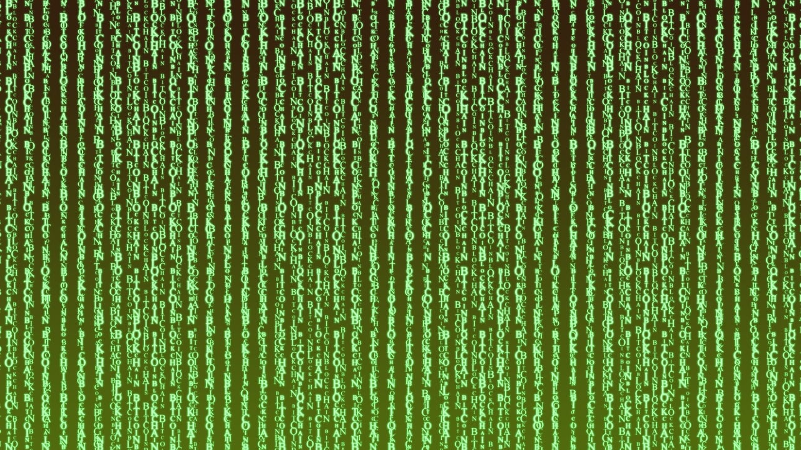

import DefinitionList from "@tdev-components/DefinitionList";
import CmsText from '@tdev-components/documents/CmsText';
import WithCmsText from '@tdev-components/documents/CmsText/WithCmsText';

# Kryptologie
:::Hero

:::

## Unterrichtsfolien
Die Unterrichtsfolien zu diesem Thema finden Sie [hier](https://erzbe-my.sharepoint.com/:f:/g/personal/silas_berger_gbsl_ch/EvZU9wlfJk1Fq3Giklfxh0gB6I9bDqFAXHS-8LLpBny89w?e=j1G72u).

## Probe
<DefinitionList>
  <dt>Dauer</dt>
  <dd>45 Minuten</dd>

  <dt>Wertung</dt>
  <dd>Die Note zählt voll</dd>

  <dt>Modus</dt>
  <dd>Auf Papier</dd>

  <dt>Hilfsmittel</dt>
  <dd>Zusammenfassung (1 Blatt A4, **einseitig**, **handschriftlich**, **persönlich** erstellt)</dd>
  <dd>Taschenrechner erlaubt</dd>

  <WithCmsText entries={{note: "b9dd8c01-8dce-4788-94dd-66046eb6d64a", punkte: "11e4ee3e-be56-445f-b9ad-df831be566de"}}>
    <dt>Note</dt>
    <dd>__<CmsText name="note" />__ (<CmsText name="punkte" />/21 Punkten)</dd>
  </WithCmsText>
</DefinitionList>

:::info[Prüfungsstoff]
- Sie können die Kryptographie und die Kryptolanalyse als Teilbereiche der Kryptologie, sowie deren Hauptaufgaben nennen.
- Sie können die Grundbegriffe der Kryptographie nennen, erklären und miteinander in Zusammenhang setzen.
- Sie können die vier Sicherheitsziele nennen und erklären.
- Sie können für ein konkretes Fallbeispiel erörtern, inwiefern die jeweiligen Sicherheitsziele darin (primär) verfolgt werden.
- Sie können die Funktionsweisen der gelernten antiken Chiffren (Skytale, Polybios, Caesar, monoalphabetische Substitution, Vigenère) erklären.
- Sie können den Zusammenhang zwischen der Vigenère-Chiffre und der Caesar-Chiffre erklären.
- Sie können mit allen gelernten antiken Chiffren und mit einem gegebenen Schlüssel eine Nachricht ver- und entschlüsseln.
- Sie können für ein gegebenes Verschlüsselungsverfahren die Grösse seines Schlüsselraums (Anzahl möglicher Schlüssel) mit der Effizienz / Machbarkeit eines Brute-Force-Angriffs in Zusammenhang bringen.
- Sie können erklären, weshalb es sich bei der Caesar-Verschlüsselung und der monoalphabetischen Substitution nicht um starke, sondern um schwache Verschlüsselungen handelt.
- Sie können einen Caesar-verschlüsselten Text mithilfe der Häufigkeitsanalyse ohne Kenntnis des Schlüssels entschlüsseln. Sie können zudem erklären, wie man dieses Verfahren verallgemeinert auf die monoalphabetische Substitution anwenden kann.
- Sie können für ein konkretes Fallbeispiel erörtern, ob Kerckhoffs' Prinzip dort befolgt wurde.
- Sie können erklären, weshalb man bei modernen Verschlüsselungsverfahren mit binärcodierten Daten arbeitet und welche Vor- und Nachteile dies mit sich bringt.
- Sie können Texte und Pixelgrafiken (im «Pentacode-Stil») von Hand mit Pentacode codieren und decodieren.
- Sie können Texte und Pixelgrafiken mit der XOR-Chiffre ver- und entschlüsseln.
- Sie können die Funktionsweise der Blockchiffre im ECB- und CBC-Modus erklären und die beiden Modi miteinander vergleichen.
- Sie können Texte und Pixelgrafiken mit der XOR-Blockchiffre im ECB- und im CBC-Modus ver- und entschlüsseln.
- Sie können asymmetrische Ansätze zur Übertragung einer geheimen Nachricht ("Geheime Truhe", "Farben mischen"), sowie allfällige Schwächen dieser Ansätze nenen und erklären
- Sie können schwer umkehrbare Vorgänge nennen und erklären, wie diese in kryptographischen Verfahren genutzt werden können.
- Sie können erklären, wie eine Nachricht über asymmetrische Verschlüsselung an eine oder mehrere Personen versendet wird.
- Sie können die Rolle des öffentlichen und des privaten Schlüssels in der asymmetrischen Verschlüsselung erklären.
- Sie können die symmetrische und asymmetrische Verschlüsselung miteinander vergleichen.
- Sie können beschreiben, wie symmetrische und asymmetrische Verfahren zur Ver- und Entschlüsselung miteinander kombiniert werden können.
- Sie können die drei verschiedenen Methoden der Authentifizierung aufzählen, sowie deren Nachteile und Beispiele für ihre konkrete Umsetzung (z.B. "Wissen" → "Passwörter") nennen.
- Sie können ein sicheres Passwort erstellen, resp. für ein gegebenes Passwort entscheiden, ob und weshalb es sicher / unsicher ist.
- Sie können erklären, weshalb wir Passwörter immer in Form von Prüfsummen (Hashwerten) speichern müssen.
- Sie können die Wünsche / Anforderungen an eine kryptographische Prüfsumme / Hashfunktion nennen, erklären und begründen.
- Sie können begründen, weshalb eine Hashfunktion nicht injektiv sein kann, und wissen, was die Konsequenz davon ist.
:::

---