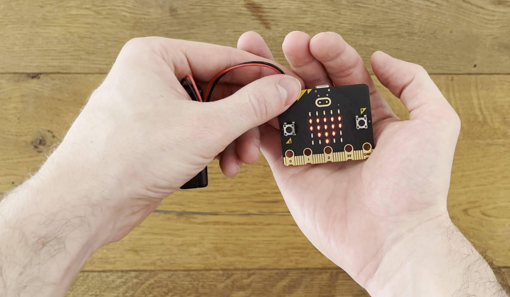

# Der Micro:bit
:::Hero

:::
:::Caption
Der Micro:bit: Ein winziger Computer, der sogar in eine Hand passt!
:::

Dieser Artikel gibt Ihnen einen ersten Einblick in die faszinierende Welt des _Micro:bit_. Mit diesem winzig kleinen
Computer können Sie Ihre Python-Programmierkenntnisse auf eine spannende neue Plattform übertragen und ganz
unkompliziert in die Welt der Hardware-Programmierung und Robotik eintauchen!

## Was ist der Micro:bit?
Der Micro:bit ist eine kompakter _Einplatinencomputer_ - er verfügt also weder über einen Bildschirm, noch über eine
Maus oder eine Tastatur. Sie verwenden den Micro:bit, indem Sie auf ihrem Laptop ein Programm dafür entwickeln, welches
Sie anschliessend via USB-Kabel auf das Gerät übertragen.

:::insight[Wozu wurde der Micro\:bit entwickelt?]
Der Micro:bit wurde von der BBC (_British Broadcasting Corporation_) entwickelt, damit Menschen von jung bis alt die
Grundlagen der Programmierung und der Robotik auf spannende, kreative Weise entdecken können.
:::

## Was sind seine Anwendungsmöglichkeiten?
Obwohl der Micro:bit klein ist, bietet er vielfältige Einsatzmöglichkeiten als Plattform. Hier sind einige Dinge, die
Sie mit diesem kleinen Kraftpaket realisieren können:
- **Licht und Farben:** Nutzen Sie die eingebauten LEDs, um Muster, Animationen und sogar Nachrichten zu erstellen.
  Tauchen Sie ein in die Welt der visuellen Kreationen!
- **Bewegung und Beschleunigung:** Verwenden Sie die integrierten Sensoren, um Bewegungen zu erfassen und Ihre eigenen
  Bewegungssteuerungen für den Micro:bit als Plattform zu programmieren. Der Micro:bit setzt Ihre Bewegungen in
  aufregende Aktionen um!
- **Musik und Töne:** Ja, Sie können sogar Musik mit dem Micro:bit als Plattform kreieren! Programmieren Sie eigene
  Melodien und entdecken Sie, wie Sie Klänge erzeugen können.
- **Spiele programmieren:** Entwickeln Sie Ihre eigenen Spiele! Der Micro:bit als Plattform erlaubt es Ihnen, Ihrer
  Fantasie freien Lauf zu lassen und eigene interaktive Spiele zu programmieren.

---
