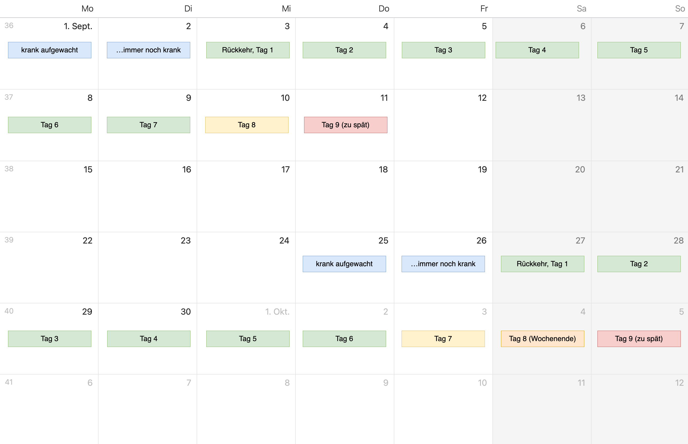

# Absenzen
## Das Absenzenwesen in Kürze
- Sämtliche Absenzen (entschuldigt, unentschuldigt, Urlaub, Verspätungen) werden im Klassenbuch vermerkt.
- Absenzen müssen so früh wie möglich melden (via Mail oder Teams an Klassenlehrperson und alle betroffenen Fachlehrpersonen)
- Alle Absenzen müssen durch die Schüler:in innert 8 Kalendertagen nach Rückkehr im Absenzenheft entschuldigt werden.
  - Absenz ins Absenzenheft eintragen (inkl. Anzahl Lektionen) und von den Eltern unterschreiben lassen.
  - Von allen betroffenen Fachlehrpersonen unterschreiben lassen.
  - Zum Schluss von der Klassenlehrperson unterschreiben lassen.
  - Wird diese Frist nicht eingehalten, zählen die Absenzen als unentschuldigt.
- 7 unentschuldigte Verspätungen führen zu einer Verwarnung durch die Schulleitung.
  - Bei Wiederholung: Verweis möglich.
- Verlorene Absenzenhefte müssen im Sekretariat ersetzt werden (Kosten: CHF 15.-).

## Beispiele für die Entschuldigungsfristen

## Absenzen im Detail
::pdf[./pdf/absenzenwesen_im_detail.pdf]

## Merkblatt Absenzen
::pdf[./pdf/mb_absenzen.pdf]

## Links
- [Absenzenreglement](https://www.gbsl.ch/wp-content/uploads/2020/05/Absenzenreglement_19_V0109.pdf) (auch im Absenzenheft abgedruckt)
- [Formular Dispensationsgesuch](https://erzbe.sharepoint.com/sites/GYMB/gbs/gym/dok/SiteAssets/Forms/AllItems.aspx?id=%2Fsites%2FGYMB%2Fgbs%2Fgym%2Fdok%2FSiteAssets%2FFO%5FGesuch%5FDispensation%5FX0111%2Epdf&parent=%2Fsites%2FGYMB%2Fgbs%2Fgym%2Fdok%2FSiteAssets).

---