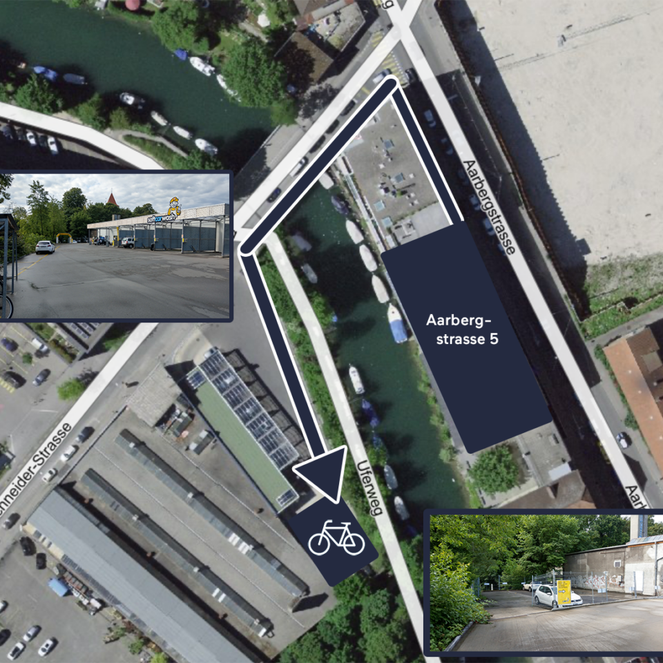

# Wo ist was?

## Wichtige Orte

## Standort Aarbergstrasse
Der Standort Aarbergstrasse (Gebäude __A__) befindet sich an der [Aarbergstrasse 5, 2560 Nidau](https://www.google.com/maps/place/Aarbergstrasse+5,+2560+Nidau/@47.1290396,7.2404689,675m/data=!3m2!1e3!4b1!4m6!3m5!1s0x478e195b3d698afd:0xac51f9e6f5394e8c!8m2!3d47.1290396!4d7.2404689!16s%2Fg%2F11c20cr59b?entry=ttu&g_ep=EgoyMDI1MDgxMi4wIKXMDSoASAFQAw%3D%3D).

:::danger[Erweiterte Hausordnung]
Am Standort Aarbergstrasse gilt eine erweiterte Hausordnung:
- Es ist strengstens verboten, Fahrräder oder Roller auf dem Trottoir oder auf den Parkplätzen entlang der Aarbergstrasse abzustellen.
- Der Vermieter duldet keine Trottinettes im Gebäude.
- Weitere ergänzende Regeln finden Sie vor Ort im Eingangsbereich.
:::

Velos dürfen nur am dafür vorgesehenen Platz an der Dr. Schneiderstrasse auf der anderen Seite des Kanals hinter der
Waschanlage abgestellt werden:

---