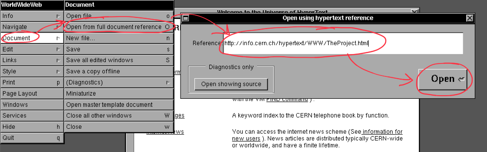

import QuillV2 from "@tdev-components/documents/QuillV2";
import String from "@tdev-components/documents/String";

# Die Anfänge des WWW
](img/first-web-server.jpg)

Das World Wide Web (WWW) ist ein weltweites, über das Internet abrufbares System von miteinander vernetzten Hypertext-Dokumenten. Ein solches _Hypertext-Dokument_ bezeichnen wir heute — wenn auch etwas verallgemeinernd — als _Webseite_. Das WWW wurde 1989 vom britischen Wissenschaftler Tim Berners-Lee am CERN in der Nähe von Genf entwickelt.

:::insight[CERN: Anfänge des World Wide Web]
Mehr Informationen zur Geburt des World Wide Web finden Sie auf dieser [Webseite des CERN](https://home.cern/science/computing/birth-web).
:::

## Das Web von damals: Eine kleine Zeitreise
Wer eine Webseite öffnen will, braucht einen Browser. Tim Berners-Lee musste also nicht nur eine erste Webseite schreiben, sondern auch noch ein Programm entwickeln, welches diese anzeigen konnte. Der erste solche Web Browser hiess _WorldWideWeb_.

Eine Nachbildung davon können Sie auch heute noch
[selbst ausprobieren](https://worldwideweb.cern.ch/browser/).

Um darin eine Webseite zu öffnen, gehen Sie folgendermassen vor:

Einem _Hyperlink_ (heute sagen wir einfach _Link_) können Sie folgen, indem Sie darauf **doppel**klicken. Anders als bei einem modernen Browser öffnet sich dabei jeweils ein neues Fenster.

:::aufgabe[Ersten Browser ausprobieren]
<TaskState id="3ffbdcd7-d373-4858-95d7-c99fad4f7613" />
Öffnen Sie **im [_WorldWideWeb_ Browser](https://worldwideweb.cern.ch/browser/)** die Webseite des _World Wide Web_-Projekts. Es handelt sich dabei um die erste Webseite der Welt, welche Sie unter der Adresse `http://info.cern.ch/hypertext/WWW/TheProject.html` erreichen.

Suchen Sie dort den Link __<u>People</u>__ und öffnen Sie ihn.

Wie lautet die E-Mail-Adresse von Tim Berners-Lee? Prüfen Sie ihre Lösung.

<String id="24c0dae3-91d2-45ea-8472-a620fdc96705" label="Antwort" solution="timbl@info.cern.ch" placeholder="E-Mail..." />
:::

:::aufgabe[Parallelen und Unterschiede]
<TaskState id="342a1072-3467-4903-9b8f-431d030286da" />
Seit den Anfängen des World Wide Web und dem ersten Web Browser hat sich zweifellos viel getan.

Was denken Sie: Was hat sich verändert und was ist bis heute gleichgeblieben? Welche Veränderungen sind Ihnen allenfalls beim Ausprobieren des _WorldWideWeb_ Browsers aufgefallen?

<QuillV2 id="1f679697-ec75-4486-886b-92747a34f699" />

<Solution id="63d85b3e-380d-4cfc-91c1-0d6fb471b63b" title="Antwortvorschlag">
  Die Kernkonzepte des World Wide Web bleiben bis heute unverändert: Es ist immer noch ein System aus vernetzten _Hypertext-Dokumenten_, zwischen denen man mit _Hyperlinks_ hin und her navigiert. Heute kommen dazu aber auch Bilder, GIFs, Videos, Login-Seiten, Paywalls, etc.
   
  Auch die Kernaufgabe des Browsers ist heute noch gleich wie damals: Er ist dazu da, um Webseiten anzuzeigen. Zum Öffnen einer Webseite muss man aber nicht mehr durch ein mehrstufiges Menu navigieren. Heute hat man dazu eine einfache aber mächtige Address- und Suchleiste. Zum Öffnen eines Links braucht man auch nicht mehr einen Doppelklick und es öffnet sich dabei heute kein separates Fenster mehr.
   
  Kurz gesagt: Das moderne Web ist viel mächtiger, umfangreicher und grundsätzlich benutzerfreundlicher — wohl aber auch komplexer und unübersichtlicher. Die darunterliegenden Kernkonzepte haben sich aber nicht verändert.
</Solution>
:::

---
