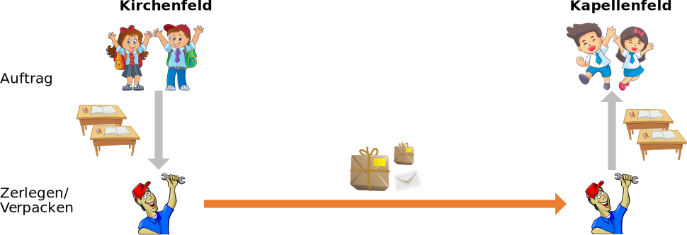

# Transportschicht

Die Transportschicht stellt sicher, dass der Transport korrekt abläuft. Die zu transportierenden Dinge oder Daten müssen zerlegt werden, damit sie in Pakete passen. Die Pakete müssen nummeriert werden, damit die Dinge/Daten am Zielort wieder richtig zusammengesetzt werden können.

## Beispiel «Schule»

Im Beispiel «Schule» zerlegt der Hauswart die einzelnen Pulte. Er muss die Einzelteile der Pulte beschriften, damit sie in der Kapellenfeld-Schule wieder richtig zusammengebaut werden können. Er verpackt die Einzelteile in Pakete und beschriftet diese mit der Post-Adresse. Schliesslich schickt er dem Hauswart der Kapellenfeld-Schule einen Brief (Lieferschein), in welchem auflistet, wie viele Pakete und Pulte verschickt werden.

Der Hauswart der Kapellenfeld-Schule kontrolliert anhand des Lieferscheins, ob alle Pakete angekommen sind. Dann setzt er die Pulte aus den Einzelteilen gemäss Beschriftung wieder zusammen.

Möglicherweise fehlt eine Schraube. In dem Fall schickt er dem Kirchenfeld-Hauswart einen Brief und bittet ihn, diese Schraube nachzuschicken.

## Internet

Die zwei wichtigsten Protokolle der Transportschicht sind TCP und UDP. Hier werden die Daten der Anwendungsschicht in TCP- oder UDP-Pakete verpackt. Dabei muss natürlich notiert werden, worum es sich bei den Daten der Anwendungsschicht handelt (HTTP, SMTP, ...). Das Protokoll der Anwendungsschicht wird in Form einer Nummer, Port genannt, im TCP- oder UDP-Paket gespeichert (siehe Begriff Ports).

TCP : Das Transmission Control Protocol ist verbindungsorientiert und wird bei unserer täglichen Arbeit im Internet in den allermeisten Fällen verwendet. Es garantiert, dass keine Pakete verlorengehen oder fehlerhaft ankommen – resp. falls Pakete nicht ankommen, dass diese nochmals angefordert werden. Dies ist in der Regel (z.B. beim Übertragen von Webseiten oder E-Mails) sinnvoll und erwünscht – schliesslich möchten wir nicht, dass einige Passagen auf Webseiten oder in E-Mails fehlen.

UDP : Das User Datagram Protocol hingegen ist verbindungslos, d.h. es findet keine Kontrolle statt, ob sämtliche Pakete (fehlerfrei) ankommen. Dies ist insbesondere dann hilfreich, wenn wir Audio- oder Videostreams konsumieren. Wir möchten nicht lange auf ein verlorenes Paket warten, sondern nehmen eher ein kurzes Stocken in Kauf und sind froh, dass das Abspielen anschliessend direkt weitergeht.

# ⭐️ Weitere Informationen

::youtube[https://www.youtube.com/embed/AYdF7b3nMto?si=ofDXVO-NlOT7f3YM]

---
