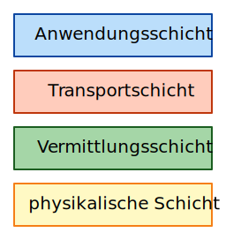
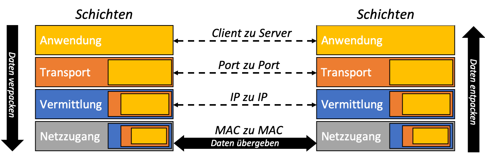

# Das Schichtenmodell
Die Kommunikation zwischen Digitalgeräten ist auf so allgemeine Art geregelt, dass es für die beteiligten Endgeräte eigentlich keinen Unterschied macht, ob sie direkt miteinander verbunden sind, oder ob sie ihre Nachrichten über ein weltweites Netzwerk (=Internet) austauschen. Die Grundlage für beides ist ein Schichtenmodell, das die komplexe Aufgabe der Nachrichtenübermittlung auf verschiedenen Ebenen, bzw. Schichten verteilt:

Eine Kommunikation zwischen zwei Digitalgeräten besteht eigentlich aus mehreren ineinander verschachtelten Gesprächen. Das Internet konnte seine explosionsartige Entwicklung nur deshalb so verhältnismässig reibungslos überstehen, weil die verschiedenen «Gespräche» schon früh mithilfe eines sauberen Schichtenmodells auf verschiedene Kommunikationsebenen aufgeteilt wurden. (Das theoretische Schichtenmodell der digitalen Kommunikation heisst OSI, im Internet wird zumeist die etwas vereinfachte TCP/IP-Protokollfamilie benutzt.)

Die Schichten des TCP/IP-Stacks
Jedes dieser Gespräche dient einem bestimmten Zweck innerhalb der komplizierten Aufgabe des weltweiten digitalen Nachrichtenaustauschs, jede Kommunikationsebene folgt dafür ihren eigenen Regeln (=Protokolle) und die verschiedenen Ebenen sind – abgesehen von der Verschachtelung – möglichst unabhängig voneinander.

## Gruppenpuzzle 🧩
TBD