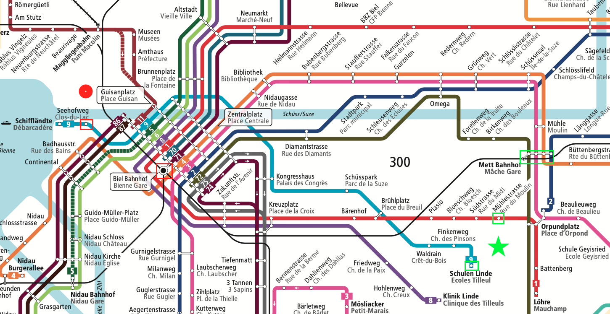

---
sidebar_custom_props:
  source:
    name: ofi.gbsl.website
    ref: 'https://ofi.gbsl.website/26e/Netzwerke/Routing/routing-alltag'
page_id: 599f3e7a-0940-48cc-b227-fc5e6a13850c
draft: true
---

import QuillV2 from '@tdev-components/documents/QuillV2';
import TaskState from '@tdev-components/documents/TaskState';

# Routing im Alltag
Im Rahmen dieser Übungen machen Sie sich Gedanken über die folgende Reise:

<svg viewBox="0 0 24 24" role="presentation" class="mdi-icon red" style={{width: "1.25em", height: "1.25em"}}><path d="M12,2A10,10 0 0,0 2,12A10,10 0 0,0 12,22A10,10 0 0,0 22,12A10,10 0 0,0 12,2Z" style={{fill: "currentcolor"}}></path></svg> Start
  : Gymnasium Biel-Seeland
  : Ländtestrasse 12, Biel/Bienne
<svg viewBox="0 0 24 24" role="presentation" class="mdi-icon green" style={{width: "1.25em", height: "1.25em"}}><path d="M12,17.27L18.18,21L16.54,13.97L22,9.24L14.81,8.62L12,2L9.19,8.62L2,9.24L7.45,13.97L5.82,21L12,17.27Z" style={{fill: "currentcolor"}}></path></svg> Ziel
  : Sportplatz Mettmoos
  : Parkplatz Mettmoos, 2504 Biel/Bienne

# Verkehrsbetriebe Biel (VB)
Durch das [Verkehrsnetz der Verkehrsbetriebe Biel](https://vb-tpb.ch/documents/394/lay_12_biel-bienne_DINA3_quer_2024_1e_GzA.pdf) wird der öffentliche Verkehr in der Stadt Biel sichergestellt.

:::aufgabe[Aufgabe 1: Netzplan]
<TaskState id='8b97cb9d-c429-410f-bf31-9f75262b7819' />
Welche Möglichkeiten finden Sie im Liniennetz der VB für die von Ihnen geplante Reise?

<QuillV2 id='f7474960-67b5-4cff-946e-63dc730aa88e' />
:::

:::aufgabe[Aufgabe 2: Google Maps]
<TaskState id='83654219-6fb5-42ab-9e94-ac98ec23e1ec' />
Welchen Transportoptionen schlägt Ihnen [Google Maps](https://www.google.com/maps/dir/Gymnasium+Biel-Seeland,+L%C3%A4ndtestrasse,+Biel/Sportplatz+Mettmoos,+Parkplatz+Mettmoos,+2504+Biel/@47.1389478,7.2150557,17243m/data=!3m2!1e3!4b1!4m14!4m13!1m5!1m1!1s0x478e195743e2cd43:0x7eeeab7e9cc7fa72!2m2!1d7.2359948!2d47.1334045!1m5!1m1!1s0x478e192b26b851e1:0x5e85058550f44003!2m2!1d7.2756948!2d47.1390779!3e3?entry=ttu&g_ep=EgoyMDI0MTAyOS4wIKXMDSoASAFQAw%3D%3D) vor, wenn Sie die Route _GBSL_ → _Sportplatz Mettmoos_ suchen?

- Welche Optionen werden vorgeschlagen?
- Welches ist gemäss Google die beste Route?
- Ändert sich die Route, wenn sie möglichst kurze Fusswege enthalten soll? (Einstellbar unter Routenoptionen)
- Ändert sich der Reisevorschlag, wenn Sie spät in der Nacht (00:45 Uhr) eine Verbindung suchen?

<QuillV2 id='f1b854c5-1994-44e2-a89f-0e91f8f33f1a' />
:::

## Analogien
WLAN
  : zu Fuss bis zur nächsten Haltestelle
Sichtbare WLANs
  : Haltestellen, die zu Fuss erreichbar sind: Biel Bahnhof, Mühlestrasse, Orpundplatz, etc.
Kabelgebundene Rechnernetz (LAN, ohne "W" für "Wireless")
  : mit Bus (für weiter entfernte Ziele: Tram, Zug, ...)
Router
  : Umsteigen an gewissen Haltestellen

## Routing für Touristen
Datenpakete sind – anders als wir als Passagiere vom ÖV – nicht intelligent. Sie wissen nicht, wie sie umsteigen müssen. Dies muss für sie übernommen werden.

Ein Datenpaket im ÖV vom Gymer zum Sportplatz Mettmoos müsste
1. an jeder Haltestelle wissen:
   - ob man Aussteigen oder Umsteigen muss
   - in welchen Bus man als nächstes einsteigen muss
   - ob man am Ziel angekommen ist.
2. an jeder Strassenkreuzung (wenn zu Fuss unterwegs) wissen:
   - welche Abzweigung es nehmen soll
   - ob es am Ziel angekommen ist.

:::aufgabe[Aufgabe 3: Routing-Tabelle]
<TaskState id='b20e64d5-864a-406e-97bc-5c7c22647f7d' />
Erstellen Sie für das Ziel "Sportplatz Mettmoos" via Bus Nr. 1 eine Umsteige-Anleitung für Datenpakete gemäss den Punkten 1 und 2 aus der obigen Anleitung für die folgenden Punkte:

- Biel/Bienne, Bahnhof
- Zukunftsstrasse / Rue de l'Avenir
- Südstrasse / Rue du Midi
- Mühlestrasse / Rue du Moulin

**Beispiel-Anleitung:**

| Ort                   | 	Ziel                             | Aktion           |
|-----------------------|-----------------------------------|------------------|
| Biel/Bienne, Bahnhof	 | Zukunftsstrasse / Rue de l'Avenir | Bus Nr. 1 nehmen |
| ...                   | ...                               | ...              |

Halten Sie Ihre Anleitung auf Papier fest.
:::

## Grosse Gruppe
:::aufgabe[Aufgabe 4: Grosse Gruppe]
<TaskState id='fe139203-6d6f-469d-a5f3-8516ef90599b' />
4 Parallelklassen (also ca. 100 Personen) haben nach Unterrichtsschluss beim Sportplatz Mettboos abgemacht. Wie kommen sie am schnellsten vom Gymer dorthin, wenn wir damit rechnen, dass wegen der Belegung des Feierabendverkehrs maximal 25 Schüler*innen pro Bus Platz finden?

<QuillV2 id='eef5516d-178f-45d5-841c-8db35d902a0e' />
:::

---