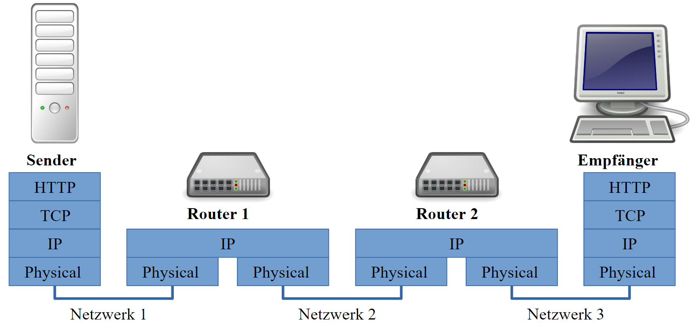
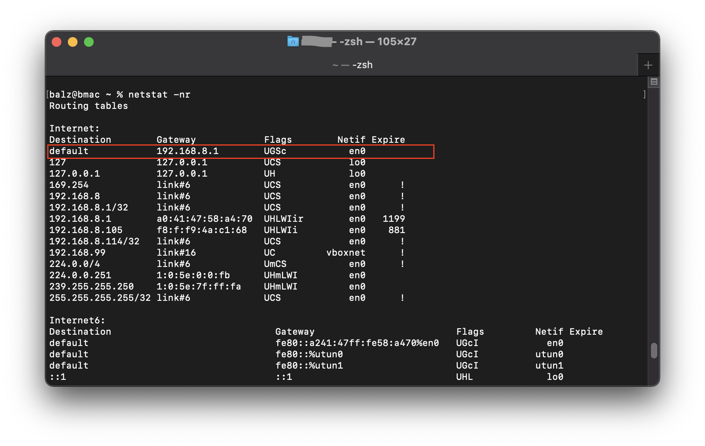
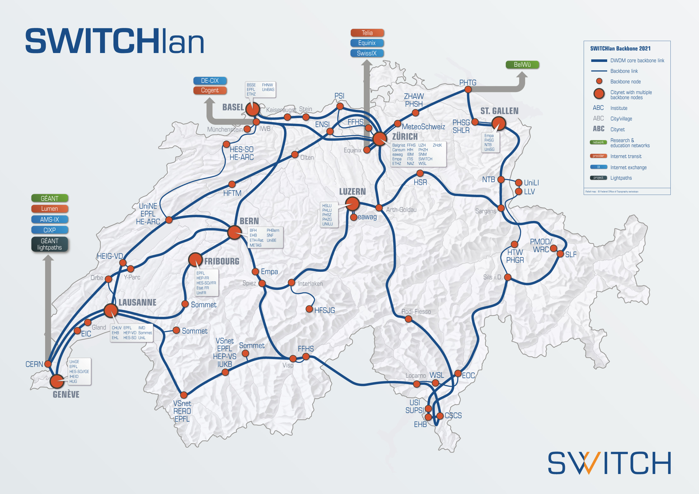
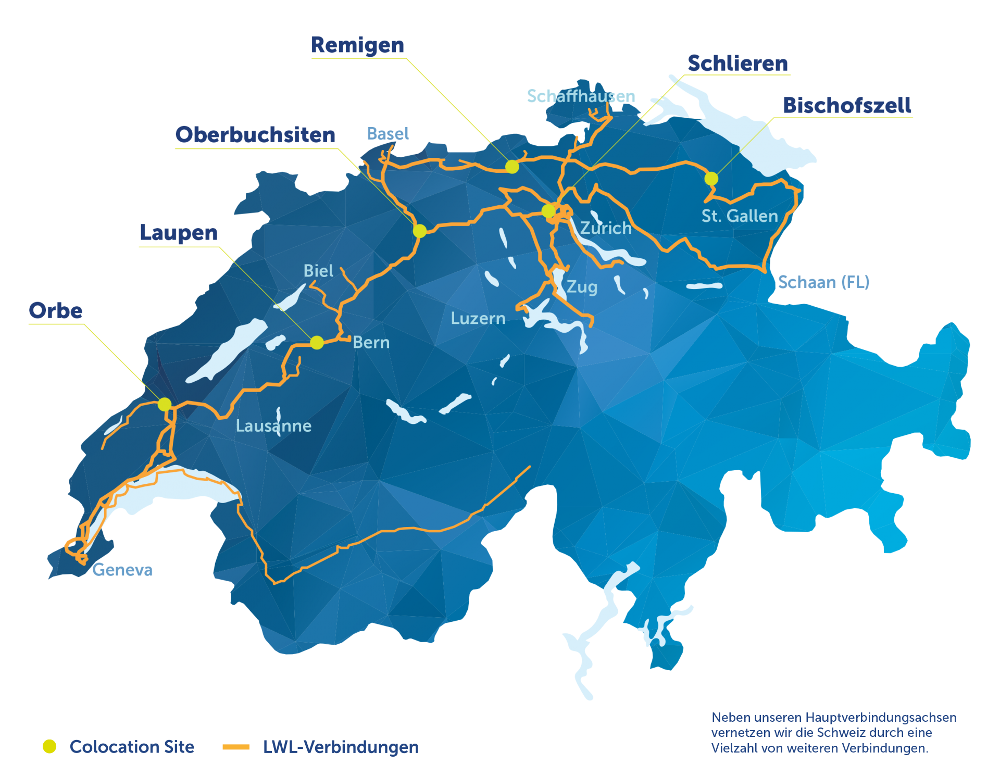

---
sidebar_custom_props:
  source:
    name: ofi.gbsl.website
    ref: 'https://ofi.gbsl.website/26e/Netzwerke/Routing/routing-internet'
page_id: 3349ef1a-27c7-4a0f-8e46-a7da08d25fe3
---

import QuillV2 from '@tdev-components/documents/QuillV2';
import TaskState from '@tdev-components/documents/TaskState';
import String from '@tdev-components/documents/String';

# Routing im Internet
Wie Pakete eine Postadresse haben, brauchen auch Datenpakete eine Adresse, damit sie korrekt zugestellt werden können. Diese Adressen nennt man **IP-Adressen**, wobei IP für *Internet Protocol* steht.

## Adressierung
Normalerweise erhält jedes Gerät beim Beitritt zu einem Rechnernetz eine IP-Adresse zugewiesen. Die Adresse gehört zum entsprechenden Netz und erlaubt die Kommunikation mit allen Geräten die sich ebenfalls im selben Netz befinden. Deshalb erhält Ihr Gerät hier am Gymnasium eine andere Adresse als bei Ihnen zu Hause.

### Aufbau
Eine IP-Adresse (genauer, IPv4 Adresse) setzt sich aus 4 Zahlen zu je 8 Bit zusammen. Diese 4 Zahlen werden im Dezimalsystem notiert und mit Punkten verbunden.

```
194.124.132.216
```

Es gibt also insgesamt $2^{32} = 4'294'967'296$ verschiedene IP-Adressen. Auf den ersten Blick scheint die Anzahl sehr gross zu sein. Durch die Vielzahl an internetfähigen Geräten weltweit sind ein Grossteil der Adressen inzwischen vergeben. Deshalb gibt es eine neuere IP-Version 6, die aber den alten Standard noch nicht ersetzt hat.

### Ping
Beim Ping-Befehl handelt es sich um ein Netzwerkdiagnose-Tool, womit man die Datenübertragung zu einem anderen Gerät überprüfen kann. Dabei sendet man ein Signal an ein entferntes Gerät. Dieses Gerät sollte dann ein Signal zurücksenden.

```sh title="In der Kommandozeile"
ping 194.124.132.216
```

:::aufgabe[Ping ausführen]
<TaskState id='af424cdb-18fa-4fae-9af5-640a13fd44f0' />
Öffenen Sie die Kommandozeile (Eingabeaufforderung) und führen Sie einen Ping mit folgenden IP-Adressen aus:

```sh
8.8.8.8
185.237.144.226
194.150.245.142
127.0.0.1
```

- Was bedeutet die Ausgabe?
- Wieso gibt es Unterschiede?

<QuillV2 id='6b05d3de-6d27-4379-965c-511ba1c20e08' />

<Solution id='acc57b84-159a-49b9-a073-55336a9826e0'>
  Der Ping-Befehl sendet wiederholt eine Test-Paket in der Grösse von 64 Bytes an die gewünschte IP-Adresse und misst dabei, wie lange es dauert, bis eine Antwort zurückkommt.

  Bei der Adresse `194.150.245.142` kommt keine Antwort zurück - dies bedeutet, dass unter dieser Adresse kein Gerät erreichbar ist.

  Bei der Adresse `127.0.0.1` kommt die Antwort viel schneller als bei den beiden ersten. Das liegt daran, dass es sich hierbei um die sogenannte **Loopback-Adresse** handelt: Unter `127.0.0.1` erreicht man auf jedem Computer diesen Computer selbst. Die Daten müssen also nie Ihr Gerät verlassen, weshalb auch so schnell eine Antwort kommt. Das ist so, als würden Sie einen Brief an sich selbst Adressieren - sie müssen ihn gar nicht erst zur Post bringen, um ihn zu zuzustellen.
</Solution>
:::

## Routing für Datenpakete
Routing-Algorithmen sorgen dafür, dass Datenpakete ihren Weg durch das Internet finden. Dabei kann es sein, dass mehrere Pakete mit demselben Ziel unterschiedliche Routen nehmen.


### Router im Schichtenmodell
Der **Router** ist das **Paketverteilzentrum** und verbindet mehrere Netzwerke miteinander. Er besitzt also mindestens **zwei Netzwerkkarten** und somit auch mindestens **zwei IP-Adressen** um sich mit den einzelnen Netzwerken zu verbinden.

Sie müssen die **IP-Pakete auspacken**, damit diese gemäss der IP-Adresse **weitergeleitet** werden können. Dabei bedienen sich Router spezieller Tabellen, welche angeben, wohin ein Paket mit einer bestimmten IP-Adresse hingeleitet werden soll.



:::insight[Benötigte Informationen]
Damit ein Router ein IP-Paket weiterleiten kann, braucht er folgende, im Paket enthaltene Informationen:
- IP-Adresse Sender
- IP-Adresse Empfänger
:::

## Standardgateway
Für die Kommunikation mit Geräten ausserhalb des eigenen Netzwerks müssen die Internetpakete zum nächsten Verteilzentrum geschickt werden. In der Analogie zum Öffentlichen Verkehr ist dies die nächstgelegene Haltestelle, die Sie zum Hauptbahnhof bringt: wollen Sie an einen Ort ausserhalb ihrer Stadt, so gehen Sie zum Hauptbahnhof, wo Sie in die richtige Richtung weitergeleitet werden. Dieser Weg zum Hauptbahnhof wird bei Netzwerkfähigen Geräten **Standardgateway** genannt.

### Standardgateway ihres Laptops
So bestimmen Sie das Standardgateway Ihres Laptops:

::::Tabs{groupId="os"}
:::Tab[Windows]{value="windows"}
```.sh title="In der Kommandozeile (cmd) eingeben"
ipconfig
```


:::

:::Tab[macOS]{value="macos"}
```.sh title="In der Koommandozeile (terminal) eingeben"
netstat -nr
```


:::
::::

:::insight[Nicht überall gleich]
Zu Hause haben Sie als Standardgateway die IP-Adresse Ihres Routers/Modems eingetragen – also dem Gerät, das Sie von Ihrem Internet-Anbieter erhalten, um Zugang zum Internet zu erhalten.
:::

:::aufgabe[Standardgateway bestimmen]
<TaskState id='5f3e849a-9101-4159-b526-8bfd879d9cac' />
Falls Sie ihr aktuelles Standardgateway noch nicht kennen, dann finden Sie es jetzt heraus. Halten Sie das Ergebnis für die nächste Aufgabe hier fest.

<String id='c93ffd74-a133-4fbf-8cf7-d6e717a0e4fb' placeholder='Standardgateway...' />
:::

## Routen verfolgen
Der Befehl `traceroute` (macOS) resp. `tracert` (Windows) kann diese Route nachverfolgt werden. Dabei werden die Zwischenstationen – also dort wo das Paket entpackt und gemäss Ziel-IP-Adresse weitergeleitet wird – angezeigt.

:::::aufgabe[traceroute]
<TaskState id='9eff533e-0e3d-42c7-bfbe-65ddcba96763' />
::::Tabs{groupId="os"}
:::Tab[Windows]{value="windows"}
Öffnen Sie eine Eingabeaufforderung (cmd) und geben Sie nacheinander die folgenden drei Befehl ein:
```.sh title="In der Kommandozeile (cmd)"
tracert office.com
tracert www.google.ch
tracert www.gbsl.ch
```
:::

:::Tab[macOS]{value="macos"}
Öffnen Sie eine Eingabeaufforderung (terminal) und geben Sie nacheinander die folgenden drei Befehle ein:

```.sh title="In der Kommandozeile (terminal)"
traceroute office.com
traceroute www.google.ch
traceroute www.gbsl.ch
```
:::
::::

Beobachten Sie den Output. Erkennen Sie Gemeinsamkeiten oder irgendeine spezielle Zwischenstation?

<QuillV2 id='ee52903a-1e80-49d0-a742-42fa608cd0cb' />

<Solution id='35299f79-a196-42ab-aa78-6fc380f781f3'>
  Die erste Zwischenstation ist immer Ihr Standardgateway. Vergleichen Sie mit dem Resultat der vorangehenden Aufgabe!

  Danach sind vermutlich noch ein paar weitere Zwischenstationen bei allen drei Traceroute-Abfragen identisch. Das liegt daran, dass Ihre Pakete höchstwahrscheinlich immer den gleichen Weg zum nächsten Verteilzentrum Ihres Internetanbieters (Swisscom, UPC, etc.) nehmen. Erst dann laufen die Routen auseinander, denn nun muss das Paket von diesem Verteilzentrum über eine möglichst effiziente Route zur Ziel-Adresse vermittelt werden.
</Solution>
:::::

## «Highspeed-Routen»
### Schweiz
Auf der untenstehenden Karte erkennt man die schnellsten Leitungen von Switch. Diese Organisation verbindet die Universitäten und Forschungsinstitute miteinander und mit dem Ausland.



Andere Provider besitzen ebenfalls schnelle Leitungen zwischen den Städten und ins Ausland. z.B. wurden bestehenden Gas-Leitungen mit schnellen Glasfaser-Kabeln versehen.



### Interkontinental

Das [Unterseenetzwerk](../Unterseekabel) haben Sie ja bereits kennengelernt. Bei der Verbindung von Kontinenten hatte man schon vor dem Internet-Zeitalter Unterseekabel verlegt.


Heute laufen zahlreiche «Highspeed-Routen» über den Grund der Meere.

::youtube[https://www.youtube.com/embed/0TZwiUwZwIE?si=wP5CQXEA14LpFh_0]

---