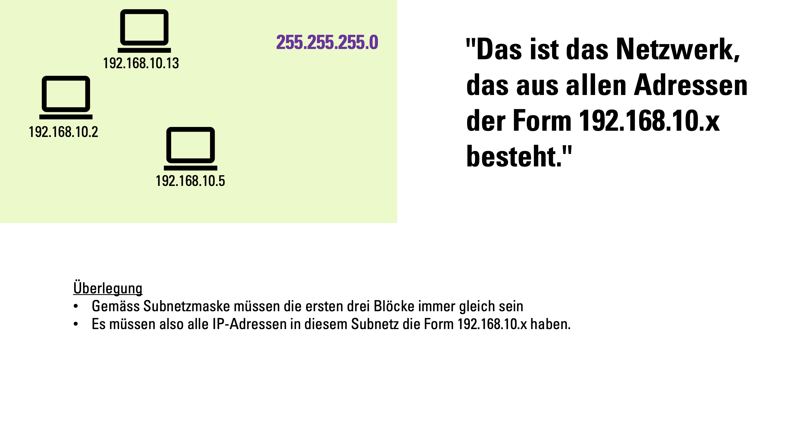
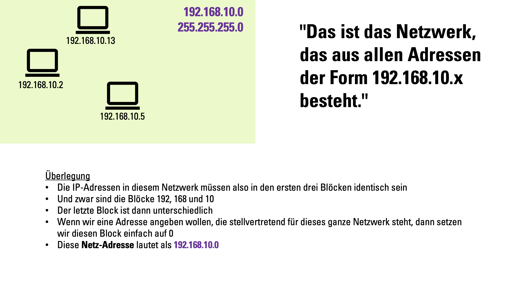
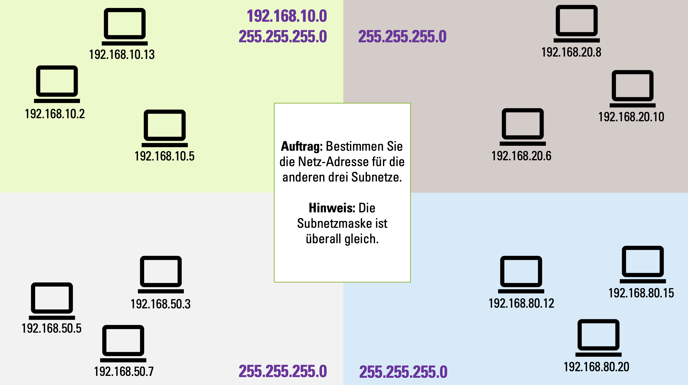
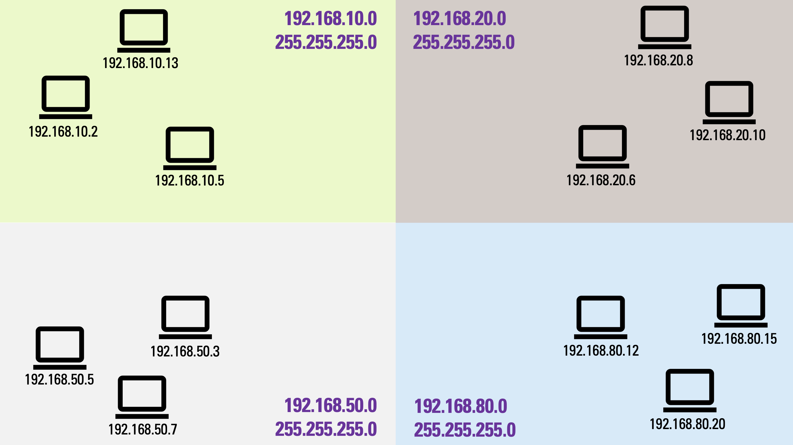
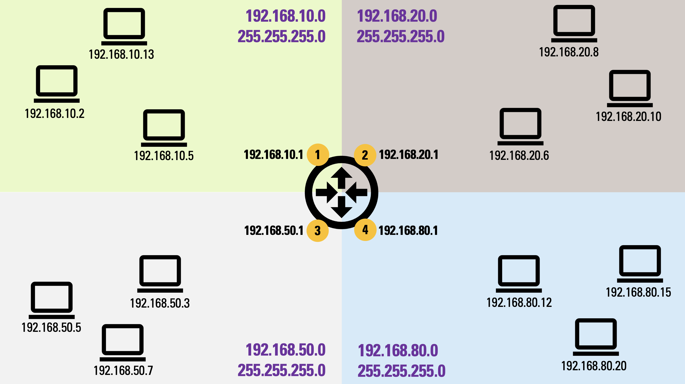
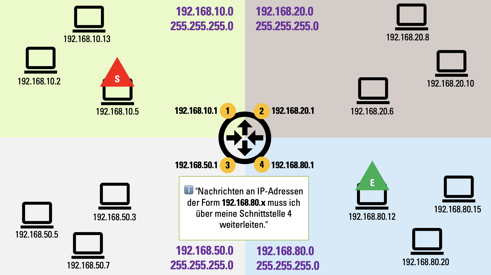
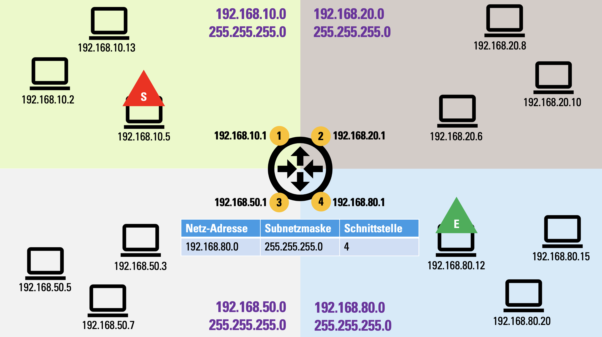
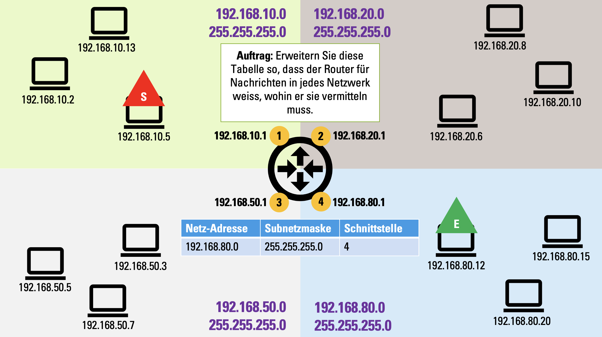
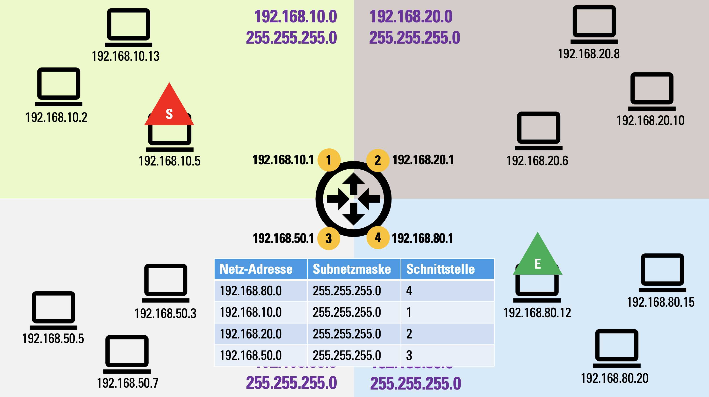

# ⭐️ Routing-Tabellen erstellen

In diesem Selbstlernblock lernen Sie, wie wir für ein Netzwerk eine **Routing-Tabelle** erstellen können.

Damit wir eine Routing-Tabelle erstellen können, brauchen wir zuerst ein paar Subnetze. Fangen wir mal mit dem ersten Subnetz an: 

Wir haben also das Subnetz aller Adressen der Form `192.168.10.x`. Das sehen wir daran, dass alle Adressen mit den Blöcken `192`, `168` und `10` beginnen und dass gemäss der Subnetzmaske in diesen Blöcken auch identisch sein müssen.

Nun wäre es praktisch, wenn wir dieses Netzwerk mit einer einzigen Adresse (plus Subnetzmaske) beschreiben könnten:

In Zusammenhang mit der Subnetzmaske `255.255.255.0` ist dies also das Subnetz mit der Netz-Adresse `192.168.10.0`.

:::aufgabe[Netz-Adressen ergänzen] Ergänzen Sie die Netz-Adressen für die restlichen drei Netzwerke. Schreiben Sie Ihre Lösungen unten in die drei Textboxen und kontrollieren Sie mit dem :mdi[help-circle-outline]-Button.

<String
    id="1449fe0e-6673-4b8d-a94f-b4b3b0f663f4"
    label="Oben rechts"
    placeholder="Netzwerk-Adresse"
    solution="192.168.20.0"
/>
<String
    id="be5abc7a-8cb1-428e-ab55-1bf854caa688"
    label="Unten links"
    placeholder="Netzwerk-Adresse"
    solution="192.168.50.0"
/>
<String
    id="b774130d-2b46-476b-af13-0ec835a08d23"
    label="Unten rechts"
    placeholder="Netzwerk-Adresse"
    solution="192.168.80.0"
/>

<Solution id="a63a6389-7017-470e-ace7-b8bddc83f0c6"></Solution>
:::

Nun müssen wir diese vier Subnetze miteinander verbinden. Dafür brauchen wir ein Gateway: den **Router** (Symbol in der Mitte).

Damit der Router die Netzwerke miteinander verbinden kann, muss er sich gleichzeitig in allen vier Netzwerken befinden. Unser Router hat dazu vier **Schnittstellen** (auch **Interfaces** genannt; markiert mit 1-4). Jede dieser Schnittstellen verhält sich wie ein ganz normales Gerät im Netzwerk und hat deshalb eine eigene IP-Adresse.

Nun können wir uns überlegen, was der Router wissen muss, um Daten von einem Gerät in Subnetz X zu einem anderen Gerät in Subnetz Y zu übertragen. Als Beispiel wählen wir mal einen **S**ender und einen **E**mpfänger aus. 

Um Daten an den gewählten **E**mpfänger zu schicken, muss der Router sie also über seine Schnittstelle 4 weiterleiten.

Diese Information können wir tabellarisch festhalten. Eine solche Tabelle bezeichnet man als **Routing-Tabelle**.

:::aufgabe[Routing-Tabelle vervollständigen] Bearbeiten Sie den Auftrag, den Sie unten im Bild sehen. 

Halten Sie Ihre Lösung z.B. in einer Excel-Tabelle fest und vergleichen Sie anschliessend mit der Musterlösung.

<Solution id="488156d2-5f3b-4ade-997b-8b0c02c9a053"></Solution>
:::

:::aufgabe[Arbeitsblatt Routing-Tabellen]

<TaskState id="3f473995-39f4-4f05-905a-5a05773d7a6f" />

Mit [diesem Arbeitsblatt](https://erzbe-my.sharepoint.com/:b:/g/personal/silas_berger_gbsl_ch/EW325BG3dqdPkiYytzk0zHgBeLMNEUgX0SJq59V0kGZ9Zg?e=A8cmhj) können Sie das Erstellen von Routing-Tabellen noch weiter üben.

<Solution id="ebd21072-2037-4ae8-bcd5-55ca8a6403b0">
    Die Lösungen finden Sie
    [hier](https://erzbe-my.sharepoint.com/:b:/g/personal/silas_berger_gbsl_ch/EdxxYUiQZ0BHnGDu-visbZ4BdEUZL-3Yc8IgULzHE5UI5g?e=Lf30S5).
</Solution>
:::

---
