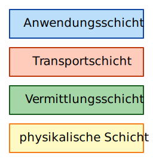

import Restricted from '@tdev-components/documents/Restricted';

# Das Schichtenmodell
Die Kommunikation zwischen Digitalgeräten ist auf so allgemeine Art geregelt, dass es für die beteiligten Endgeräte eigentlich keinen Unterschied macht, ob sie direkt miteinander verbunden sind, oder ob sie ihre Nachrichten über ein weltweites Netzwerk (=Internet) austauschen. Die Grundlage für beides ist ein Schichtenmodell, das die komplexe Aufgabe der Nachrichtenübermittlung auf verschiedenen Ebenen, bzw. Schichten verteilt:

Eine Kommunikation zwischen zwei Digitalgeräten besteht eigentlich aus mehreren ineinander verschachtelten Gesprächen. Das Internet konnte seine explosionsartige Entwicklung nur deshalb so verhältnismässig reibungslos überstehen, weil die verschiedenen «Gespräche» schon früh mithilfe eines sauberen Schichtenmodells auf verschiedene Kommunikationsebenen aufgeteilt wurden. (Das theoretische Schichtenmodell der digitalen Kommunikation heisst OSI, im Internet wird zumeist die etwas vereinfachte TCP/IP-Protokollfamilie benutzt.)

Die Schichten des TCP/IP-Stacks
Jedes dieser Gespräche dient einem bestimmten Zweck innerhalb der komplizierten Aufgabe des weltweiten digitalen Nachrichtenaustauschs, jede Kommunikationsebene folgt dafür ihren eigenen Regeln (=Protokolle) und die verschiedenen Ebenen sind – abgesehen von der Verschachtelung – möglichst unabhängig voneinander.

## Gruppenpuzzle 🧩
<Restricted id='36060781-4b45-490a-98c6-a105a750ca6d'>
  :::aufgabe[Phase 1]
  Falls Sie das nicht schon gemacht haben, lesen Sie jetzt zuerst den obigen Abschnitt auf dieser Seite.

  Lesen Sie anschliessend den Detail-Artikel (links zu finden) zu **einer** der vier Schichten, entsprechend Ihrer Gruppennummer:

  | Gruppe | Schicht             |
  |--------|---------------------|
  | 1      | Anwendungsschicht   |
  | 2      | Transportschicht    |
  | 3      | Vermittlungsschicht |
  | 4      | Netzzugangsschicht  |
  :::
</Restricted>

<Restricted id='5c381277-06b8-4e25-9d88-a83451c7d2e0'>
  :::aufgabe[Phase 2]
  Setzen Sie sich jetzt als Gruppe zusammen (alle 1, alle 2, etc.).

  Diskutieren Sie folgende Punkte:
  - Was habe Sie verstanden?
  - Welche Aufgabe hat diese Schicht (in Bezug auf das Beispiel «Schule» und auf echte Netzwerke)?
  - Wie verbinden Sie Ihre Schicht mit dem Daten-Übertragungs-Spiel aus dem Unterricht?
  - Welche neuen Begriffe haben Sie kennengelernt, und was bedeuten diese?
  - Was ist Ihnen noch unklar?
  :::
</Restricted>

<Restricted id='a4a6a916-b9bd-477a-b90d-5fd0fe7ef777'>
  :::aufgabe[Phase 3]
  Sie haben Ihr Verständnis für die von Ihnen bearbeitete Schicht nun noch einmal gefestigt. Jetzt sollen Sie Ihr Wissen teilen!

  Bilden Sie nun selbstständig neue **Vierergruppen** — und zwar so, dass jede Gruppe eine Expert:in pro Schicht enthält.

  In der Gruppe erledigen Sie folgende Aufträge:
  - Erklären Sie einander, was Sie über Ihre Schicht gelernt haben.
  - Überlegen Sie sich, wie dieses Schichtenmodell zum Daten-Übertragungs-Spiel passt. Welche Schicht gehört zu welchem Aspekt des Spiels? Was war im Spiel allenfalls anders?
  :::
</Restricted>
