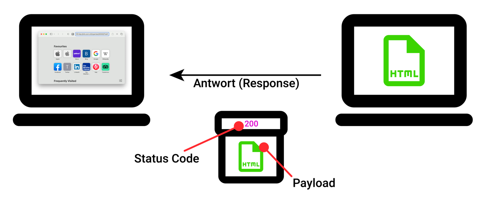

# Ablauf eines Webseitenaufrufs

Immer wenn in der Informatik zwei Parteien (in diesem Fall zwei Computer) miteinander kommunizieren wollen, müssen sich beide Seiten an gewisse Spielregeln halten, damit sie sich gegenseitig verstehen. Diese Spielregeln bezeichnen wir in der Fachsprache als **Protokolle**. Sie legen beispielsweise einen Handlungsablauf fest, oder sie definieren, wie ein bestimmtes Datenpaket aufgebaut sein muss.

:::definition[Protokoll] In der Informatik ist ein **Protokoll** (oder **Kommunikationsprotokoll**) eine Vereinbarung darüber, wie die Datenübertragung zwischen zwei oder mehreren Parteien ablaufen soll. :::

In diesem Abschnitt verschaffen wir uns einen Überblick über den Ablauf eines Webseitenaufrufs, wie er durch das **Hypertext Transfer Protocol (HTTP)** festgelegt wird.

## Die Teilnehmer

Der erste Teilnehmer ist dabei der sogenannte **Browser** - also ein Programm auf dem Computer der Benutzerin, welches Webseiten aufrufen und anzeigen kann.

:::definition[Browser] **Webbrowser** oder allgemein auch **Browser** (englisch: _to browse_, 'stöbern') sind Computerprogramme zur Darstellung von Webseiten im World Wide Web oder allgemein von Dokumenten und Daten. :::

Der andere Teilnehmer ist ein zweiter (meistens sehr leistungsstarker) Computer, welcher gewisse **Ressourcen** besitzt und öffentlich anbietet. In unserem Beispiel handelt es sich bei dieser Ressource um die HTML-Datei, welche die Benutzerin gerne anzeigen möchte.

Diese beiden Seiten stehen sich in einem sogenannten Client-Server-Verhältnis gegenüber. Dabei ist der **Server** diejenige Partei, die etwas anbietet. Der **Client** ist die Partei, die um etwas bittet: in diesem Fall um eine HTML-Datei. Wir können also sowohl den Browser als auch den Computer der Benutzerin als Client bezeichnen - im Prinzip sogar die Benutzerin selbst.

:::definition[Client und Server]

- Ein **Client** ist ein Programm oder ein Gerät, das Dienste von einem _Server_ abruft. Ein _Browser_ ist also ein Beispiel für einen Client.
- Ein **Server** ist ein Programm oder Gerät, das auf die Kontaktaufnahme eines _Clients_ wartet, um eine bestimmte Dienstleistung für ihn zu erfüllen. Sehr oft handelt es sich bei den Dienstleistungen um das Anbieten von HTML-Dateien. :::

## Der Ablauf

Im ersten Schritt sendet der Client nun eine **Anfrage (Request)** an den Server. In seiner Anfrage muss er die Adresse des Servers, sowie den Ort der gesuchten Datei auf diesem Server angeben. Das macht er mit der sogenannten **URL** (_Uniform Resource Locator_) - dazu [später mehr](./02-Die-URL.mdx).

Wenn der kontaktierte Server nun die gesuchte Datei am entsprechenden Ort findet, dann sendet er sie in seiner **Antwort (Response)** an den Client zurück[^1]. Die Datei wird dazu in ein Paket gepackt und darin als **Payload** (also als "eigentlicher Inhalt") des Pakets bezeichnet. Nebst der Payload enthält das Paket auch noch den sogenannten **Status Code**. Auch dazu [später mehr](./03-Http-Status-Codes.mdx).

:::definition[Payload] In der Datenübertragung ist die **Payload** derjenige Anteil eines Pakets, bei dem es sich um den eigentlichen Inhalt der Übertragung handelt. Bei einer _Response_ würde man zum Beispiel die gesuchte HTML-Datei als Payload bezeichnen.

Die Payload steht im Kontrast zu den sogenannten _Metadaten_ (auch _Steuerungsdaten_), also den übrigen Zusatzinformationen wie Adresse und Status Code, die zur erfolgreichen Übertragung nötig sind. :::

Und damit ist die gesuchte Webseite auch bereits auf dem Computer der Benutzerin angelangt. Der Browser nimmt die erhaltene HTML-Datei nun entgegen und präsentiert deren Inhalt auf dem Bildschirm.

:::key[Request-Response-Prinzip] Ein Webseitenaufruf erfolgt nach sogenannten **Request-Resopnse-Prinzip**: Der _Client_ sendet eine **Anfrage (Request)** an den _Server_. Diese Anfrage beinhaltet unter anderem Informationen darüber, welche Ressource (z.B. welche HTML-Datei) der Client in Anspruch nehmen möchte.

Der Server sendet daraufhin eine **Antwort (Response)** an den Client zurück. In Regelfall enthält diese Antwort die gewünschte Ressource, sowie einen [Status Code](./03-Http-Status-Codes.mdx). :::

Wie Sie sehen, regelt das Hypertext Transfer Protocol (HTTP) also einerseits den Ablauf eines Webseitenaufrufs in Form dieses Request-Response-Prinzips. Andererseits bestimmt es aber auch, wie diese Anfrage (Request) und die entsprechende Antwort (Response) aussehen müssen. Solange sich beide Parteien (Client und Server) an diese Spielregeln halten, können wir sicherstellen, dass ein solcher Aufruf ordnungsgemäss funktioniert.

Hier sehen Sie das Endergebnis nun noch einmal im Überblick: 

## Komplexe Webseiten

Die meisten Webseiten bestehen heutzutage nicht mehr nur aus einer einzigen HTML-Datei. Dazu kommen meistens noch CSS-Dateien für die optische Gestaltung, JavaScript-Dateien für gewisse Programmlogik, sowie Bilder und sonstige Medien.

Der Aufruf einer Webseite beginnt aber trotzdem immer mit dem Abruf eines HTML-Dokuments. Es ist anschliessend die Aufgabe des Browsers, die erhaltene HTML-Datei genau zu lesen und zu prüfen, welche weiteren Ressourcen darin verlinkt sind[^2]. Er wiederholt dann den oben beschrieben Request-Response-Prozess für all diese Ressourcen, bis er schlussendlich eine vollständig geladene Webseite darstellen kann.

[^1]: Es ist auch möglich, dass ein Server die gesuchte Datei zwar findet, sie aber trotzdem nicht herausgibt. Das ist beispielsweise dann der Fall, wenn eine Ressource nur für spezifische, eingeloggte Benutzerinnen und Benutzer zugänglich sein soll.

[^2]: Fall sie bereits mit HTML und CSS gearbeitet haben, dann haben Sie ihn Ihrer HTML-Datei vermutlich auch ein CSS-Stylesheet verlinkt: `<link rel="stylesheet" href="style.css">`.
