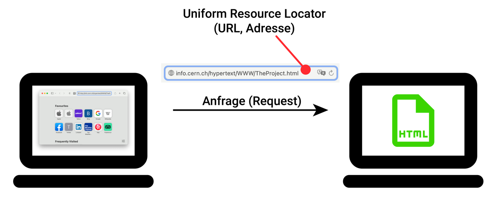

# Die URL

Der wohl wichtigste Teil der _Request_ beim [Webseitenaufruf](./01-Ablauf-Webseitenaufruf.mdx) ist die **URL** (_Uniform Resource Locator_). Darin sind nämlich zwei ganz wesentliche Informationen enthalten:

1. Wie lautet die Adresse des Servers, den wir kontaktieren wollen?
2. Welche Ressource dieses Servers möchten wir in Anspruch nehmen?

## Wie sieht das in unserem Beispiel aus?

In unserem Beispiel lautet die _URL_ `info.cern.ch/hypertext/WWW/TheProject.html` und besteht aus den folgenden zwei Teilen:

1. Dem **Domain-Teil** `info.cern.ch`.
2. Dem **Pfad** `/hypertext/WWW/TheProject.html`.

Insgesamt ist URL `info.cern.ch/hypertext/WWW/TheProject.html` also die Adresse einer ganz bestimmten Datei im World Wide Web:

- Sie ist die Adresse der Datei `TheProject.html`,
- ...welche auf dem Server `info.cern.ch`
- ...unter `/hypertext/WWW/` zu finden ist.

## Die vollständige URL

:::warning[Seite im Aufbau]

- Domain-Bestandteile
- Protokoll und Query Parameter
- Algorithmus zur Bestimmung der URL-Bestandteile
- Exkurs: Betrügerische Domain-Teile, z.B. `support.microsoft.com.evil.net` :::

---
