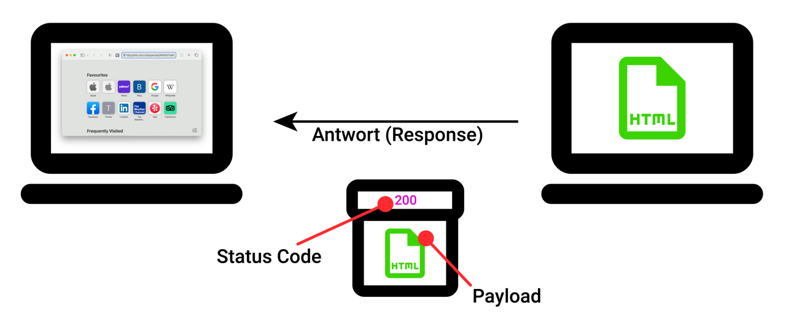

import DefinitionList from "@tdev-components/DefinitionList";

# HTTP Status Codes
Wie wir im [ersten Abschnitt](./01-Ablauf-Webseitenaufruf.mdx) gesehen haben, enthält das Antwortpaket nicht nur die gewünschte Ressource
(die HTML-Datei), sondern zudem auch immer noch eine dreistellige Zahl, den sogenannten **Status Code**. Dieser soll
dem Client genauere Auskunft darüber geben, wie er die Antwort zu interpretieren hat. In unserem Beispiel wurde die
gewünschte Ressource erwartungsgemäss retourniert, was der Server mit dem Statuscode `200 (OK)` bestätigt.

Mindestens einen solchen Statuscode haben Sie aber bestimmt schon gesehen, nämlich `404 (Not Found)`. Diesen Statuscode
retourniert der Server immer dann, wenn er die gewünschte Ressource nicht findet. Das wäre zum Beispiel der Fall
gewesen, wenn wir im obigen Beispiel versehentlich nach `DasProjekt.html` statt nach `TheProject.html` gefragt hätten.
Der eigentliche Inhalt des Pakets (die Payload) wäre in dem Fall leer gewesen.

Der Status Code ist deshalb wichtig, weil es auch andere Gründe haben kann, weshalb die keine Payload retourniert wird.
Es könnte zum Beispiel auch sein, dass auf Seiten des Servers gerade etwas schiefgelaufen ist - die Benutzerin kann
die Anfrage also getrost später nochmal versuchen. Weiter wäre es auch möglich, dass der Server die Ressource zwar
gefunden hat, sie aber aus Berechtigungsgründen nicht herausgeben darf. In dem Fall müsste die Benutzerin sich
vermutlich einloggen, oder um die entsprechende Berechtigung fragen. Der Status Code erlaubt es dem Browser also,
die Benutzerin insbesondere im Fall einer unerwarteten Antwort möglichst genau zu informieren, weshalb es etwas nicht
geklappt hat.

:::insight[Häufig verwendete Status Codes]
  <DefinitionList>
    <dt>`301`</dt>
    <dd>`Moved Permanently`</dd>
    <dd>Die Adresse dieser Ressource hat sich dauerhaft geändert - die Ressource ist also "umgezogen". Die Antwort enthält die neue Adresse.</dd>

    <dt>`401`</dt>
    <dd>`Unauthorized`</dd>
    <dd>Der Server kann die Identität des Clients nicht feststellen. Dieser muss sich authentifizieren (sprich, anmelden), um Zugriff auf diese Ressource zu erhalten.</dd>

    <dt>`403`</dt>
    <dd>`Forbidden`</dd>
    <dd>Der Server kann die Identität des Clients zwar feststellen, dieser ist jedoch nicht dazu berechtigt, diese Ressource zu konsumieren.</dd>

    <dt>`404`</dt>
    <dd>`Not Found`</dd>
    <dd>Der Server kann die angefragte Ressource nicht finden.</dd>

    <dt>`500`</dt>
    <dd>`Internal Server Error`</dd>
    <dd>Der Server hat eine Situation angetroffen, die er nicht bewältigen kann.</dd>
  </DefinitionList>

  ***

  ### Bonus: I'm a teapot
  <DefinitionList>
    <dt>`418`</dt>
    <dd>`I'm a teapot`</dd>
    <dd>Der Server weigert sich, Kaffee zu kochen - denn er ist ein Teekessel!</dd>
  </DefinitionList>

Dieser Status Code geht zurück auf Aprilscherze aus den Jahren 1998 und 2014. Einige Server geben ihn aber auch heute
teilweise noch als Antwort zurück, wenn sie eine bestimmte Anfrage nicht bearbeiten wollen. Das kann beispielsweise
dann der Fall sein, wenn es sich um automatisierte Anfragen handelt, die für den Server eine hohe Belastung bedeuten
können. _Quelle: [Mozilla Developer Network](https://developer.mozilla.org/en-US/docs/Web/HTTP/Status/418)_.
:::

---
