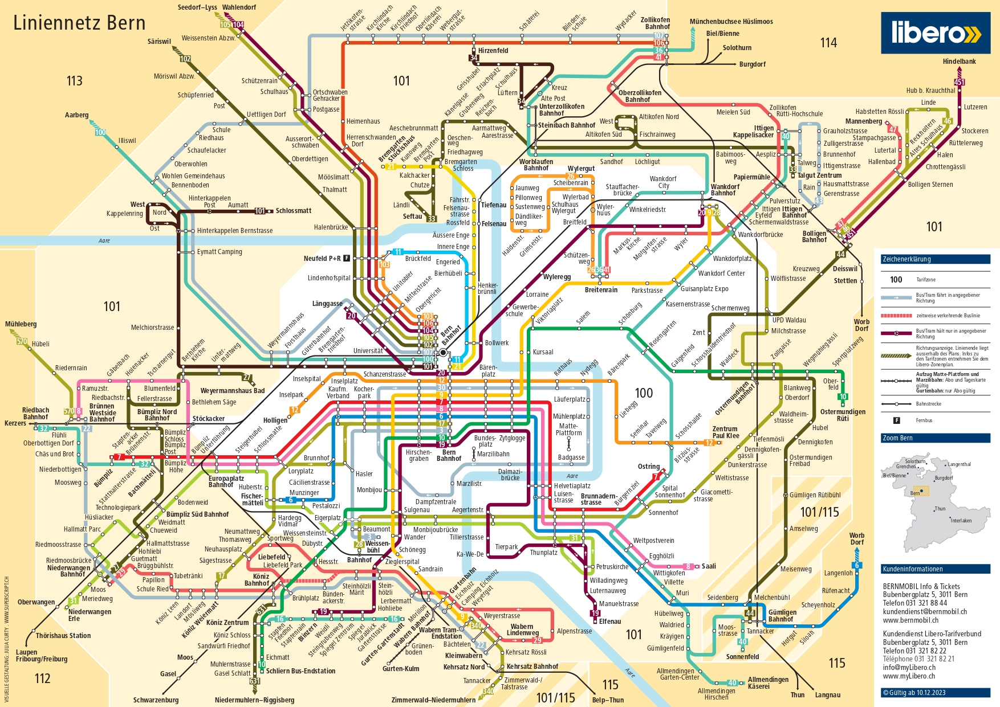

---
sidebar_custom_props:
  source:
    name: ofi.gbsl.website
    ref: 'https://ofi.gbsl.website/26e/Netzwerke/Routing/routing-alltag'
page_id: 599f3e7a-0940-48cc-b227-fc5e6a13850c
---

import DefinitionList from "@tdev-components/DefinitionList";

# Routing im Alltag
Im Rahmen dieser Übungen machen Sie sich Gedanken über die folgende Reise:

<DefinitionList>
  <dt>Start</dt>
  <dd>
    Gymnasium Lerbermatt 
    Kirchstrasse 64, 3098 Köniz
  </dd>

  <dt>Ziel</dt>
  <dd>
    Zentrum Paul Klee 
    Monument im Fruchtland 3, 3006 Bern
  </dd>
</DefinitionList>

# Bernmobil
Durch das [Verkehrsnetz von Bernmobil](https://www.bernmobil.ch/sites/default/files/2023-12/Zonenplan%2520Bern%25202024.pdf) wird der öffentliche Verkehr in der Stadt Bern sichergestellt.

:::aufgabe[Aufgabe 1: Netzplan]
Welche Möglichkeiten finden Sie im Liniennetz von Bernmobil für die von Ihnen geplante Reise?
:::

:::aufgabe[Aufgabe 2: Google Maps]
Welchen Transportoptionen schlägt Ihnen [Google Maps](https://www.google.com/maps/dir/Gymnasium+Lerbermatt,+Kirchstrasse+64,+3098+K%C3%B6niz/Zentrum+Paul+Klee,+Monument+im+Fruchtland,+Bern/@46.9427366,7.4276285,14z/am=t/data=!4m14!4m13!1m5!1m1!1s0x478e384bca8725e5:0x4abbfb069dad48e8!2m2!1d7.4339934!2d46.9304008!1m5!1m1!1s0x478e376710a618cb:0xda760f639344051!2m2!1d7.474098!2d46.948891!3e3?entry=ttu) vor, wenn Sie die Route _Gymnasium Lerbermatt_ → _Zentrum Paul Klee_ suchen?

- Welche Optionen werden vorgeschlagen?
- Welches ist gemäss Google die beste Route?
- Ändert sich die Route, wenn sie möglichst kurze Fusswege enthalten soll? (Einstellbar unter Routenoptionen)
- Ändert sich der Reisevorschlag, wenn Sie spät in der Nacht (00:45 Uhr) eine Verbindung suchen?
:::

## Analogien
<DefinitionList>
  <dt>WLAN</dt>
  <dd>zu Fuss bis zur nächsten Haltestelle</dd>
  <dt>Sichtbare WLANs</dt>
  <dd>Haltestellen, die zu Fuss erreichbar sind: Steinhölzli & Zentrum Paul Klee</dd>
  <dt>Kabelgebundene Rechnernetz (LAN, ohne "W" für "Wireless")</dt>
  <dd>mit Bus (für weiter entfernte Ziele: Tram, Zug, ...)</dd>
  <dt>Router</dt>
  <dd>Umsteigen an gewissen Haltestellen</dd>
</DefinitionList>

## Routing für Touristen
Datenpakete sind – anders als wir als Passagiere vom ÖV – nicht intelligent. Sie wissen nicht, wie sie umsteigen müssen. Dies muss für sie übernommen werden.

Ein Datenpaket im ÖV vom Gymer zum Zentrum Paul Klee müsste
1. an jeder Haltestelle wissen:
   - ob man Aussteigen oder Umsteigen muss
   - in welchen Bus man als nächstes einsteigen muss
   - ob man am Ziel angekommen ist.
2. an jeder Strassenkreuzung (wenn zu Fuss unterwegs) wissen:
   - welche Abzweigung es nehmen soll
   - ob es am Ziel angekommen ist.

:::aufgabe[Aufgabe 3: Routing-Tabelle]
Erstellen Sie für das Ziel "Zentrum Paul Klee" eine Umsteige-Anleitung für Datenpakete gemäss Punkt 1 aus obiger Anleitung für die folgenden Haltestellen:

- Steinhölzli
- Wander
- Monbijou
- Zytglogge
- Schlosshalde
- Zentrum Paul Klee

**Beispiel-Anleitung:**

| Ort          | 	Ziel  | Aktion            |
|--------------|--------|-------------------|
| Steinhölzli	 | Wander | Bus Nr. 19 nehmen |
| ...          | ...    | ...               |

Halten Sie Ihre Anleitung auf Papier fest.
:::

## Grosse Gruppe
:::aufgabe[Aufgabe 4: Grosse Gruppe]
4 Parallelklassen – also ca. 100 Personen haben nach Unterrichtsschluss beim Zentrum Paul Klee abgemacht. Wie kommen sie am schnellsten vom Gymer dorthin, wenn wir damit rechnen, dass wegen der Belegung des Feierabendverkehrs maximal 25 Schüler*innen pro Bus Platz finden?
:::
