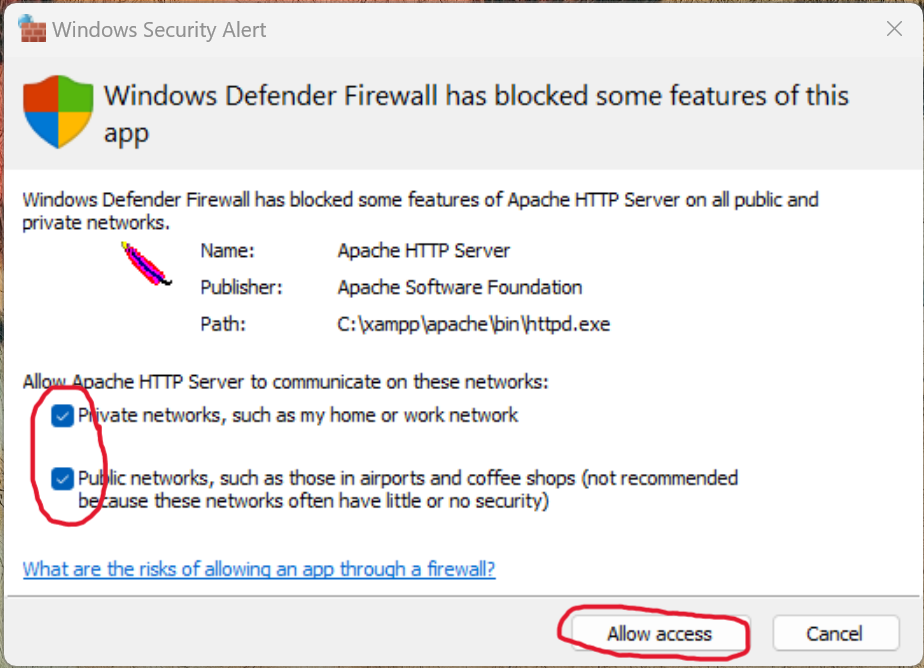
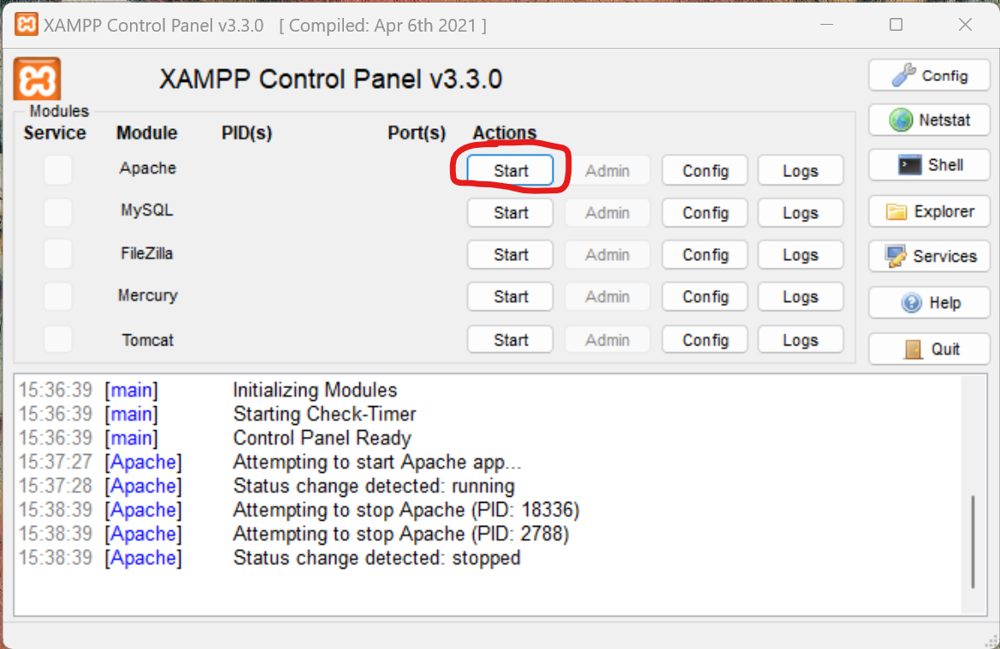
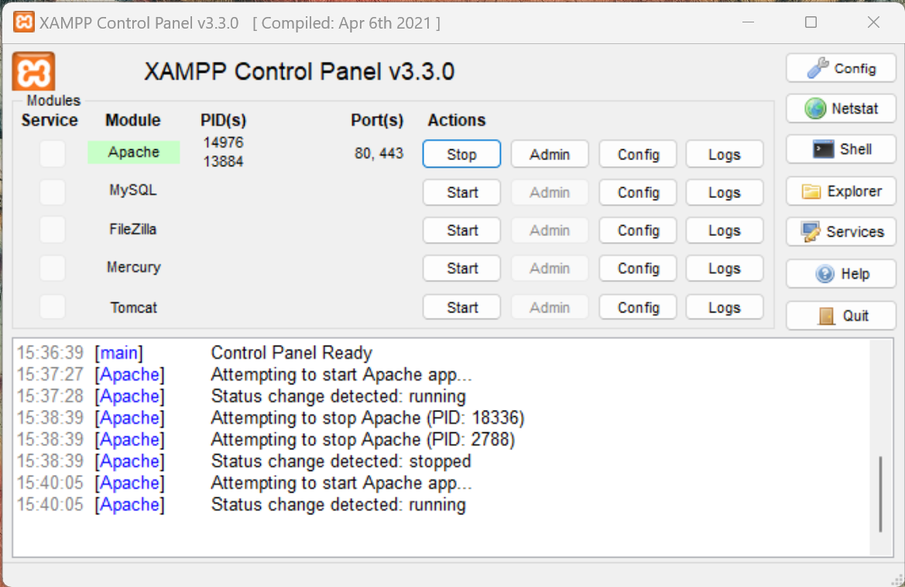
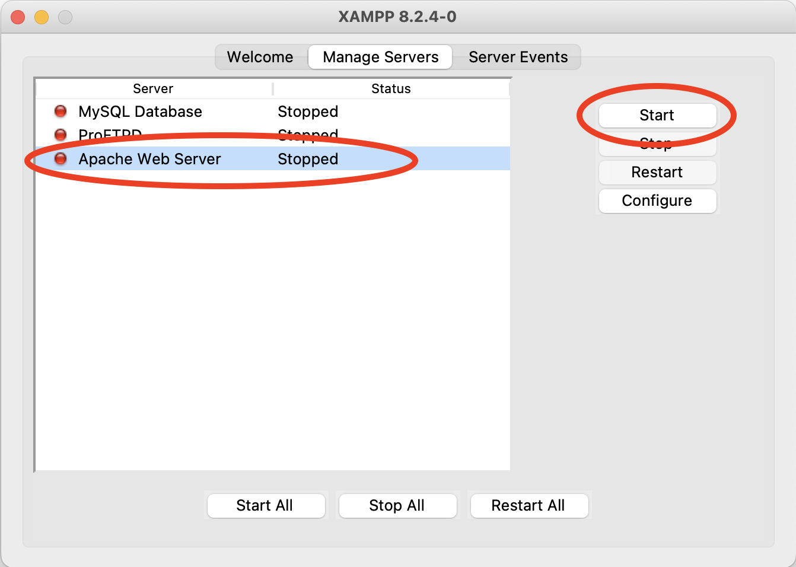
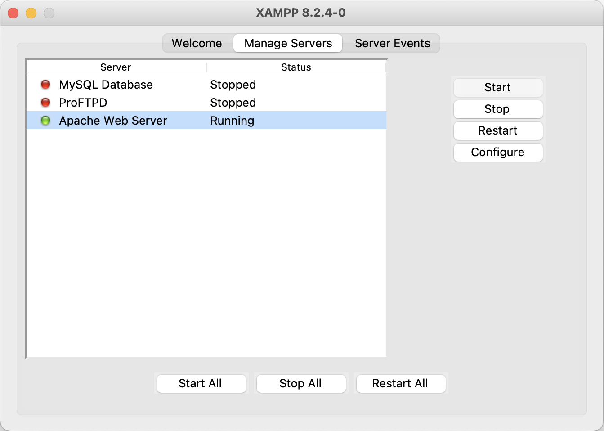
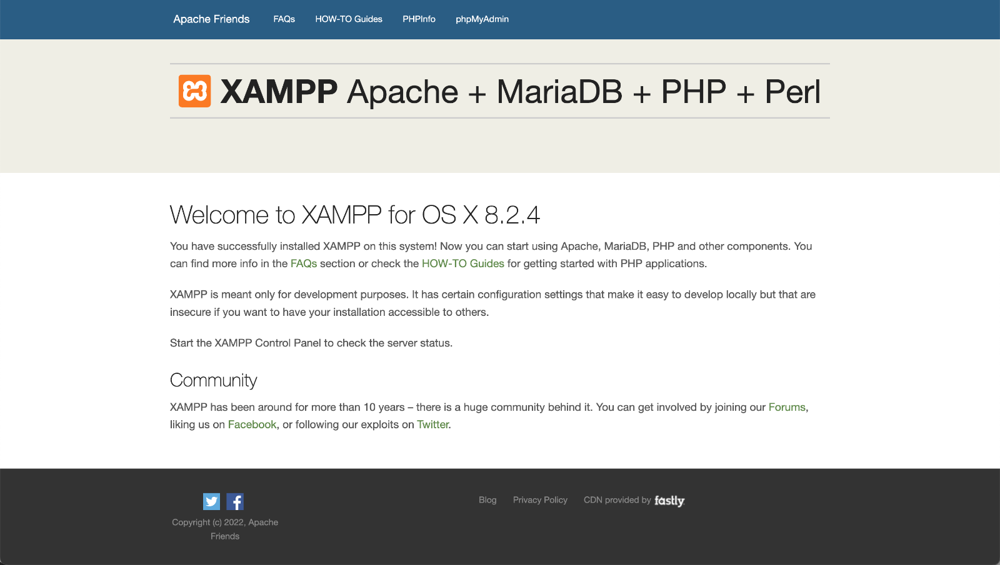

# Den Laptop zum Web Server verwandeln
Sie haben bereits mit HTML und CSS gearbeitet und eine eigene Webseite erstellt? Super! In diesem Abschnitt lernen Sie, wie Sie Ihren Laptop zu einem Web Server verwandeln, damit Ihre Kolleginnen und Kollegen auf Ihre Webseite zugreifen können.

## XAMPP einrichten
Um Ihren Laptop als Web Server verwenden zu können, müssen Sie zuerst ein entsprechendes Programm installieren. Wir verwenden dazu eine Software namens _XAMPP_. Gehen Sie für die Einrichtung von XAMPP wie folgt vor:

::::Tabs{groupId="os"}
:::Tab[Windows]{value="windows"}
1. Laden Sie die [aktuellste Version von XAMPP](https://sourceforge.net/projects/xampp/files/XAMPP%20Windows/8.2.12/xampp-windows-x64-8.2.12-0-VS16-installer.exe) herunter.
2. Führen Sie die heruntergeladene Datei aus, um das Programm zu installieren. Akzeptieren Sie dabei alle Standardeinstellungen.
3. Wenn die Windows Defender Firewall um Erlaubnis fragt, erlauben Sie den Zugriff sowohl für private als auch für öffentliche Netzwerke (siehe Screenshot).
4. Schliessen Sie die Installation ab und öffnen Sie am Schluss das _XAMPP Control Panel_. Sie können dieses auch jederzeit aus den Windows Start-Menü öffnen.

:::Caption
  Windows Firewall: Zugriff für private und öffentliche Netzwerke erlauben.
:::

:::Tab[macOS]{value="macos"}
1. Laden Sie die [aktuellste Version von XAMPP](https://sourceforge.net/projects/xampp/files/XAMPP%20Mac%20OS%20X/8.2.4/xampp-osx-8.2.4-0-installer.dmg) herunter.
2. Führen Sie die heruntergeladene Datei aus, um das Programm zu installieren. Akzeptieren Sie dabei alle Standardeinstellungen.
3. Schliessen Sie die Installation ab und öffnen Sie am Schluss das _XAMPP Control Panel_.
:::
::::

## Web Server starten
::::Tabs{groupId="os"}
:::Tab[Windows]{value="windows"}
Sobald Sie XAMPP installiert haben, starten Sie im Control Panel das _Apache_-Modul:

Wenn alles funktioniert hat, sollte das Control Panel am Schluss wie folgt aussehen:

:::

:::Tab[macOS]{value="macos"}
Sobald Sie XAMPP installiert haben, starten Sie im Control Panel das _Apache Web Server_-Modul:

Wenn alles funktioniert hat, sollte das Control Panel am Schluss wie folgt aussehen:

:::
::::

Um das zu kontrollieren, rufen Sie die Adresse http://127.0.0.1 auf. Es sollte folgende Webseite angezeigt werden:

:::insight[Exkurs: Die Loopback-Adresse]
Sie haben damit auch gleich eine spezielle IP-Adresse kennengelernt: `127.0.0.1` ist die sogenannte **Loopback-Adresse**, auch **Localhost** genannt. Unter dieser Adresse erreicht jedes Gerät immer sich selbst (deshalb _Loopback_), unabhängig von der tatsächlichen IP-Adresse, welche dem Gerät im Netzwerk zugewiesen wurde.
:::

## Eigene Webseite anbieten
Ihr Laptop funktioniert nun also als Web Server. Eine von diesem Web Server angebotene Webseite haben Sie am Ende des letzten Schritts bereits gesehen. Jetzt sollen Sie aber auch Ihre eigene Webseite über diesen Server anbieten, die Sie bereits erstellt haben.

Öffnen Sie dazu zuerst den XAMPP `htdocs`-Ordner:
::::Tabs{groupId="os"}
:::Tab[Windows]{value="windows"}
Der XAMPP `htdocs`-Ordner befindet sich unter `C:\xampp\htdocs`.
:::

:::Tab[macOS]{value="macos"}
Der XAMPP `htdocs`-Ordner befindet sich unter `Programme → XAMPP → xamppfiles → htdocs`.
:::
::::

:::info[Zur Orientierung...]
Im XAMPP `htdocs`-Ordner finden Sie einige Dateien wie `index.php` und `applications.html`, sowie einige Ordner wie `dashboard` und `img`. Wenn Sie diese sehen, dann sind sie am richtigen Ort.
:::

Erstellen Sie jetzt also in diesem `htdocs`-Ordner einen neuen Unterordner namens `meine-webseite`. Kopieren Sie zum Schluss alle Dateien Ihrer eigenen Webseite (also, die HTML-Datei, plus allfällige CSS-Dateien, Bilder, etc.) unverändert in den neu erstellten Ordner `meine-webseite`.

Diese Webseite können Sie jetzt im Browser öffnen. Angenommen, Ihre HTML-Datei heisst `webseite.html`. Dann können Sie die Adresse [http://127.0.0.1/meine-webseite/webseite.html](http://127.0.0.1/meine-webseite/webseite.html) aufrufen und sehen dort Ihr Werk!

:::insight[Ausnahme: index.html]
Falls Sie Ihre HTML-Datei `index.html` genannt haben, dann reicht es, wenn Sie die Adresse nur als [http://127.0.0.1/meine-webseite/](http://127.0.0.1/meine-webseite/) angeben - der Web Server sucht dann automatisch nach einer Datei namens `index.html`.
:::

## Webseite von Kolleginnen und Kollegen aufrufen
Die eigene Webseite im Browser öffnen, das konnten Sie auch schon vorher, ohne XAMPP. Da Sie Ihre Webseite aber nun über einen Web Server im lokalen Netzwerk anbieten, können auch Ihre Kolleginnen und Kollegen darauf zugreifen!

Um die Webseite von jemandem aus Ihrer Klasse anzuschauen, fragen Sie die Person nach ihrer **IP-Adresse**, sowie nach dem **Namen ihrer HTML-Datei**. Rufen Sie anschliessend die Adresse `http://<IP der Person>/meine-webseite/<Name der HTML-Datei>.html` auf. Dabei ersetzen Sie natürlich die Angaben in spitzen Klammern `<>` durch die echten Angaben Ihrer Kollegin oder Ihres Kollegen.

:::info[Beispiel]
Angenommen, die IP-Adersse sei `192.168.10.20` und der Name der HTML-Datei sei `website.html`. Dann lautet die Adresse dieser Webseite [http://192.168.10.20/meine-webseite/website.html](http://192.168.10.20/meine-webseite/website.html).
:::

---
