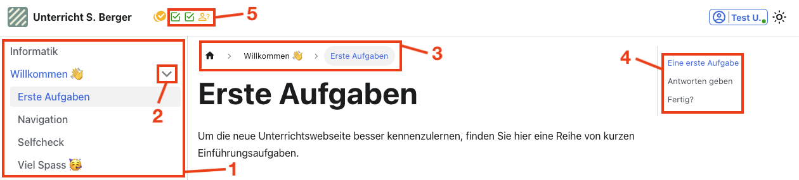

# Navigation
Um sich auf der Unterrichtswebseite zu bewegen, haben Sie folgende Möglichkeiten:
:::Hero

:::

**1**
: _Inhaltsbaum_
: Hier finden Sie alle Themen und Artikel für den Unterricht.
**2**
: _Thema aufklappen_
: Dieser Pfeil bedeutet, dass es sich hier um ein Thema mit mehreren Artikeln handelt.
**3**
: _Breadcrumbs_
: Die Breadcrumbs (dt.: _Brotkrümel_) zeigen an, wo wir uns gerade befinden (der sogenannte _Pfad_ der aktuellen Seite). Mit diesen Knöpfen kann man auch navigieren.
: Im obigen Bild befinden wir uns im Artikel __Erste Aufgaben__ im Thema __Willkommen 👋__.
**4**
: _Inhaltsverzeichnis_
: Das Inhaltsverzeichnis der aktuellen Seite, mit allen Überschriften.
: Mit einem Klick auf eine Überschrift springt man zum entsprechenden Kapitel.
**5**
: _Aufgabenübersicht_
: Übersicht über den Arbeitsstand in diesem Artikel.
: Mit einem Klick auf das jeweilige Symbol springt man zur entsprechenden Aufgabe.

Zudem finden Sie ganz zuunterst jeweils zwei Knöpfe _Vorwärts_ und _Zurück_, mit denen Sie zum nächsten oder zum vorherigen Artikel wechseln können.

## Alles klar?
:::aufgabe[Ich habe alles gelesen und verstanden]
<TaskState id='26ab26a8-3fc5-4598-99de-669bb14a69c8' />

Haben Sie alles auf dieser Seite gelesen und verstanden? Dann markieren Sie diese Aufgabe als erledigt.
:::

Klicken Sie anschliessend auf _Weiter_ und gehen Sie zum nächsten Schritt.

---