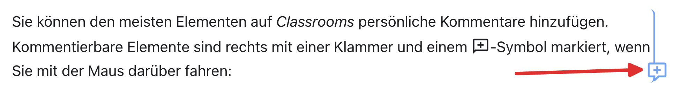

# Navigation
Um dich auf _Classrooms_ zu bewegen, hast du folgende Möglichkeiten:
:::Hero

:::

**1**
: _Inhaltsbaum_
: Hier findest du alle Themen und Artikel für den Unterricht.
**2**
: _Thema aufklappen_
: Dieser Pfeil bedeutet, dass es sich hier um ein Thema mit mehreren Artikeln handelt.
**3**
: _Breadcrumbs_
: Die Breadcrumbs (dt.: _Brotkrümel_) zeigen an, wo wir uns gerade befinden (der sogenannte _Pfad_ der aktuellen Seite). Mit diesen Knöpfen kann man auch navigieren.
: Im obigen Bild befinden wir uns im Artikel __Erste Aufgaben__ im Thema __Willkommen 👋__.
**4**
: _Inhaltsverzeichnis_
: Das Inhaltsverzeichnis der aktuellen Seite, mit allen Überschriften.
: Mit einem Klick auf eine Überschrift springt man zum entsprechenden Kapitel.
**5**
: _Aufgabenübersicht_
: Übersicht über den Arbeitsstand in diesem Artikel.
: Mit einem Klick auf das jeweilige Symbol springt man zur entsprechenden Aufgabe.

Zudem findest du ganz zuunterst jeweils zwei Knöpfe __Vorwärts__ und __Zurück__, mit denen du zum nächsten oder zum vorherigen Artikel wechseln kannst.

## Suche
Oben rechts findest du eine Suchfunktion, mit du das ganze _Classrooms_ durchsuchen kannst:

:::cards

::br

:::

## Kommentare
Du kannst den meisten Elementen auf _Classrooms_ persönliche Kommentare hinzufügen. Kommentierbare Elemente sind rechts mit einer Klammer und einem :mdi[message-plus-outline]-Symbol markiert, wenn du mit der Maus darüber fährst:

Klicke auf das :mdi[message-plus-outline]-Symbol um einen Kommentar zu erstellen.

Du kannst den Kommentar wieder zuklappen, damit er nicht mehr im Weg ist. Mit einem Klick auf die drei Punkte kannst du zudem die Farbe anpassen und den Kommentar löschen:

Deine Kommentare sind nur für dich und deine Lehrperson sichtbar. Sie können dir beispielsweise dabei helfen, Erkenntnisse direkt im Unterrichtsmaterial festzuhalten oder Lernziele farblich zu markieren, die du noch nicht verstehst oder die du noch üben möchtest.

:::aufgabe[Kommentar erstellen]
<TaskState id="268bd1a8-4b40-4b99-83e3-9bf1fa02faf9" />
Probiere es gleich aus! Erstelle für diesen Absatz hier einen Kommentar und markiere die Aufgabe anschliessend als erledigt.
:::

## Alles klar?
:::aufgabe[Ich habe alles gelesen und verstanden]
<TaskState id='31e0b3df-a398-4c17-954c-a25f38045b16' />

Hast du alles auf dieser Seite gelesen und verstanden? Dann markiere diese Aufgabe als erledigt.
:::

Klicke anschliessend auf __Weiter__ und gehe zum nächsten Artikel.

---