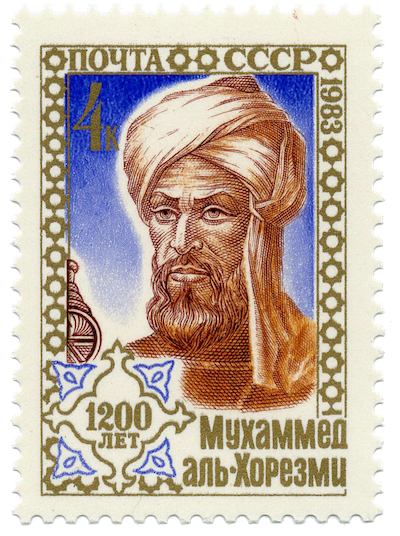

import Restricted from '@tdev-components/documents/Restricted';
import TaskState from "@tdev-components/documents/TaskState";

# Algorithmus

## Definition

> «Ein Algorithmus beschreibt die Methode, mit der eine Aufgabe gelöst wird. Ein Algorithmus besteht aus einer Folge von Schritten, deren korrekte Abarbeitung die gestellte Aufgabe löst. Die Abarbeitung oder den Vorgang selbst bezeichnet man als Prozeß.»
> Les Goldschlager/Andrew Lister: Informatik, 1984

Die folgende Tabelle zeigt ein paar Beispiele von Prozessen mit zugehörigem Algorithmus:

| Prozess            | Algorithmus   | Typischer Schritt                 |
| :----------------- | :------------ | :-------------------------------- |
| Kranich falten     | Faltanleitung | Papier entlang einer Linie falten |
| Zimtsterne backen  | Rezept        | Eier schaumig schlagen            |
| Musikstück spielen | Notenblatt    | Ein c' spielen                    |

## Spezielle Sprachen
Algorithmen werden oft in einer **Fachsprache** oder in einer **symbolischen Sprache** verfasst. Damit lassen sich die einzelnen Schritte eines Algorithmus oft **klarer und kürzer** ausdrücken als in der Alltagssprache. Beispiele für solche Sprachen sind:

- Die **Notenschrift** ist eine symbolische Sprache, in welcher die zu spielende Musik kompakt festgehalten werden kann.
- **Rezepte** sind normalerweise in einer Fachsprache verfasst, welche Fachbegriffe wie «Schnee», «schlagen» oder «Glasieren» und Mengenangaben wie «TL» oder «Prise» enthält.
- **Bauanleitungen**, z.B. IKEA-Anleitungen zum Zusammenbau von Möbeln sind in einer nonverbalen Zeichensprache verfasst.

## Schritt
Wie die einzelnen Schritte eines Algorithmus lauten, hängt stark vom Gebiet ab, für welches der Algorithmus verwendet wird. Die Einzelschritte beim Spielen eines Musikstücks unterscheiden sich stark von den Schritten beim Kochen.

Eine wichtige Eigenschaft von Algorithmen ist die **Ausführbarkeit**. Sie bedeutet, dass jeder einzelne Schritt eines Algorithmus klar definiert sein muss und ausgeführt werden kann. Da eine klare Definition in Alltagssprache oft umfangreich ist, kommt hier die Fachsprache oder die symbolische Sprache zum Zug.

## Struktur
Ein Algorithmus definiert, in welcher **Reihenfolge** die einzelnen Schritte nacheinander abgearbeitet werden. Die Beschreibung dieser Reihenfolge ist die **Struktur** des Algorithmus. Während die Einzelschritte je nach Anwendungsgebiet unterschiedlich sind, sind die Strukturen (beim Programmieren spricht man von **Kontrollstrukturen**) von Algorithmen universell.

Folgende Strukturen können unterschieden werden:
- **Sequenz 👣**: eine Folge von Schritten/Anweisungen, die nacheinander abgearbeitet werden.
- **Wiederholung 🔁**: Einer oder mehrere Schritte werden eine bestimmte Anzahl mal wiederholt.
- **Bedingte Ausführung ⑂**: Einer oder mehrere Schritte werden nur ausgeführt, wenn eine bestimmte Bedingung erfüllt ist.
- **Unterprogramm 🏷**: Eine Sequenz kann mit einem Namen versehen werden. Anstatt immer die ganze Sequenz aufzuschreiben, kann der Name angegeben werden.
- **Parameter ⊕ ⊖**: Das Ergebnis eines Algorithmus kann variiert werden durch Werte, welche bei jeder Ausführung neu festgelegt werden.

## Endlichkeit
Die Endlichkeit ist eine weitere wichtige Eingenschaft von Algorithmen. Sie bedeutet, dass ein Algorithmus immer nach endlich vielen Einzelschritten beendet wird. Ausserdem darf ein Algorithmus nur endlich viel Platz beanspruchen (z.B. Speicherplatz im Computer).

## Anforderungen an Algorithmen
Folgende **sechs Anforderungen** können wir an Algorithmen stellen:

| Anforderung      | Erklärung                                                                                                                                                             |
|------------------|-----------------------------------------------------------------------------------------------------------------------------------------------------------------------|
| Allgemeinheit    | Es soll nicht nur ein einzelnes Problem gelöst werden. Beispielsweise soll ein Algorithmus nicht nur 7 + 4 addieren können, sondern zwei beliebige natürliche Zahlen. |
| Eindeutigkeit    | Die Abfolge der einzelnen Schritte soll genau festgelegt sein. Es soll zu jedem Zeitpunkt klar sein, welcher Schritt als nächstes ausgeführt werden muss.             |
| Ausführbarkeit   | Man (respektive, ein Prozessor) muss jeden Einzelschritt des Algorithmus auch wirklich ausführen können.                                                              |
| Endlichkeit      | Ein Algorithmus soll immer nach einer endlichen Anzahl Schritte zu einer Lösung kommen. Würde es unendlich lange dauern, wäre er nutzlos.                             |
| Korrektheit      | Ein Algorithmus soll für alle möglichen (erlaubten) Eingaben zu einer korrekten Lösung kommen.                                                                        |
| Determiniertheit | Ein Algorithmus soll mit den gleichen Eingabewerten immer zur gleichen Ausgabe kommen. Die Quadratwurzel aus 49 muss immer 7 geben.                                   |

:::insight[Wann ist es ein Algorithmus und wann nicht?]
In der Praxis müssen nicht immer alle sechs Anforderungen erfüllt sein, damit wir von einem Algorithmus sprechen. Ein Algorithmus ist aber immer eine Schritt-für-Schritt-Anleitung.
:::

## ⭐️ Al-Chwarizmi

Abu Dschaʿfar Muhammad ibn Musa al-Chwārizmī war ein Mathematiker und Universalgelehrter. Er stammte zwar aus dem iranischen Choresmien, verbrachte jedoch den größten Teil seines Lebens in Bagdad und war dort im «Haus der Weisheit», einer Art Akademie, tätig.

Al-Chwarizmi gilt als einer der bedeutendsten Mathematiker, da er sich mit Algebra als elementarer Untersuchungsform beschäftigte.[^1]

In der lateinischen Übersetzung eines Werkes von Al-Chwarizmi wurde sein Name als «algorismus» geschrieben. Davon leitet sich der heutige Begriff «Algorithmus» ab.[^2]

<Restricted id='7b2f8f7e-1fc1-40a5-be69-ed046fcc97df'>
  ## Übungen
  :::aufgabe[Algorithmus oder nicht?]
  <TaskState id='c52020ed-437e-4cd8-9014-bd36f0ded4ef' />
  Bearbeiten Sie [dieses Arbeitsblatt](https://erzbe-my.sharepoint.com/:b:/g/personal/silas_berger_gbsl_ch/EbV3xwQijJpFotuQeIIUGWABqzy2WAevytaHhOzNSTGOEA?e=7CSuzJ).
  :::
</Restricted>

[^1]: Quelle: [Wikipedia: al-Chwarizmi](https://de.wikipedia.org/wiki/Al-Chwarizmi)
[^2]: Quelle: [Wiktionary: Algorithmus](https://de.wiktionary.org/wiki/Algorithmus)
