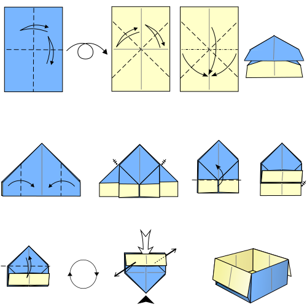

# Faltanleitung

Eine Faltanleitung ist ein Beispiel für einen Algorithmus. Das japanische Wort Origami bezeichnet die Kunst des Papierfaltens.

## Schritt

In einer Faltanleitung kommen nur wenige Arten von Schritten vor:

- **Falten**: Durch eine gestrichelte Linie wird angedeutet, wo gefaltet werden soll. Der Pfeil gibt an, in welche Richtung gefaltet wird.
- **Falz machen**: Durch Hin- und Zurückfalten wird ein Falz erzeugt. Dies wird durch einen Pfeil angedeutet, der hin und zurück zeigt.
- **Drehen**: Durch einen Pfeil zwischen zwei Abbildungen wird angezeigt, dass das Papier entsprechend umgedreht werden soll.

## Beispiele

### Schachtel

Eine einfache Faltanleitung für eine Schachtel.

### Kranich

Der Kranich ist das klassische Motiv im japanischen _Origami_.

---
