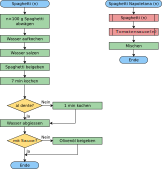

---
sidebar_custom_props:
    source:
        name: ofi.gbsl.website
        ref: 'https://ofi.gbsl.website/26e/Programmieren-1/Algorithmen/Struktogramme'
page_id: dd7a8fbe-9840-49ff-b062-ca8e61fbc6fe
---

# Flussdiagramm

Ein **Flussdiagramm** (engl. flow chart) oder **Programmablaufplan** ist eine grafische Darstellungsform eines Algorithmus. Es besteht aus Elementen, welche einzelne Schritte des Algorithmus darstellen. Pfeile, welche die Elemente verbinden, geben die Reihenfolge an, in welcher die Schritte ausgeführt werden müssen.

Das Flussdiagramm unten links beschreibt, wie Spaghetti gekocht werden. Das Flussdiagramm unten rechts beschreibt, wie Spaghetti Napoletana gekocht werden. Dabei wird der Spaghetti-Algorithmus mit einem **Aufruf** (rot) wiederverwendet.

---
