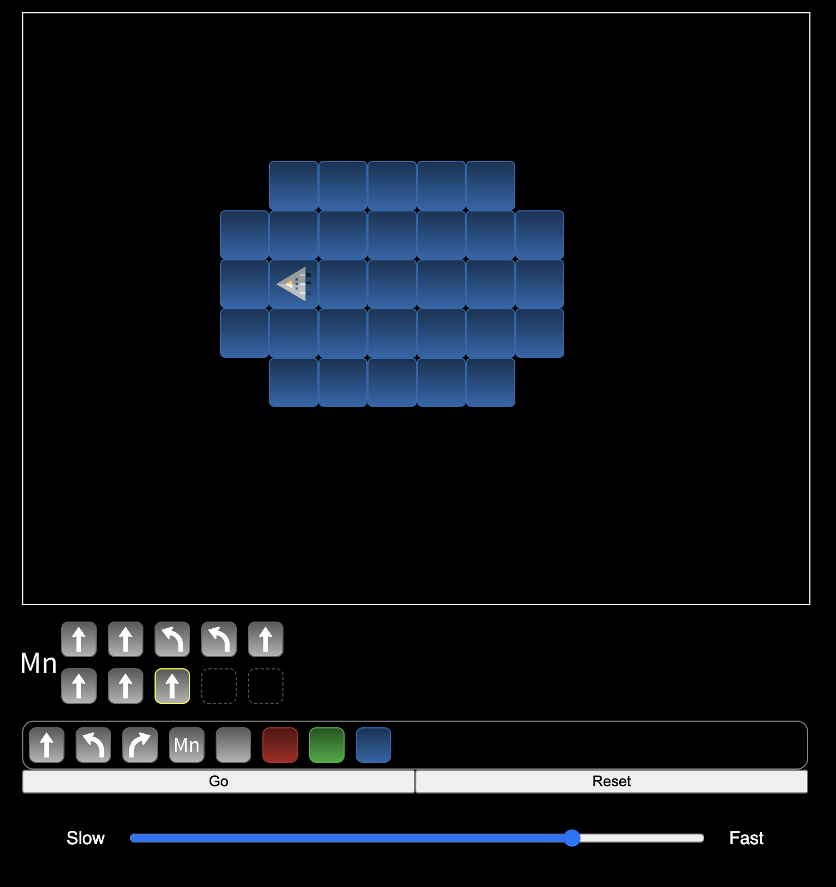
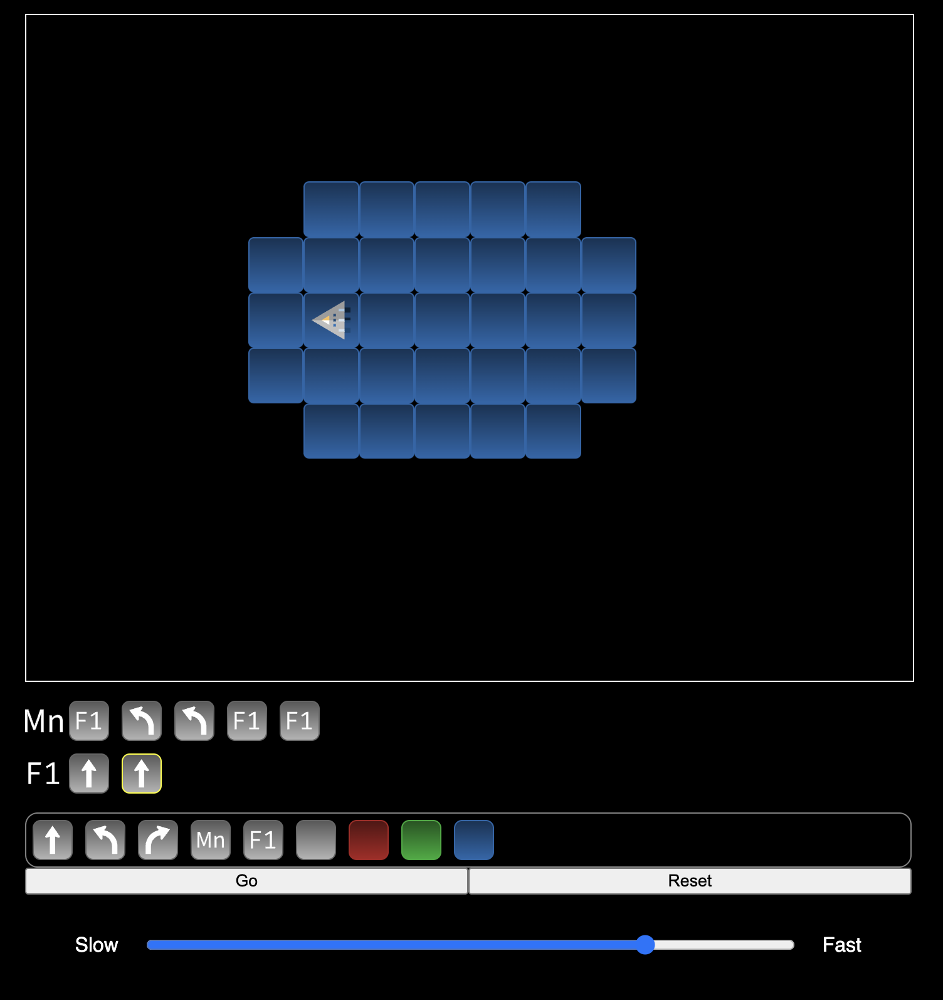
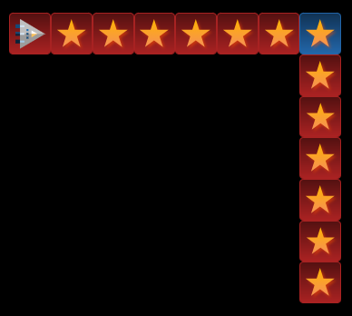
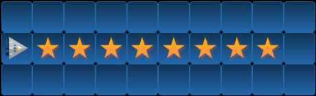
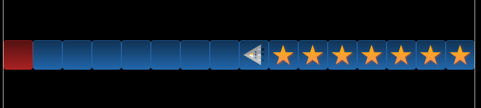
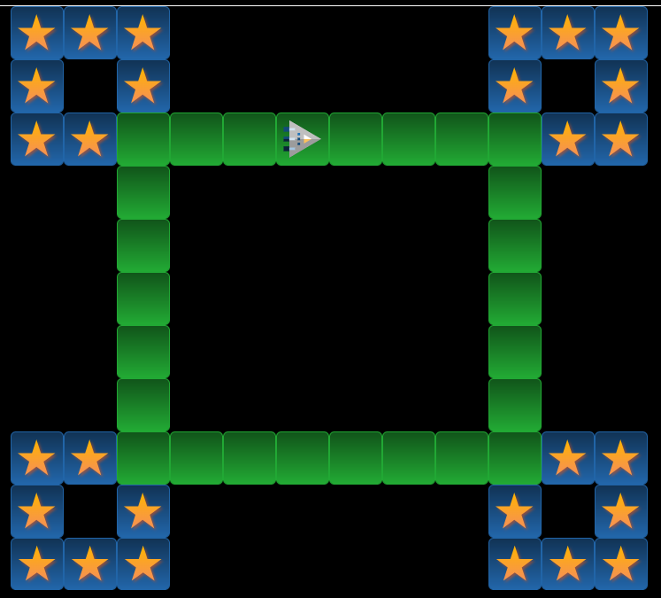
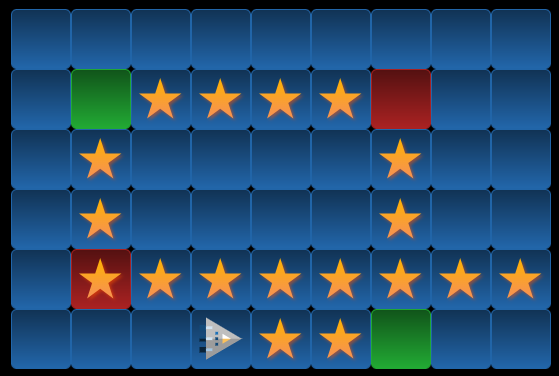
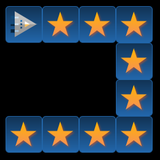

---
sidebar_custom_props:
    source:
        name: inf.gbsl.website
        ref: 'https://inf.gbsl.website/28Gb/Programmieren-1/Algorithmen/Robozzle/'
page_id: f14bcb4f-d260-434b-918e-46b53f275b49
---

# ⭐️ RoboZZle

RoboZZle ist eine Sammlung interaktive Puzzles, mit denen Sie Ihr algorithmisches Denken üben können.

## Tutorial

Um ein Puzzle zu lösen, müssen Sie mit dem Raumschiff alle Sterne einsammeln. Dazu ziehen Sie die Symbole unten auf die kleinen Kacheln oben, um so eine Sequenz von Befehlen zu kreieren. Wenn Sie mit Ihrer Lösung zufrieden sind, klicken Sie **Go**, um Ihr Programm auszuführen.

Für Beispiel 1a sieht die Lösung somit folgendermassen aus: 

Bei Beispiel 1b müssen Sie ein Unterprogramm **F1** definieren, welches Sie im Hauptprogramm **Mn** aufrufen: 

:::tip[Geschwindigkeit anpassen] Wenn Sie die obigen Lösungen ausprobieren, dann passen Sie mit dem **Slow**-**Fast**-Slider die Geschwindigkeit an, bevor Sie auf **Go** drücken. So können Sie besser nachvollziehen, wie das Programm ausgeführt wird. :::

Klicken Sie das jeweilige Beispiel / Puzzle an, um zur entsprechenden RoboZZle-Seite zu gelangen. Wenn Sie alle drei Beispiele gelöst haben (für die Beispiele 1a und 1b haben Sie die Antwort bereits oben), dann ist das Tutorial beendet. Sie können anschliessend zu den Puzzles (unten) weitergehen.

:::cards{flexBasis="275px" alignItems="start"} [ 👉 Beispiel 1a](https://alexanderson1993.github.io/robozzle-react/?level=-1) ::br [ 👉 Beispiel 1b](https://alexanderson1993.github.io/robozzle-react/?level=-2) ::br [ 👉 Beispiel 2](https://alexanderson1993.github.io/robozzle-react/?level=-4) :::

## Puzzles

:::cards{flexBasis="275px" alignItems="start"} [ 👉 Puzzle 1](https://alexanderson1993.github.io/robozzle-react/?level=14288) ::br [ 👉 Puzzle 2](https://alexanderson1993.github.io/robozzle-react/?level=14737) ::br [ 👉 Puzzle 3](https://alexanderson1993.github.io/robozzle-react/?level=14261) :::

:::cards{flexBasis="275px" alignItems="start"} [ 👉 Puzzle 4](https://alexanderson1993.github.io/robozzle-react/?level=-3) ::br [ 👉 Puzzle 5](https://alexanderson1993.github.io/robozzle-react/?level=105) ::br [ 👉 Puzzle 6](https://alexanderson1993.github.io/robozzle-react/?level=140) :::

:::cards{flexBasis="275px" alignItems="start"} [ 👉 Puzzle 7](https://alexanderson1993.github.io/robozzle-react/?level=27) ::br [ 👉 Puzzle 8](https://alexanderson1993.github.io/robozzle-react/?level=15093) ::br [ 👉 Puzzle 9](https://alexanderson1993.github.io/robozzle-react/?level=12986) :::

:::cards{flexBasis="275px" alignItems="start"} [ 👉 Puzzle 10](https://alexanderson1993.github.io/robozzle-react/?level=16166) ::br [ 👉 Puzzle 11](https://alexanderson1993.github.io/robozzle-react/?level=87) :::

---
